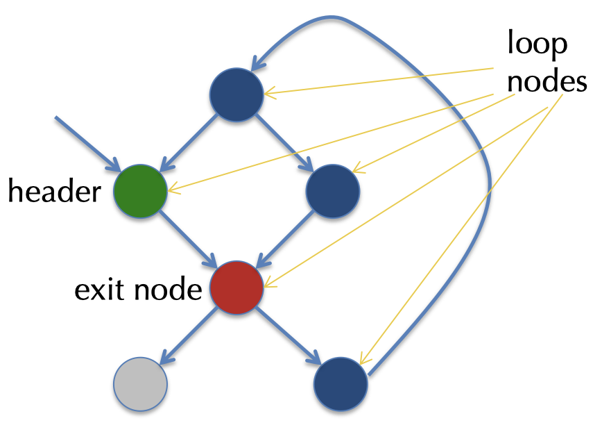
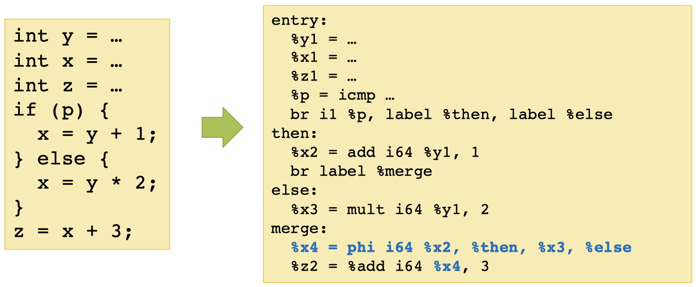
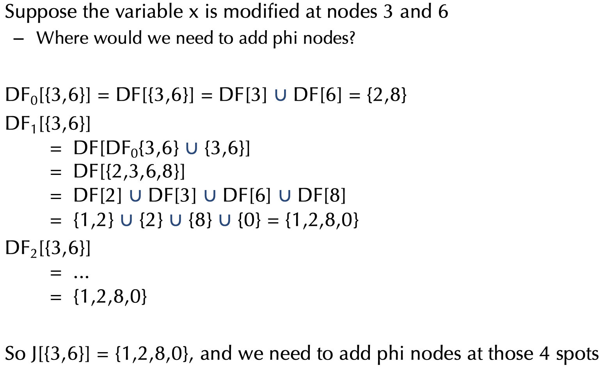
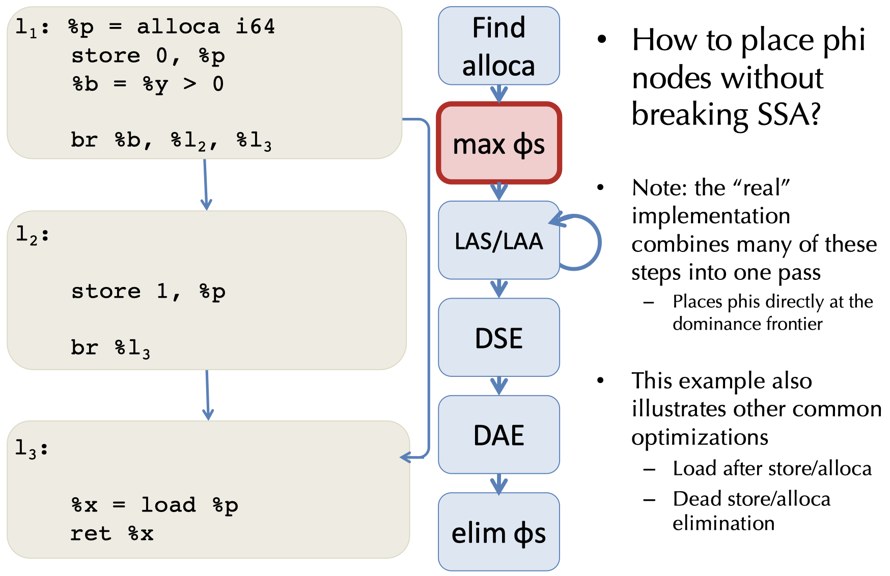
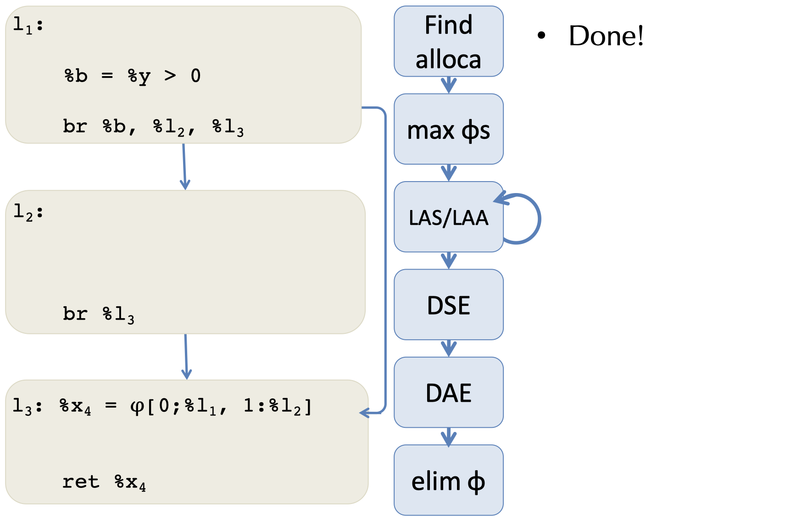

**Compiler Design — Lecture notes week 11**

- Author: Ruben Schenk
- Date: 07.12.2021
- Contact: ruben.schenk@inf.ethz.ch

## 14.12 Quality of Dataflow Analysis Solutions

### 14.12.1 Best Possible Solution

Suppose we have som GFC. If there exists a path $p_1$ starting from the root node traversing the nodes $n_0, \, n_1, \, ..., \, n_k$, then the best possible information along $p_1$ is given by:

$$l_{p1} = F_{nk}(...F_{n2}(F_{n1}(F_{n0}(T)))...)$$

The best solution at the output is some $l \sqsubseteq l_p$ for all paths $p$.

We can define the **meet-over-paths (MOP)** solution as:

$$\sqcap_{p \in \text{paths-to}[n]}l_p$$

The iterative solution computes the MOP solution if the flow functions distribute over $\sqcap$, that is, if $\sqcap_iF_n(l_i) = F_n(\sqcap_il_i)$.

The Reaching Definitions analysis with iterative analysis always terminates with the MOP! In fact, the other three analyses (i.e. liveness, available expressions, and very busy expressions) are all MOP!

### 14.12.2 Flow Functions

Consider the node `x = y op z`. We define the following flow functions for this node:

- $F(l_x,T,l_z) = (T,T,l_z)$ and $F(l_x,l_y,T) = (T,l_y,T)$ -> "if either input might have multiple values, the result of the operation might too"
- $F(l_x,\bot,l_z) = (\bot,\bot, l_z)$ and $F(l_x,l_y,\bot) = (\bot,l_y,\bot)$ -> "if either input is undefined, the result of the operation is too"
- $F(l_x,i,j) = (i \text{ op }j,i,j)$ -> "if the inputs are known constants, calculate the output statically"

## 14.13 Dataflow Analysis: Summary

Many dataflow analyses fit into a common framework. The key idea is to fond an iterative solution of a system of equations over a lattice:

- The iteration terminates if the flow functions are monotonic
- The solution is equivalent to the MOP answer if the flow functions distribute over the meet operator ($\sqcap$)

# 15. Loops and Dominators

## 15.1 Loops

### 15.1.1 Introduction

Taking into account loops is important for optimizations. The 90/10 rule applies, so optimizing loop bodies is important!

But how do we identify loops in the control-flow graph?

### 15.1.2 Definition Of A Loop

A **loop** is a set of nodes in the CFG which have one distinguished entry: the _header._

- Each node is reachable from the header
- Header is reachable from each node
- No edges enter a loop except the header
- _Exit nodes_ are nodes with outgoing (in the sense of "out of the loop") edges



Loops may contain other loops, so-called _nested loops._

### 15.1.3 Goal of Control-flow Analysis

The goal of the control-flow analysis is to identify loops and the nesting structure in a CFG.

Control-flow analysis is based on the idea of _dominators:_

- `A` **dominates** `B` if the only way to reach `B` from the start node is via `A`.

An edge in the CFG is called a _back edge_ if its target dominates the source. A _loop_ contains >=1 back edge!


## 15.2 Dominators

### 15.2.1 Dominator Trees

- Domination is _transitive:_ `A dom B, B dom C => A dom C`
- Domination is ant-symmetric: `A dom B, B dom A => A = B`

Every flow graph has a **dominator tree** which is equal to the Hasse diagram of the dominates relation:


### 15.2.2 Dominator Dataflow Analysis

We can define `Dom[n]` as a forward dataflow analysis:

- `Dom[n]` is the set of all the nodes that dominate `n`
- We can use the same framework as we've seen earlier: `Dom[n] = out[n]` where:
    - `B` is dominated by `A` if `A` dominates _all_ of `B`'s predecessors: $\text{in}[n] := \bigcup_{n' \in \text{pred}[n]}out[n']$
    - Every node dominates itself: $\text{out}[n] := \text{in}[n] \cup \{n\}$

Formally, we can define our analysis as follows: $\mathcal{L}$ is the set of nodes ordered by $\subseteq$, and:

- $T = \{\text{all the nodes}\}$
- $F_n(x) = x \cup \{n\}$
- $\sqcap$ is $\cap$

### 15.2.3 Improving The Algorithm

Instead of storing all those nodes along the path in a dominator tree from root to `b`, it is much more efficient to store only the immediate dominator of `b` in some set called `doms[b]`.

To compute `Dom[b]`, we simply have to walk through `doms[b]`.

### 15.2.4 Completing COntrol-flow Analysis

Dominator analysis identifies _back edges:_

- Edge `(n, h)` is a back edge if `h` dominates `n`

Each back edge has a _natural loop:_

- `h` is the header
- All nodes dominated by `h` that also reach `n` without going through `h` are included in the loop body

For each back edge `(n, h)` we can find a natural loop with:

$$\{n' \, | \, h \text{ dom } n' \, \land \, n \text{ is reachable from } n' \text{ in } G \setminus \{h\} \} \cup \{h \}$$

### 15.3 Example: Natural Loops


# 16. Revisiting SSA

## 16.1 Introduction

### 16.1.1 Single Static Assignment (SSA)

For example, LLVM IR names, via `%uids`, _all_ intermediate values. This makes the order of evaluation explicit. Each `%uid` is assigned only once.

A naive backup implementation would be to map `%uids` to stack slots, however it would be much better to map as many `%uids` as possible to registers.

### 16.1.2 Alloca vs. %UID

The current compilation strategy looks as follows:


But what happens if we directly map source variables into `%uids`?


Does this always work? So, see the following if-then-else example.

### 16.1.3 What About If-Then-Else?


What do we put for `???` ?

## 16.2 Phi Functions

### 16.2.1 Introduction

The solution to our problem in the previous chapter are so-called $\phi$ **functions:**

- Those are fictitious operators, used only for the analysis
- Choose versions of a variable by the path hwo control enters the phi node

```
%uid = phi <ty> v1, <label1>,..., vn, <labeln>
```



### 16.2.2 Phi Nodes and Loops

Importantly, `%uids` on the RHS of phi nodes can be defined "later" in the CFG, meaning that `%uids` can hold values "around a loop". The scope of `%uids` is defined by the dominance.


## 16.3 Alloc "Promotion"

### 16.3.1 Introduction

Not all source variables can be allocated to registers:

1. If the address of the variable is taken

```llvm
entry:
    %x = alloca i64             // %x cannot be promoted
    %y = call malloc(i64 8)
    %ptr = bitcast i8* %y to i64**
    store i64** %ptr, %x        // store the pointer into the heap
```

2. If the address of the variable "escapes" by being passed to a function

```llvm
entry:
    %x = alloca i64         // %x cannot be promoted
    %y = call foo(i64* %x)  // foo may store the pointer into the heap
```

A `alloca` instruction is said to be **promotable** if neither of the above conditions hold. Luckily, mostlocal variables declared in source programs are promotable and therefore can be register allocated.

### 16.3.2 Convertig to SSA

To convert to SSA we proceed with the following steps:

1. Start with the ordinary CFG that uses allocas, identify promotable allocas
2. Compute dominator tree information
3. Calculate def/use information for each such allocated variable
4. Insert $\phi$ functions for each variable at necessary "join points"
5. Replace loads/stores to alloc'ed variables with freshly-generated `%uids`
6. Eliminate the now unneeded load/store/alloca instructions

### 16.3.3 Where to Place $\phi$ Functions?

To know where we need to place the $\phi$ functions we need to calculate the **dominance frontier.**

- Node `A` _strictly dominates_ `B` if `A dom B & A != B`

The _dominance frontier_ of a node `B` is the set of all CFG nodes `y` such that `B` dominates a predecessor of `y`, but does not strictly dominate `y`. We write `DF[n]` to denote the dominance frontier of node `n`.


### 16.3.4 Algorithm For Computing `DF[n]`

We assume that `doms[n]` store the dominator tree.

The following algorithm adds each `B` to the DF set to which it belongs to:

```pseudo
for all nodes B
    if #(pred[B]) >= 2:
        for each p in pred[B]:
            runner := p
            while (runner != droms[B]):
                DF[runner] := DF[runner] union {B}
                runner := doms[runner]
```

### 16.3.5 Insert $\phi$ at Join Points

Lift the `DF[n]` to a set of nodes `N` in the obvious way:

$$DF[N] = \bigcup_{n \in N}DF[n]$$

Suppose variable `x` is defined at a set of nodes `N` with

- `DF_0[N] = DF[N]`
- `DF_i+1[N] = DF[DF_i[N] union N]``

Let `J[N]` be the _least fixed point_ of the sequence:

$$DF_0[N] \subseteq DF_1[N] \subseteq DF_2[N] ...$$

That is, `J[N] = DF_k[N]` for some `k` such that `DF_k[N] = DF_k+1[N]`.

We insert $\phi$ **functions** for the variable `x` at each node in `J[N]`.

_Example:_



### 16.3.6 Phi Placement Alternative

This alternative is less efficient, but easier to understand.

The idea is to place phi nodes _maximally_, i.e. at every node with >= 2 predecessors.
If all values flowing into the phi node are the same, we eliminate it.

### 16.3.7 SSA Optimization Example





## 16.4 Register Allocation