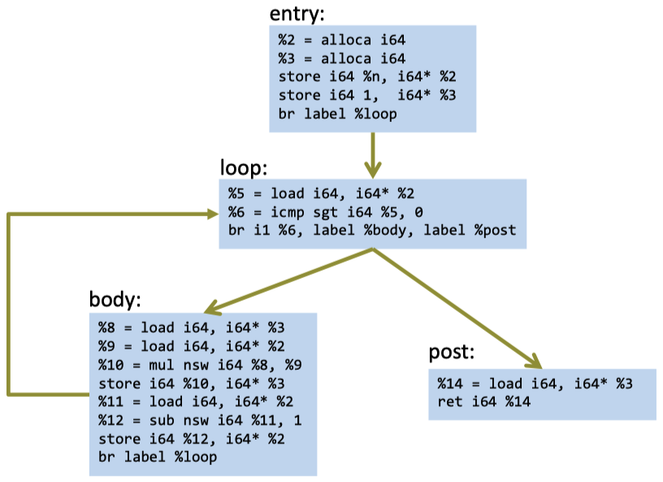
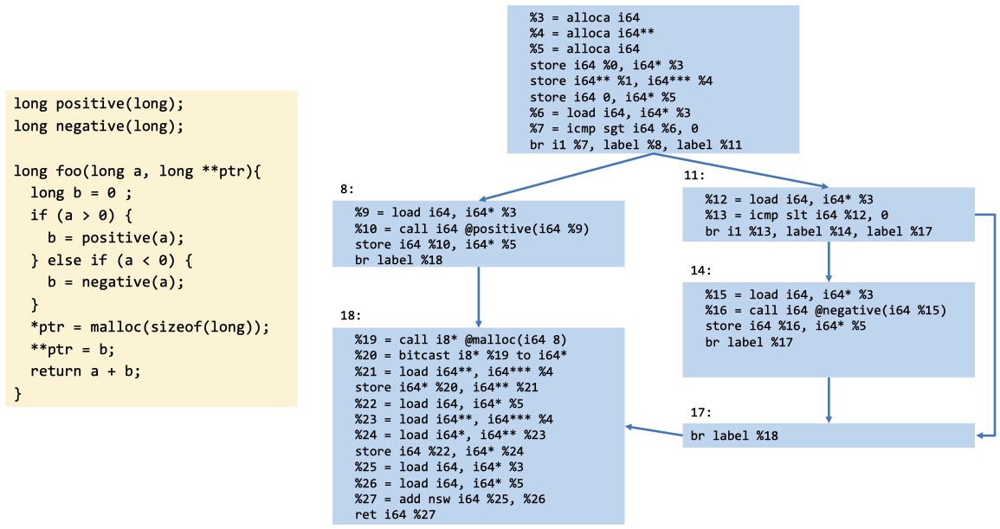
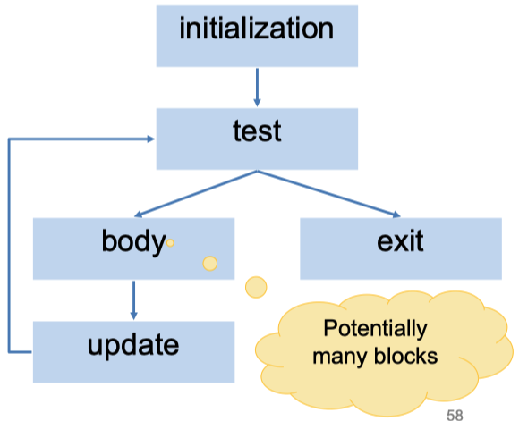
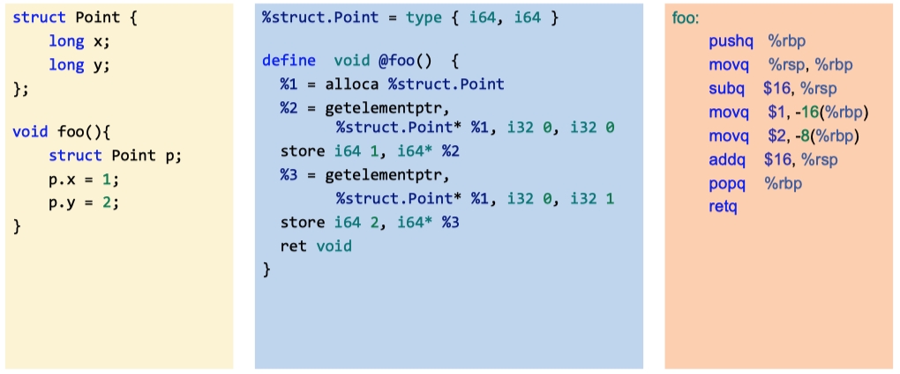
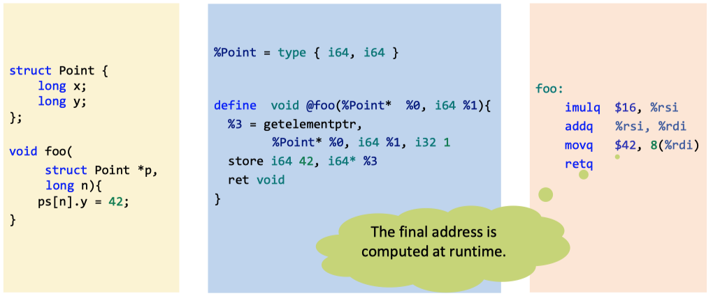
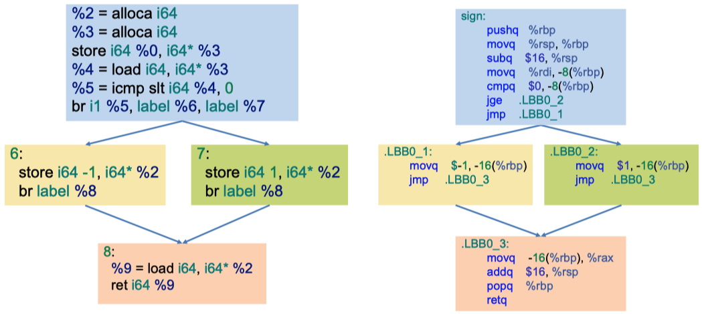

# 5. LLVM

Originally, **LLVM** stood for _Low-Level Virtual Machine_, however, this name doesn't much sense anymore. LLVM is an open-source compiler infrastructure.

## 5.1 LLVM Compiler Infrastructure

{width=50%}

## 5.2 LLVM overview

Consider the following code example:

```c
int s = 42;

long use(long a);

long foo(long a, long *b) {
    long sum = a + 42;

    if(sum > 100) {
        use(sum);
        return sum;
    } else {
        *b = sum;
        return sum;
    }
}
```

The translation down to LLVM (LLVM IR) will look like this:

```llvm
@s = globl i32 42

declare void @use(i64)

define i64 “foo (i64 %a, i64* %b) {
    %sum = add nsw i64 %a, 42
    %cond = icmp sgt i64 %sum, 100
    br i1 %cond, label t%then, label %else

then:
    call void @use(i64 %sum)
    ret i64 %sum

else:
    store i64 %sum, i64* %b
    ret i64 %sum
}
```

_Instruction_, i.e. the body of functions and if/else branches consists of the following part:

- _Opcode_, such as `add`, `icmp sgt`, `br i1`, `call`, etc.
- One or Zero _SSA Return Values_, such as `%sum` in the expression `%sum = add nsw i64 %a, 42`. Single static assignment (SSA) means, that each value, such as `%sum`, can only be once on the left-hand side of an assignment (i.e. can only be assigned once and not be changed afterwards).
- _Operands_, such as `%a`, `42`, etc.
- _Explicitly typed_

The main important _instruction classes_ are:

- Arithmetic
- Comparison
- Control flow
- Call/Return
- Load/Store

We furthermore use **labeled basic blocks** in LLVM:

- The first BB label is optional
- Last instruction is called the terminator

## 5.3 LLVM IR

### 5.3.1 LLVMLite Arithmetic and Bin Instructions

Arithmetic instructions:

| **LLVMLite**             | **Meaning**      | **x86Lite Equivalent** |
| ------------------------ | ---------------- | ---------------------- |
| `%L = add i64 OP1, OP2`  | `%L = OP1 + OP2` | `add SRC, DEST`        |
| `%L = subb i64 OP1, OP2` | `%L = OP1 - OP2` | `subq SRC, DEST`       |
| `%L = mul i64 OP1, OP2`  | `%L = OP1 * OP2` | `Imulq SRC, DEST`      |

Bin instructions:

| **LLVMLite**             | **Meaning**        | **x86Lite Equivalent** |
| ------------------------ | ------------------ | ---------------------- | ---- | --------------- |
| `%L = and i64 OP1, OP2`  | `%L = OP1 && OP2`  | `andq SRC, DEST`       |
| `%L = or i64 OP1, OP2`   | `%L = OP1          |                        | OP2` | `orq SRC, DEST` |
| `%L = xor i64 OP1, OP2`  | `%L = OP1 ^ OP2`   | `xorq SRC, DEST`       |
| `%L = shl i64 OP1, OP2`  | `%L = OP1 << OP2`  | `sarq AMT, DEST`       |
| `%L = lshr i64 OP1, OP2` | `%L = OP1 >> OP2`  | `shlq AMT, DEST`       |
| `%L = ashr i64 OP1, OP2` | `%L = OP1 >>> OP2` | `shrq AMT, DEST`       |

Code example:

```c
long sqnorm2(long x, long y) {
    return (x * x + y * y) * 2;
}
```

```llvm
define i64 @sqnorm2(i64 %0, i64 %1) {
    %3 = mul i64 %0, %0
    %4 = mul i64 %1, %1
    %5 = add i64 %4, %3
    %6 = shl i64 %5, 1
    ret i64 %6
}
```

### 5.3.2 LLVM Storage Models

In LLVM, there are several kinds of storage models:

- _Local variables_ (or temporaries); `%uid`
- _Global declarations_ (e.g. for string constants): `@gid`
- _Abstract locations_: references to stack-allocated storage created by the `alloca` instruction
- Heap-allocated structures created by external calls (e.g. to `malloc`)

#### Locals

_Local variables:_

- Defined by the instructions of the form `%uid = ...`
- Must satisfy the _single static assignment_ invariant: Each `%uid` appears on the left-hand side of an assignment only once in the entire control flow graph
- Analogous to `let %uid = e in ...` in OCaml
- Intended to be an _abstract version of machine registers_

#### `alloca`

The `alloca` instruction allocates stack space and returns a reference to it:

- The returned reference is stored in local: `%ptr = alloca type`
- The amount of space allocated is determined by the type

The contents of the slot are accessed via the `load` and `store` instructions:

```llvm
%acc = alloca i64
store i64 341, i64* %acc
%x = load i64, i64* %acc
```

Intended to be an _abstract version of stack slots_.

#### LLVMLite Memory Instructions

| **LLVMLite**                | **Meaning**       | **x86Lite Equivalent**    |
| --------------------------- | ----------------- | ------------------------- |
| `%L = load <ty>* OP`        | `%L = *OP`        | `movq (SRC), DEST`        |
| `store <ty> OP1, <ty>* OP2` | `*OP2 = OP1`      | `movq SRC, (DEST)`        |
| `%L = alloca <ty>`          | alloc. stack slot | `subq sizeof(<ty>), %rsp` |

Example:

{width=50%}

### 5.3.3 LLVMLite Control Flow Instructions

| **LLVMLite**                                     | **Meaning**               | **x86Lite equivalent**                                 |
| ------------------------------------------------ | ------------------------- | ------------------------------------------------------ |
| `%L = call <ty1> OP1(<ty2> OP2, ..., <tyN> OPN)` | `%L = OP1(OP2, ..., OPN)` | OP2, ..., OPN handled according to calling conventions |
| `call void OP1(<ty2> OP2, ..., <tyN> OPN)`       | `OP1(OP2, ..., OPN)`      | "                                                      |
| `ret void`                                       | return                    | `retq`                                                 |
| `ret <ty> OP`                                    | return OP                 | `retq`                                                 |
| `br label %LAB`                                  | unconditional branch      | `jmp %LAB`                                             |
| `br i1 OP, label %LAB1, label %LAB2`             | conditional branch        | `jne/je/... %LAB1; jmp %LAB2`                          |

### 5.3.4 LLVMLite Misc Instructions

| **LLVMLite**                                        | **Meaning**                                                   | **x86Lite Equivalent**                                           |
| --------------------------------------------------- | ------------------------------------------------------------- | ---------------------------------------------------------------- | ------------------ | ---------------------------------------------------------- | -------------------- |
| `%L = icmp (eq                                      | ne                                                            | slt                                                              | ...) i64 OP1, OP2` | Compare OP1 and OP2, typically used together with branches | No direct equivalent |
| `%L = getelementptr T1* OP1, i64 OP2, ..., i64 OPN` | Address computation (typically used for indexing into arrays) | Sometimes `leaq` but typically unrolled to multiple instructions |
| `%L = bitcast <ty1>* OP to <ty2>*`                  | `(<ty2>*) OP`                                                 | No types in x86                                                  |

## 5.4 More on LLVM

### 5.4.1 Factorial Example

```c
#include <stdint.h>

int64_t factorial(int64_t n) {
    int64_t acc = 1;
    while(n > 0) {
        acc = acc * n;
        n = n - 1;
    }
    return acc;
}
```

```llvm
define i64 @factorial(i64 @0) {
    %2 = alloca i64
    %3 = alloca i64
    store i64 %0, i64* %2
    store i64 1, i64* %3
    br label %4

4:
    %5 = load i64, i64* %2
    &6 = icmp sgt i64 %5, 0
    br i1 %6, label %7, label %13

7:
    %8 = load i64, i64* %3
    %9 = load i64, i64* %2
    %10 = mul nsw i64 %8, %9
    store i64 %10, i64* %3
    %11 = load i64, i64* %2
    %12 = sub nsw i64 %11, 1
    store i64 %12, i64* %2
    br label %4

13:
    %14 = load i64, i64* %3
    ret i64 %14
}
```

### 5.4.2 Basic Blocks

A **basic block** is a sequence of instructions that is always executed starting at the first instruction and always exits at the last instruction:

- Starts with a label that names the _entry point_ of the basic block
- Ends with a control-flow instruction, i.e. the _link_
- Contains no other control-flow instructions
- Contains no interior label used as a jump target

_Example_: Representation in OCaml:

```ocaml
type block = {
    insns : (uid * insn) list;
    term  : (uid * terminator)
}
```

### 5.4.3 Control-flow Graphs

A **control-flow graph** is represented as a list of labeled basic blocks with these invariants:

- No two blocks have the same label
- All terminators mention only labels that are defined among the set of basic blocks
- There is a distinguished, potentially unlabeled, entry block

_Example_: Representation in OCaml:

```ocaml
type cfg = block * (lbl * block) list
```

_Example_: Control-flow graph of the factorial function:

{width=50%}

_Example_: `foo` function:

{width=50%}

### 5.4.4 Generating Code for Loops

A **loop** has the following general form:

```c
for(initializationStatement; testExpression; updateStatement) {
    // statement inside the body of the loop
}
```

We therefore have the following five elements:

1. BB with the initialization
2. BB with the test expression
3. BB for the update statement
4. BB for the body of the loop
5. Connect the different BB's with the conditional statements

The general CFG for a loop looks as follows:

{width=50%}

### 5.4.5 LLVM Cheat Sheet

```shell
# Extract LLVM-IR from C code - with optimization
clang -S -emit-llvm -O3 -o file.ll file.c

# Extract LLVM_IR from C code - no optimization
clang -S -emit-llvm -O0 -o file.ll file.c -Xclang -disable-llvm-passes

# View the CFG of a file
opt -view-cfg file.ll

# Compile .ll file to .o file
clang file.ll -c -o file.o

# Compile .ll file to executable
clang file.ll -o file.exe
```

## 5.5 Structured Data

### 5.5.1 Example LL Types

_`C`-Code:_

```c
struct Node {
    long a;
    struct Node* next;
};

struct List {
    struct Node head;
    long length;
};

struct ListOfLists {
    struct List *lists1;
    struct List *lists2;
}

void foo() {
    long a[4];
    long b[3][4];
    struct Node c;
    struct List d;
    struct ListsOfLists f;
    long(*g)(long, long);
}
```

_`LLVM-IR`-Code:_

```llvm
%struct.Node = type { i64, %struct.Node* }

%struct.List = type { %struct.Node, i64 }

%struct.ListsOfLists = type { %struct.List*, %struct.List* }

Define void @foo() #0 {
    %1 = alloca [4 x i64]               ;a
    %2 = alloca [3 x [4 x i64]]         ;b
    %3 = alloca %struct.Node            ;c
    %4 = alloca %struct.List            ;d
    %5 = alloca %struct.ListsOfLists    ;f
    %6 alloca i64 (i64, i64)*           ;g
    ret void
}
```

### 5.5.2 Datatypes in LLVM

- LLVM's IR uses types to describe the structure of data
- `<#elts>` is an integer constant >= 0
- Structure types can be named at the top level: such structure types can be recursive

```bnf
t ::=
    void
    i1 | i8 | i64       # N-bit integers
    [<#elts> x t]       # arrays
    fty                 # function types
    {t1, t2, ..., tn}   # structures
    t*                  # pointers
    %Tident             # named types

fty ::=                 # function types
    t (t1, ..., tn)     # return, argument types

%T1 = type {t1, t2, ..., tn}    # named type
```

#### Point struct example

```c
struct Point {
    long x;
    long x;
};

void foo() {
    struct Point p;
    p.x = 1;
    p.y = 2;
}
```

```llvm
%struct.Point = type { i64, i64 }

define void @foo() {
    %1 = alloca %struct.Point
    %2 = getelementptr,
            %struct.Point* %1, i32 0, i32 0
    atore i64 1, i64* %2
    %3 = getelementptr,
            %structPoint* %1, i32 0, i32 1
    store i64 2, i64* %3
    ret void
}
```

#### `getelementptr`

LLVM provides the `getelementptr` (**GEP**)instruction to compute pointer values:

- Given a pointer and a path through the structured data pointed to by that pointer, `getelementptr` computes an address
- This is the abstract analog of the X86 `lea`. It does not access memory
- It is a type indexed operation, since the size computations depend on the type

```llvm
<result> = getelementptr <ty>* <ptrval>{, <ty> <idx>}*
```

_GEP example:_

{width=50%}

_Remarks:_

- GEP never dereferences the address it's calculating!
  - GEP only produces pointers by doing arithmetic
  - It doesn't actually traverse the links of datastructure
- To index into a deeply nested structure, we need to follow the pointer by loading it from the computed pointer

#### Array Indexing

```c
struct Point {
    long x;
    long y;
};

void foo(struct Point *ps, long n) {
    ps[n].y = 42;
}
```

```llvm
%Point = type { i64, i64 }

define void @foo(%Point* %0, i64 %1) {
    %3 = getelementptr, %Point* %0, i64 %1, i32 1
    store i64 42, i64* %3
    ret void
}
```

#### Struct parameters and return values

```c
struct Point {
    long x;
    long y;
};

long foo(struct Point p) {
    return p.x + p.y;
}

// Assume this is in a different file
struct Point {
    long x;
    long y;
    long z;
}

struct Point bar(long x, long y, long z) {
    struct Point p;
    p.x = x;
    p.y = y;
    p.z = z;
    return p;
}
```

```llvm
%struct.Point = type { i64, i64 }

; Remark here that struct parameters are unpacked!
define i64 @foo(i64 %0, i64 %1) {
    %3 = add nsw i64 %1, %0
    ret i64 %3
}

; Assume this is in a different file
%struct.Point = type { i64, i64, i64 }

; Return strcut allocated by the caller and passed as pointer argument
define void @ bar(%struct.Point* %0,
                    i64 %1, i64 %2, i64 %3) {
    %5 = getelementptr, %struct.Point* %0, i64 0, i32 0
    store i64 %1, i64* %5
    %6 = getelementptr, %struct.Point* %0, i64 0, i32 1
    store i64 %2, i64* %6
    %7 = getelementptr, %struct.Point* %0, i64 0, i32 2
    store i64 %3, i64* %7
    ret void
}
```

### 5.5.3 Compiling LLVMLite to x86 (With LLVM's Help)

#### LLVMLite Types to x86

- `[[i1]], [[i64]], [[t*]]` = quad word (8 bytes, 8-byte aligned)
- raw `i8` values are not allowed (they must be manipulated via `i8*`)
- array and struct types are laid out sequentially in memory
- `getelementptr` computations must be relative to the LLVMLite size definitions (i.e. `[[i1]] = quad`)

#### Compiling LLVM Locals

How do we manage storage for each `%uid` defined by an LLVM instruction?

_Option 1:_

- Map each `%uid` to an x86 register
- Efficient!
- Difficult to do effectively: many `%uid` values but only 16 registers

_Option 2:_

- Map each `%uid` to a stack-allocated space
- Less efficient!
- Simple to implement

#### `C` -> `LLVMLite` -> `x86Lite` Example

```c
long bar(long n);
long foo(long n) {
    long a = n;
    return bar(a);
}
```

```llvm
define i64 @foo(i64 %0) {
    %2 = alloca i64
    %3 = alloca i64
    store i64 %0, i64* %2
    %4 = load i64, i64* %2
    store i64 %4, i64* %3
    %5 = load i64, i64* %3
    %6 = call i64 @bar(i64 %5)
    ret i64 %6
}

declare i64 @bar(i64)
```

```x86
foo:
    pushq   %rbp
    movq    %rsp, %rbp
    subq    $16, %rsp
    movq    %rdi, -8(%rbp)
    movq    -8(%rbp), %rax
    movq    %rax, -16(%rbp)
    movq    -16(%rbp), %rdi
    callq   bar
    addq    $16, %rsp
    popq    %rbp
    retq
```

_Remarks:_

- For each `alloca Ty` -> `subq sizeof(Ty), %rsp` (optimization: combine them!)
- Loads from/stores to stack slots -> `movq & offset(%rbp)`
- Storing args/temporaries to stack slots simplifies code: no need to keep track if a register was overwritten, instead load it before every use
- Arguments and return values handled according to calling conventions (in this example: `%0 -> %rdi, %5 -> % rdi, %6 -> %rax`)

#### `getelementptr` -> `x86`

{width=50%}

_Remarks:_

- `%1` in this case corresponds to `-16(%rbp)`: `getelementptr -> base address + offset`
- _Compilation of GEP:_
  1. Translate GEP's base pointer to an actual address (e.g. a stack slot)
  2. Compute the offset specified by the indices and add it to the base address

#### Array Indexing

{width=50%}

#### If-statements and Loops

- If-statements and loops correspond to branching in the CFG
- Basic blocks are mostly generated independently
- The resulting x86 BB's are connected via jumps

_Example:_

{width=50%}
