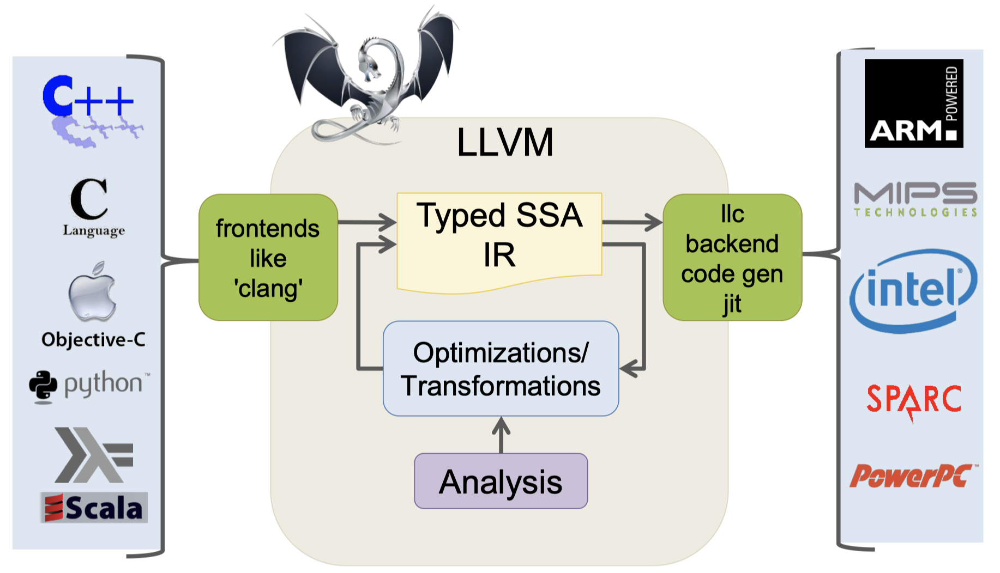

**Compiler Design — Lecture note week 4**

- Author: Ruben Schenk
- Date: 12.10.2021
- Contact: ruben.schenk@inf.ethz.ch

# 5. LLVM

Originally, **LLVM** stood for _Low-Level Virtual Machine_, however, this name doesn't much sense anymore. LLVM is an open-source compiler infrastructure.

## 5.1 LLVM Compiler Infrastructure



## 5.2 LLVM overview

Consider the following code example:

```c
int s = 42;

long use(long a);

long foo(long a, long *b) {
    long sum = a + 42;

    if(sum > 100) {
        use(sum);
        return sum;
    } else {
        *b = sum;
        return sum;
    }
}
```

The translation down to LLVM (LLVM IR) will look like this:

```llvm
@s = globl i32 42

declare void @use(i64)

define i64 “foo (i64 %a, i64* %b) {
    %sum = add nsw i64 %a, 42
    %cond = icmp sgt i64 %sum, 100
    br i1 %cond, label t%then, label %else

then:
    call void @use(i64 %sum)
    ret i64 %sum

else:
    store i64 %sum, i64* %b
    ret i64 %sum
}
```

_Instruction_, i.e. the body of functions and if/else branches consists of the following part:

- _Opcode_, such as `add`, `icmp sgt`, `br i1`, `call`, etc.
- One or Zero _SSA Return Values_, such as `%sum` in the expression `%sum = add nsw i64 %a, 42`. Single static assignment (SSA) means, that each value, such as `%sum`, can only be once on the left-hand side of an assignment (i.e. can only be assigned once and not be changed afterwards).
- _Operands_, such as `%a`, `42`, etc.
- _Explicitly typed_

The main important _instruction classes_ are:

- Arithmetic
- Comparison
- Control flow
- Call/Return
- Load/Store

We furthermore use **labeled basic blocks** in LLVM:

- The first BB label is optional
- Last instruction is called the terminator

## 5.3 LLVM IR

### 5.3.1 LLVMLite Arithmetic and Bin Instructions

Arithmetic instructions:

| **LLVMLite**             | **Meaning**      | **x86Lite Equivalent** |
|--------------------------|------------------|------------------------|
| `%L = add i64 OP1, OP2`  | `%L = OP1 + OP2` | `add SRC, DEST`        |
| `%L = subb i64 OP1, OP2` | `%L = OP1 - OP2` | `subq SRC, DEST`       |
| `%L = mul i64 OP1, OP2`  | `%L = OP1 * OP2` | `Imulq SRC, DEST`      |

Bin instructions:

| **LLVMLite**             | **Meaning**        | **x86Lite Equivalent** |
|--------------------------|--------------------|------------------------|
| `%L = and i64 OP1, OP2`  | `%L = OP1 && OP2`  | `andq SRC, DEST`       |
| `%L = or i64 OP1, OP2`   | `%L = OP1 || OP2`  | `orq SRC, DEST`        |
| `%L = xor i64 OP1, OP2`  | `%L = OP1 ^ OP2`   | `xorq SRC, DEST`       |
| `%L = shl i64 OP1, OP2`  | `%L = OP1 << OP2`  | `sarq AMT, DEST`       |
| `%L = lshr i64 OP1, OP2` | `%L = OP1 >> OP2`  | `shlq AMT, DEST`       |
| `%L = ashr i64 OP1, OP2` | `%L = OP1 >>> OP2` | `shrq AMT, DEST`       |

Code example:

```c
long sqnorm2(long x, long y) {
    return (x * x + y * y) * 2;
}
```

```llvm
define i64 @sqnorm2(i64 %0, i64 %1) {
    %3 = mul i64 %0, %0
    %4 = mul i64 %1, %1
    %5 = add i64 %4, %3
    %6 = shl i64 %5, 1
    ret i64 %6
}
```

### 5.3.2 LLVM Storage Models

In LLVM, there are several kinds of storage models:

- *Local variables* (or temporaries); `%uid`
- *Global declarations* (e.g. for string constants): `@gid`
- *Abstract locations*: references to stack-allocated storage created by the `alloca` instruction
- Heap-allocated structures created by external calls (e.g. to `malloc`)

#### Locals

*Local variables:*

- Defined by the instructions of the form `%uid = ...`
- Must satisfy the *single static assignment* invariant: Each `%uid` appears on the left-hand side of an assignment only once in the entire control flow graph
- Analogous to `let %uid = e in ...` in OCaml
- Intended to be an *abstract version of machine registers*

#### `alloca`

The `alloca` instruction allocates stack space and returns a reference to it:

- The returned reference is stored in local: `%ptr = alloca type`
- The amount of space allocated is determined by the type

The contents of the slot are accessed via the `load` and `store` instructions:

```llvm
%acc = alloca i64
store i64 341, i64* %acc
%x = load i64, i64* %acc
```

Intended to be an *abstract version of stack slots*.

#### LLVMLite Memory Instructions

| **LLVMLite**                | **Meaning**       | **x86Lite Equivalent**    |
|-----------------------------|-------------------|---------------------------|
| `%L = load <ty>* OP`        | `%L = *OP`        | `movq (SRC), DEST`        |
| `store <ty> OP1, <ty>* OP2` | `*OP2 = OP1`      | `movq SRC, (DEST)`        |
| `%L = alloca <ty>`          | alloc. stack slot | `subq sizeof(<ty>), %rsp` |
