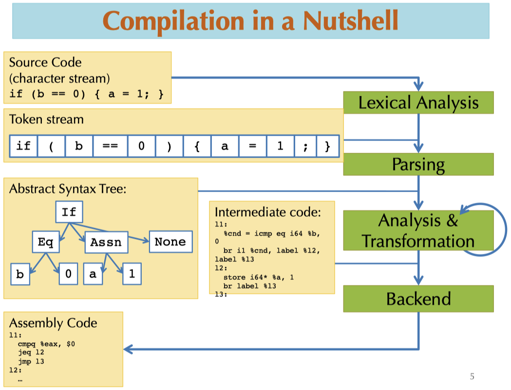
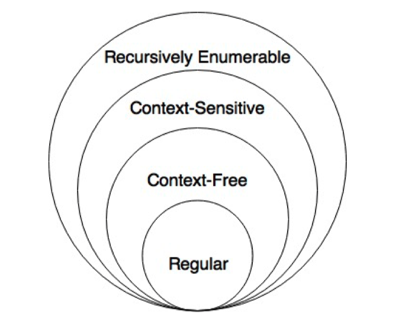

**Compiler Design — Lecture notes week 5**

- Author: Ruben Schenk
- Date: 24.10.2021
- Contact: ruben.schenk@inf.ethz.ch

# 6. Lexing

## 6.1 Compilation in a Nutshell



## 6.2 Lexical Analysis

The first step of lexing is the **lexical analysis**. Its goal is to change the _character stream_, e.g. "`if (b == 0) a = 1;`" into _tokens:_

```bnf
if (b == 0) a = 1;
=>
IF; LPAREN; Ident("b"); EQEQ; Int(0); RPAREN; LBRACE; Ident("a"); Eq; Int(1); Semi; RBRACE;
```

A **token** is a data type that represents indivisible chunks of text;

- Identifiers; `a y11 elsex _100`
- Keywords: `if else while`
- Integers: `2 200 -500 5L`
- Floating point: `2.0 .02 1e5`
- Symbols: `+ * { } ( ) ++ << >> >>>`
- Strings: `"x" "He said, \"Are you?\""`
- Comments: `(* Compiler Design: Project 1 ...*)`

Often delimited by _whitespace_ (`' ', \t` etc.). In some languages (e.g. Python or Haskell) whitespace is significant!

## 6.3 Principled Solution to Lexing

### 6.3.1 Regular Expressions

**Regular expressions** precisely describe sets of strings. A regular expression `R` has one of the following forms:

- $\epsilon$ : stands for the empty string
- `'a'` : an ordinary character stands for itself
- `R_1 | R_2` : alternatives, stands for a choice of `R_1` or `R_2`
- `R_1R_2` : concatenation, stands for `R_1` or `R_2`
- `R*` : Kleene start, stands for zero or more repetitions of `R`

There are some useful extensions to the above-mentioned forms:

- `"foo"` : strings, equivalent to `'f''o''o'`
- `R+` : one or more repetitions of `R`, equivalent to `RR*`
- `R?` : zero or one occurrence of `R`, equivalent to ($\epsilon$ | R)
- `['a'-'z']` : one of `a`, `b`, ..., or `z`, equivalent to `(a|b|...|z)`
- `[^'0'-'9']` : any character except `0` through `9`
- `R as x` : name the string matched by `R` as `x`

_Examples:_

- Recognize the keyword "if" : `"if"`
- Recognize a digit: `['0'-'9']`
- Recognize an integer literal: `'-'?['0'-'9']+`

In practice, it is useful to _name_ regular expressions:

```bnf
let lowercase = ['a'-'z']
let uppercase = ['A'-'Z']
let character = uppercase | lowercase
```

### 6.3.2 Chomsky Hierarchy



### 6.3.3 How to Match?

Consider the input string "`ifx = 0`". We could lex this input as either `'if''x''=''0'` or as `'ifx''=''0'`. Thus, regular expressions alone can be ambiguous. We need a rule for choosing between the options above:

- Most languages choose the **longest match**
- In that case, the second option would be chosen above

We get **conflicts** with tokens whose regular expressions have a shared prefix. How do we resolve this?

- Ties are broken by giving some matches higher priority (example, give keywords priority over identifiers)
- Usually specified by the order the rules appear in the lex input file

## 6.4 Lexer Generator

The **lexer generator** reads a list of regular expressions: `R_1, ..., R_n`, one per token.
Each token has an attached _action_ `A_i`, which is simply a piece of code to run when the regular expression is matched:

```bnf
rule token = parse
    | '-'?digit+                        { Int (Int32.of_string(lexeme lexbuf)) }
    | '+'                               { PLUS }
    | 'if'                              { IF }
    | character (digit|character|'_')*  { Ident(lexeme lexbuf) }
    | whitespace+                       { token lexbuf }
```
