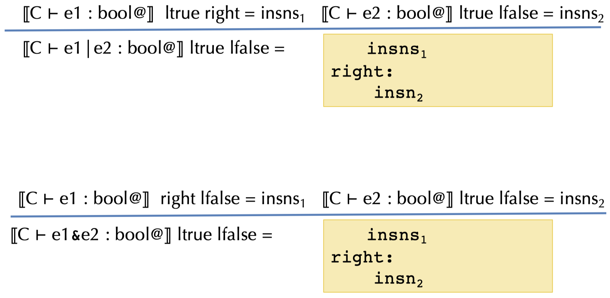
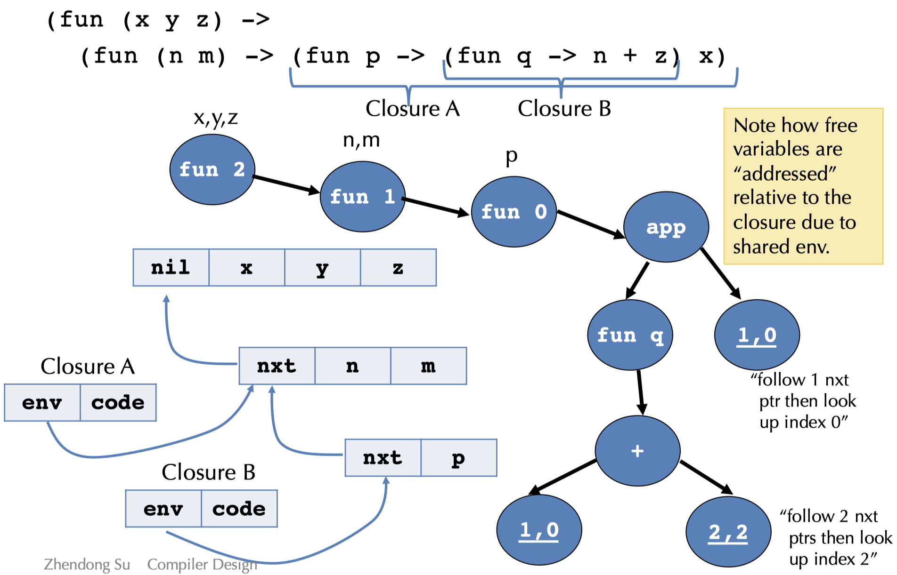

**Compiler Design — Lecture notes week 8**

- Author: Ruben Schenk
- Date: 23.11.2021
- Contact: ruben.schenk@inf.ethz.ch

## 11.4 Optimizing Control

### 11.4.1 Standard Evaluation

Consider compiling the following program fragment:

```c
if(x & !y | !w) {
    z = 3;
} else {
    z = 4;
}
return 7;
```

```llvm
    %tmp1 = icmp Eq [[y]], 0
    %tmp2 = and [[x]], %tmp1
    %tmp3 = icmp Eq [[w]], 0
    %tmp4 = or %tmp2, %tmp3
    %tmp5 = icmp Eq %tmp4, 0
    br %tmp5, label %else, label %then

then:
    store [[z]], 3
    br %merge

else:
    store [[z]], 4
    br %merge

merge:
    %tmp6 = laod [[z]]
    ret %tmp 6
```

What we observe is that usually, we want the translation `[[e]]` to produce a value $[[C \vdash e_1 + e_2 : int]] = (\text{ty, operand, stream})$ = `i64, %tmp, [%tmp = add [[e1]] [[e2]]])`. 

But, when the compiled expression appears in a test, the program jumps to one label or another after the comparison (besides that, it never uses the value). In many cases, we can avoid _materializing_ the value (i.e. storing it in a temporary) and thus produce better code.

### 11.4.2 Short Circuit Boolean Compilation

Instead of the usualy expression translation of the form:

$$[[C \vdash e : t]] = (\text{ty, operand, stream})$$

we can use a _conditional branch translation of Booleans,_ without materializing the value:

$$[[C \vdash e : \text{bool}@]] \text{ Itrue Ifalse} = \text{stream} \\ [[C, \, rt \vdash \text{if } (e) \text{ then } s_1 \text{ else } s_2 \Rightarrow C']] = [[C']]$$

This takes two extra arguments, namely the "true" branch label and the "false" branch label, and doesn't return a value.

#### Expressions


#### Evaluation



If we reconsider our previous code example, we might translate it, using short circuit evaluation, into the following code fragment:

```llvm
    %tmp1 = icmp Eq [[x]], 0
    br %tmp1, label %right2, label %right1

right1:
    %tmp2 = icmp Eq [[y]], 0
    br %tmp2, label %then, label %right2

right2:
    %tmp3 = icmp Eq [[w]], 0
    br %tmp3, label %then, label %else

then:
    store [[z]], 3
    br %merge

else:
    store [[z]], 4
    br %merge

merge:
    %tmp5 = load [[z]]
    ret %tmp6
```

## 11.5 Closure Conversion

As we have already seen, in functional languages such as ML, Haskell, Scheme, Python, etc, functiosn can be:

- passed as arguments (such as `map` or `fold`)
- returned as values (sucha s `compose`)
- nested, i.e. an inner function can refer to variables bound to an outer function

We can show a simple example with the following code fragment:

```ocaml
let add = fun x -> fun y -> x + y
let inc = add 1
let dec = add -1

let compose = fun f -> fun g -> fun x -> f (g x)
let id = compose inc dec
```

But how do we implement such functons in an interpreter or in a compiled language?

### 11.5.1 Compiling First-class Functions

To implement first-class functions on a processor, there are 2 main problems:

- We must implemen substitution of free varaibles
- We must separate "code" from "data"

We can do those things by:

- _Reify the substitution:_ Move the substitution from the meta language to the object language by making the data structure and lookup operation explicit
- _Closure conversion:_ Eliminates free varaibles by packaging up the needed environment in the data structure
- _Hoisting:_ Separates code from data, pulling closed code to the top level

#### Closure Creation

Recall the `add` function `let add = fun x -> fun y -> x + y` and consider the inner function `fun y -> x + y`.

When we run the function application `add 4`, the program builds a closure and returns it (the **closure** is a pair of the _environment_ and a _code pointer_):


The code pointer takes a pair of parameters: `env` and `y`. The function code is essentially:

```ocaml
fun (env y) -> let x = nth env 0 in x + y
```

#### Representing Closures

The simple closure conversion doesn't generate very efficient code:

- It stores all the values for variables in the environment, even if they aren't needed by the function body
- It copies the environment values each time a nested closure is created
- It uses a linked-list data structure for tuples

There are many options to solve those short comings, such as:

- Store only the values for free variables in the body of the closure
- Share subcomponents of the environment to avoid copying
- Use vectors or arrays rather then linked structures

**Array-based closure with N-ary functions:**


