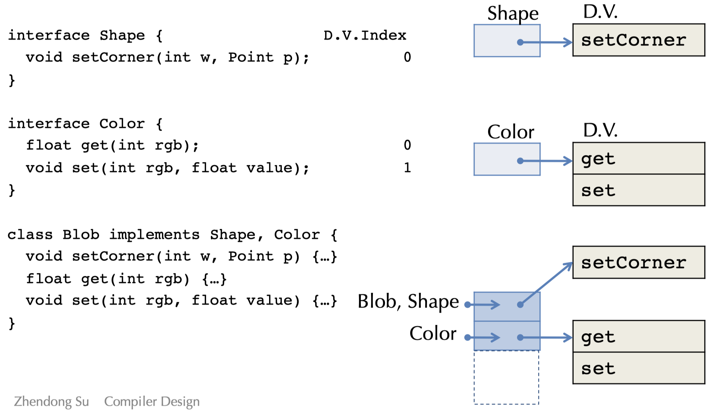
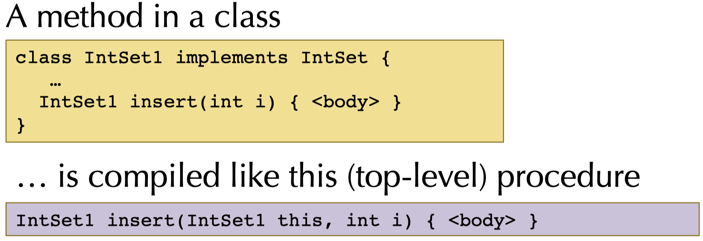

**Compiler Design — Lecture notes week 9**

- Author: Ruben Schenk
- Date: 29.11.2021
- Contact: ruben.schenk@inf.ethz.ch

## 13.3 Multiple Inheritance

### 13.3.1 Overview

A class may declare more than one sueprclass. This leads to a semantic problem: _ambiguity_

_Example:_

```c++
class A { int m(); }
class B { int m(); }
class C extends A, B { ... }    // which m()?
```

The same problem can also happen with fields. In C++, fields and methods can be duplicated when such ambiguities arise.

In Java, a class may implement more than one interface:

```java
interface A { int m(); }
interface B { int m(); }
class C implements A, B { int m() { ... }}  // only one m()
```

However, this doesn't lead to any semantic ambiguity since the class will implement a single method.

## 13.4 Dispatch Vector Layout Strategy

Let's consider the following code example:

```java
    interface Shape {                           // D.V.Index
        void setCorner(int w, Point p);         // 0
    }

interface Color {
    float get(int rgb);                         // 0
    void set(int rgb, float value);             // 1
}

class Blob implements Shape, Color {
    void setCorner(int w, Point p) {...}        // 0?
    float get(int rgb) {...}                    // 0?
    void set(int rgb, float value) {...}        // 1?
}
```

### 13.4.1 General Approaches

The problem we encounter in the above shown example is that we cannot directly identify methods by their position anymore. There are three general approaches to solve this problem:

- Option 1: Allow multiple D.V. tables (C++)
    - Choose which D.V. to use based on the static type
    - Castin from/to a class may require runtime operations
- Option 2: Use a level of indirection
    - Map method identifiers to code pointers
    - Use a hash table
    - May need to search up the class hierarchy
- Option 3: Give up separate compilation
    - Use "sparse" dispatch vectors, or binary decision trees
    - Must know the entire class hierarchy

### 13.4.2 Option 1: Multiple Dispatch Vectors

The idea is to duplicate the D.V. pointers in the object representation. The static type of the object determines which D.V. is used:



Another example:

```c++
class A {
    public:
        int x;
        virtual void f();
}

class B {
    public:
        int y;
        virtual void g();
        virtual void f();
}

class C: public A, public B {
    public:
        int z;
        virtual void f();
}

C *pc = new C;
B *pb = pc;
A *pa = pc;

// Three pointers to the same object, but different static types.
```


### 13.4.3 Option 2: Search and Inline Cache

The idea is that for each class/interface, we keep a talbe of the form `method names -> method code`. We then recursively walk up the hierarchy looking for the method name.


One optimization would be to store the class and code pointer at a call site in a cache. On a method call, we check whether ot not the class matches the cached value.

Consider for example the following compilation: `Shape s = new Blob(); s.get();`


A **cached interface dispatch** could look as follows:

```x86
    movq    [%rax], tmp
    cmpq    tmp, [cacheClass434]
    Jnz     __miss434
    callq   [cacheCode434]
__miss434:
```

### 13.4.4 Option 3: Sparse D.V. Tables

We have acces to the whole class hierarchy and must ensure that no two methods in the same class are allocated at the same D.V. offset:

- We allow holes in the D.V. just like in the hashtable variant for the search cache
- Unlike the hashtable however, there is never a conflict

The obvious advantage is that we have an identical dispatch and performance compared to a single-inheritance case. The disadvantage is that we must know the entire class hierarchy.


## 13.5 Classes & Objects In LLVM

### 13.5.1 Representing Classes in the LLVM

During typechecking, we create a _class hierarchy,_ which maps each class to its interface:

- Superclass
- Constructor type
- Fields
- Method types

We then compile the class hierarchy to produce:

- An LLVM IR struct type for each object instance
- An LLVM IR struct type for each vtable
- Global definitions that implement the class tables

### 13.5.2 Method Arguments

Method bodies are compile just like top-level procedures, except that they have an implicit extra argument: `this` or `self`:



### 13.5.3 LLVM Method Invocation Compilation

Consider the method invocation $$[[H;G;L \vdash e.m(e_1,...,e_n):t]]$ :

1. Compile $[[H;G;L \vdash e : C]]$ to get a pointer to an object value of class type $C$. Call this value `obj_ptr`
2. Use `getelementptr` to extract the vtable pointer from `obj_ptr`
3. Load the vtable pointer
4. Use `getelementptr` to extarct the function pointer's address from the vtable
5. Load the function pointer
6. Call through the function pointer, passing `obj_ptr` for `this`: `call (cmp_typ t) m(obj_ptr, [[e1]],...,[[e_n]])`
