**Visual Computing - Lecture notes week 8**

- Author: Ruben Schenk
- Date: 08.12.2021
- Contact: ruben.schenk@inf.ethz.ch

# Part 2: Computer Graphics

# 1. Introduction

## 1.1 Computer Graphics

**Computer graphics** describes the use of computers to synthesize and manipulate visual information.

It is used in many, if not all the movies we see today to synthesize movie scenes which are fictional or too expensive to shoot in real life.

In general, computer graphics is about building computational models of the real world!

## 1.2 Foundations Of Computer Graphics

Building models of the world demands sophisticated theory and systems, such as:

- geometric representations
- sampling theory
- integration and optimization
- perception
- physics-based modeling
- parallel, heterogeneous processing
- graphics-specific programming languages

## 1.3 Modeling And Drawing A Cube

We start by exploring how we draw a cube, i.e. how we describe a cube and how we can visualize our model.

We assume our cube to be as follows:

- Centered at origin `(0, 0, 0)`
- Has dimensions `2 x 2 x 2`
- Edges are aligned with `x, y, z` axes

We can then define the coordinates of the cube _vertices_ to be:

```bnf
A: (1, 1, 1)        E: (1, 1, -1)
B: (-1, 1, 1)       F: (-1, 1, -1)
C: (1, -1, 1)       G: (1, -1, -1)
D: (-1, -1, 1)      H: (-1, -1, -1)
```

With the information above, we can define the _edges_ of our cube to be:

```bnf
AB, CD, EF, GH,
AC, BD, EG, FH,
AE, CG, BF, DH
```

But how do we draw our 3D vertices as a 2D flat image? The basic strategy is:

1. Map the 3D vertices to 2D points in the image
2. Draw straight lines between 2D points corresponding to the edges

## 1.4 Perspective Projection

The **perspective projection** describes what a simple _pinhole_ model of a camera does:

{width=50%}

With this simple projection we can answer the following question: Where does a point `p = (x, y, z)` from our real world end up in the image `q = (u, v)`?

$$
\begin{aligned}
&v = \frac{y}{z}, \quad \text{(v is simply the slope y/z)} \\
&u = \frac{x}{z}
\end{aligned}
$$

{width=50%}

Applying the above learned information, we can draw our cube, assuming that the camera is at `c = (2, 3, 5)`, as follows:

1. We get the following coordinates for our vertices of the cube:

```bnf
A: (1/4, 1/2)       E: (1/6, 1/3)
B: (3/4, 1/2)       F: (1/2, 1/3)
C: (1/4, 1)         G: (1/6, 2/3)
D: (3/4, 1)         H: (1/2, 2/3)
```

2. We can draw the points on a 2D grid and connect the points which belong to our previously defined edges:

{width=50%}

## 1.5 Drawing On A Raster Display

### 1.5.1 Introduction

Considering we have solved our cube representation, a natural question to ask would be how a computer can draw lines.
A common abstraction is that an image is represented as a _2D grid of pixels._ Each pixel can take on a unique color value.

**Rasterization** describes the process of converting a continuous object to a discrete representation on a pixel grid (or _raster grid_). However, this approach leads to a fundamental question which we must solve: Which pixels should we color in to depict the line?

1. One simple approach is to light up all pixels intersected by the line:

{width=50%}

2. In modern graphics hardware, we use an approached called the _diamond rule:_

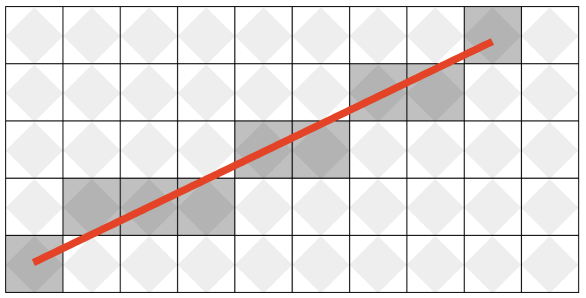{width=50%}

The last question we might want to answer is how do we find the pixels satisfying a chosen rasterization rule? We could check every single pixel in the image to see if it meets the condition.
However, considering the `O(n)` pixels in an image with respect to the at most `O(n)` "lit up" pixels, we have to do way too much computation.

### 1.5.2 Incremental Line Rasterization

Let's assume that a line is represented with integer endpoints `(u1, v1)` and `(u2, v2)`, and a slope `s = (v2 - v1)/(u2 - u1)`. We consider the very easy special case where:

- `u1 < u2, v1 < v2`, i.e. the line points towards the upper-right
- `0 < s < 1`, i.e. there is more change in `x` than in `y`

A common optimization for drawing the pixels is the so-called **Bresenham algorithm:**

```c
v = v1;
for(u = u1; u <= u2; u++) {
    v += s;
    draw(u, round(v));
}
```

# 2. Drawing Triangles

## 2.1 Introduction

If you know how to draw a triangle, you'll go a long way!

But why triangles and not other shapes, like squares, circles, or stars? Because you can make a lot of different shapes with triangles, such as squares, stars, etc.
They provide a very good compromise between their overall power of representing different shapes and the need for specialized software and hardware to handle them effectively.

We introduce the following two definitions:

- **Coverage:** What pixels does an object/triangle cover in the image?
- **Occlusion:** What object/triangle is closest to the camera in each pixel?

## 2.2 The Visibility Problem

We state the following informal definition of the **visibility problem:** What scene geometry is visible within each screen pixel?

This question somewhat corresponds to out two definitions from before:

- What scene geometry projects into a screen pixel? (_coverage_)
- Which geometry is visible from the camera at that pixel? (_occlusion_)

{width=50%}

Said differently, in terms of _rays,_ the visibility problem becomes:

- What scene geometry is hit by a ray from a pixel through the pinhole? (_coverage_)
- What object is the first hit along that ray? (_occlusion_)

## 2.3 Computing Triangle Coverage

Similar to the line problem from the previous chapter, the main question we have to answer is which pixel is _covered_ by a triangle.

_Example:_

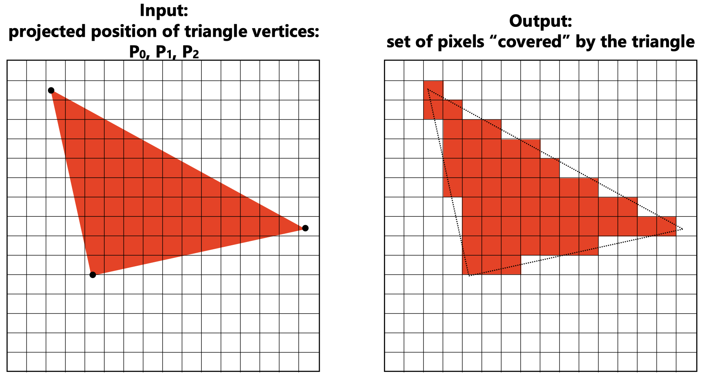{width=50%}

But what do we do with pixels that are only _partially covered_ by the triangle? One option is to compute the fraction of pixel area which is covered by the triangle, and then color the pixel according to this fraction:

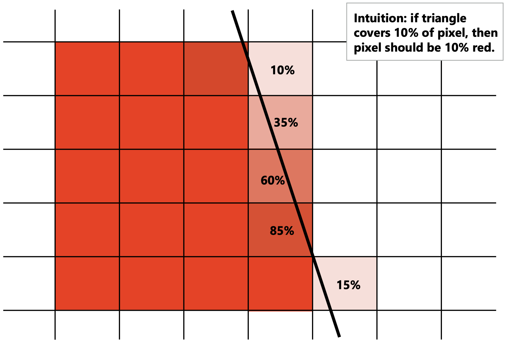{width=50%}

However, computing the area covered by a triangle can get tricky very fast, for example when dealing with the interactions between multiple triangles.
We may estimate the amount of overlap between a triangle and a pixel through _sampling._

## 2.4 Sampling 101

Consider a continuous function and 5 discrete measurement, our _samples:_

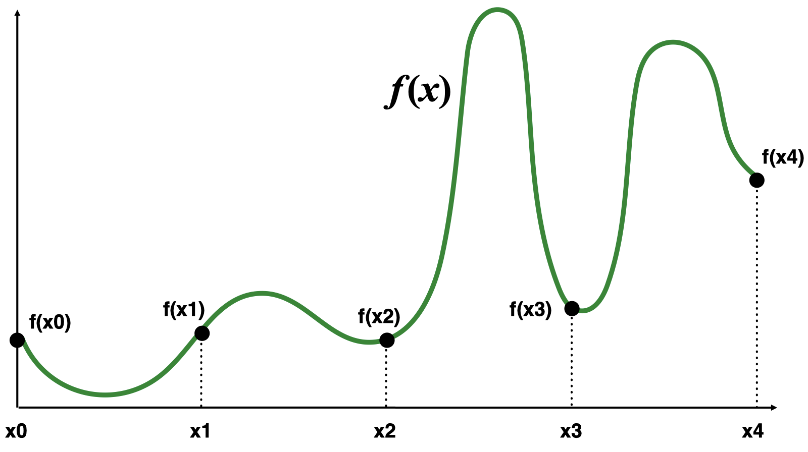{width=50%}

We can _reconstruct_ (or approximate) our original continuous functions with our discrete values through **sampling.**

### 2.4.1 Piecewise Constant Approximation

We define the reconstructed function $f_{recon}(x)$ to be the value of the sample closest to $x$, i.e. the nearest neighbor:

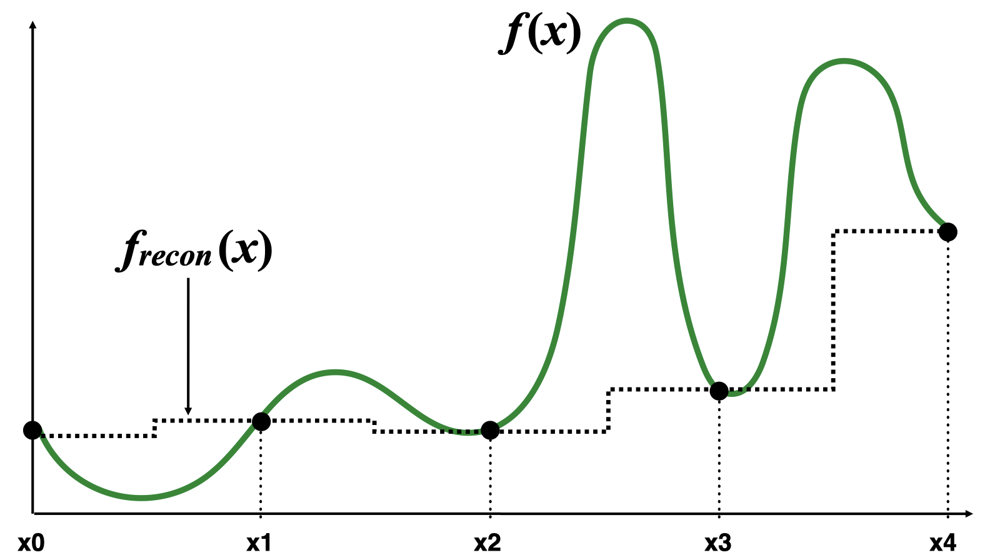{width=50%}

### 2.4.2 Piecewise Linear Approximation

We define the reconstructed function $f_{recon}(x)$ to be the linear interpolation between two samples closest to $x$.

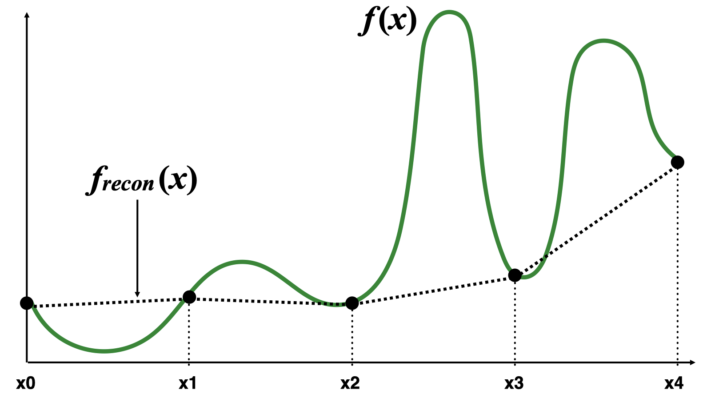{width=50%}

### 2.4.3 More Accuracy

The simplest and most obvious way to reconstruct our original 1D signal more accurately is to sample the signal more densely, i.e. to _increase the sampling rate._

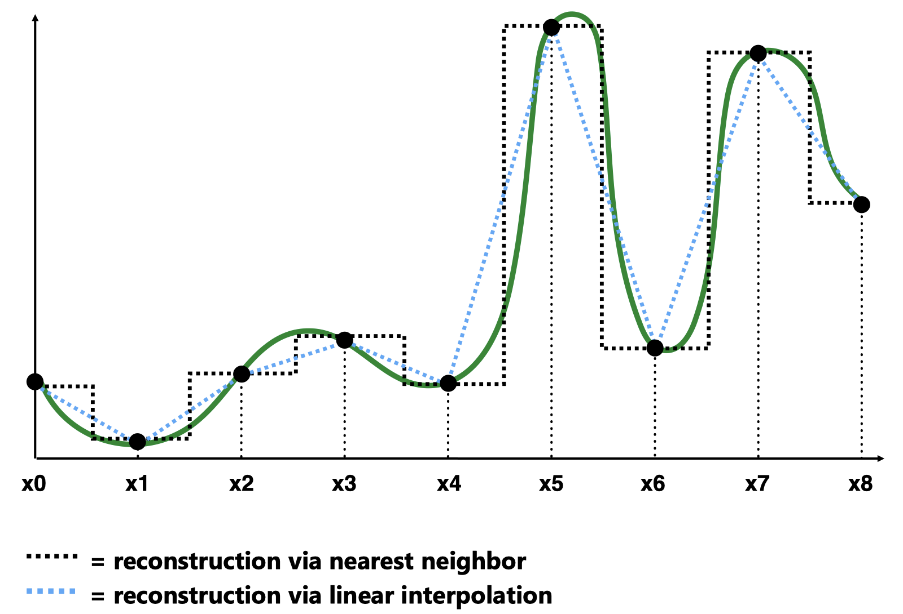{width=50%}

### 2.4.4 Mathematical Representation Of Sampling

Consider the _Dirac delta:_

$$
\begin{aligned}
&\delta(x) = \begin{cases} 0, &\text{for } x \neq 0 \\ \text{undefined}, &\text{at } x = 0  \end{cases}, \quad \text{such that} \\
&\int_{- \infty}^{\infty} \delta(x) \, dx = 1
\end{aligned}
$$

An _impulse_ has a **sifting property** which we define as follows:

$$
\int_{- \infty}^{\infty} f(x)\delta(x-a) \, dx = f(a),
$$

with an impulse occurring at $x = a$. Sampling the function is equivalent to multiplying it (inner product) by the Dirac delta!

#### Reconstruction As Convolution

{width=50%}

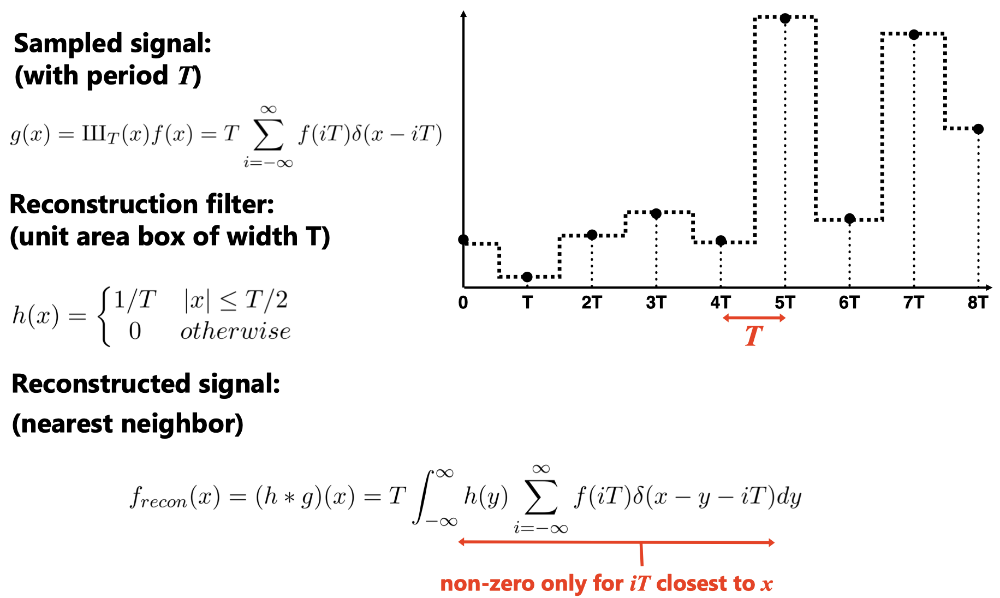{width=50%}

## 2.5 Coverage As A 2D Signal

We can think of the coverage as a 2D signal and define:

$$
\text{coverage}(x, \, y) = \begin{cases} 1, &\text{if the triangle contains point }(x, \, y) \\ 0, &\text{otherwise} \end{cases}
$$

We choose a point in the pixel which is said to be the _coverage sample point._

_Example:_

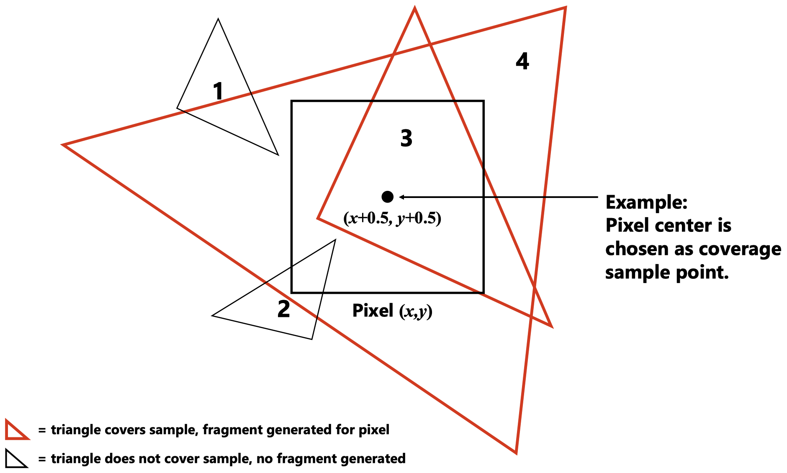{width=50%}

One (literal) edge case we have to consider is what happens if the edge of a triangle exactly falls onto our sample point. The OpenGL/Direct3D **edge rules** are:

When an edge falls directly on a screen sample point, the sample is classified as within the triangle if the edge is a _top edge_ or a _left edge:_

- Top edge: horizontal edge that is above all other edges
- Left edge: edge that is not exactly horizontal and is on the left side of the triangle

{width=50%}

## 2.6 Aliasing

### 2.6.1 1D Example

**Aliasing** describes the observation that high frequencies in an original signal masquerade as low frequencies after reconstruction due to undersampling:

{width=50%}

This leads to one obvious question when sampling: How densely should we be sampling?

### 2.6.2 Nyquist-Shannon Theorem

The _Nyquist-Shannon theorem_ says that a signal can be perfectly reconstructed if it is sampled with period $T < \frac{1}{2 \omega_0}$.

### 2.6.3 Supersampling

We can increase the density of the sampling coverage signal. The following example shows _stratified sampling_ using four samples per pixel:

{width=50%}

However, we now have more samples than pixels! This means we have to **resample**, i.e. converting from one discrete sampled representation to another:

{width=50%}

## 2.7 Sampling Triangle Coverage

### 2.7.1 Point-In-Triangle Test

To decide whether a sample point is inside the triangle we have to test whether it is "inside" all the three edges of the triangle.

For a point with the tree vertices $P_0, \, P_1, \, P_2$, we define:

$$
\begin{aligned}
&P_i = (X_i, \, Y_i) \\
&dX_i = X_{i+1} - X_i \\
&dY_i = Y_{i+1} - Y_i \\
&E_i(x, \, y) = (x - X_i) dY_i - (y-Y_i)dX_i = A_ix + B_iy + C_i \\
&E_i(x, \, y) = \begin{cases} 0, &\text{if point is on the edge} \\ >0, &\text{if point is outside of the edge} \\ <0, &\text{if point is inside the edge}  \end{cases}
\end{aligned}
$$

This leaves us with the following mathematical definition of whether a sample point $S = (sx, \, sy)$ is inside or outside a triangle:

$$
\begin{aligned}
\text{inside}(sx, \, sy) = &E_0(sx, \, sy) < 0 \, \&\& \\ &E_1(sx, \, sy) < 0 \, \&\& \\ &E_2(sx, \, sy) < 0
\end{aligned}
$$

### 2.7.2 Incremental Triangle Traversal

Another approach is based on the idea that rather than testing all possible points on a screen, we traverse them incrementally:

{width=50%}

### 2.7.3 Tiled Triangle Traversal

A modern approach is to traverse the triangle in blocks. We test all samples in the block against the triangle in parallel:

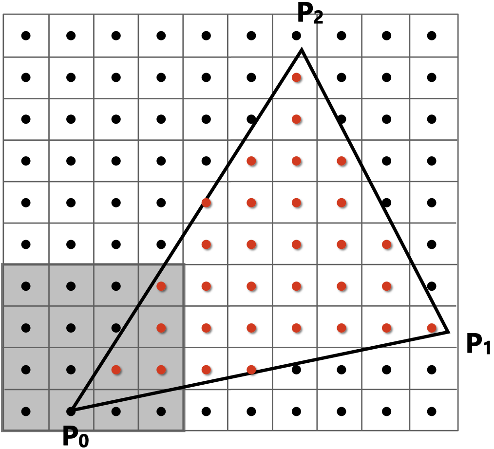{width=50%}

**Visual Computing - Lecture notes week 9**

- Author: Ruben Schenk
- Date: 10.12.2021
- Contact: ruben.schenk@inf.ethz.ch

# 3. Transforms

## 3.1 Introduction

### 3.1.1 Linear Transforms

In computer graphics, we are mainly concerned about **linear transforms.** This is due to:

- Computationally speaking, linear transforms and linear maps are easy to solve
- Linear transforms are still very powerful
- All maps can be approximated as linear maps (though sometimes only over a short distance, or small amount of time)
- Composition of linear transformations is linear, leading to uniform representation of transformations

### 3.1.2 Algebraic Definition

A map $f$ is _linear_ if it maps vectors to vectors, and if for all vectors $u, \, v$ and scalars $\alpha$ we have:

$$
f(u + v) = f(u) + f(v) \\ f(\alpha u) = \alpha f(u)
$$

For maps between $\mathbb{R}^m$ and $\mathbb{R}^n$, we can give an even more explicit definition:

If a map can be expressed as $f(u) = \sum_{i = 1}^m u_i a_i$, with fixed vectors $a_i$, then it is linear.

_Example:_

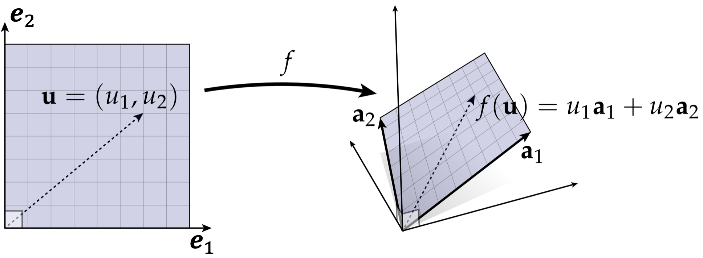{width=50%}

$u$ is a linear combination of $e_1$ and $e_2$. $f(u)$ is the _same_ linear combination, but of $a_1$ and $a_2$, and we have that $a_1 = f(e_1)$ and $a_2 = f(e_2)$.

## 3.2 Scale

{width=50%}

**Scaling** is simply defined by either scalar multiplication of the whole vector (_uniform scale_) or scalar multiplication of specific basis vectors (_non-uniform scale_).

$$
S(x) = x_1ae_1 + x_2be_2 = \begin{bmatrix} a & 0 \\ 0 & b \end{bmatrix} \cdot x
$$

## 3.3 Rotation

{width=50%}

Mathematically, **rotations** can be defined by the following two formulae:

$$
R_{\theta}(e_1) = (\cos \theta, \, \sin \theta) = a_1 \\
R_{\theta}(e_2) = (- \sin \theta, \, \cos \theta) = a_2
$$

Which leads us, due to the linearity of rotations, to the following simple formula:

$$
R_{\theta}(x) = x_1 a_1 + x_2 a_2 = \begin{bmatrix} \cos \theta & -\sin \theta \\ \sin \theta & \cos \theta \end{bmatrix} \cdot x
$$

_Remark:_ Rotation around any other point than the origin is _not linear,_ since for linearity, the origin must map to the origin!

## 3.4 Reflection

For now, we only consider **reflection** about the $y$-axis and $x$-axis. They are expressed as:

- $Re_y(x) = x_1e_x \cdot (-1) + x_2e_y$
- $Re_x(x) = x_1e_x + x_2e_2 \cdot (-1)$

Those special cases are actually simple _non-uniform scales._

## 3.5 Shear

A **shear operation** (in the $x$ direction) is done by moving the upper edge along the $x$-axis by some defined amount.

{width=50%}

Mathematically, this operation is defined through:

$$
H_a(x) = x_1 \begin{bmatrix} 1 \\ 0 \end{bmatrix} + x_2 \begin{bmatrix} a \\ 1 \end{bmatrix} = \begin{bmatrix} 1 & a \\ 0 & 1  \end{bmatrix} \cdot x
$$

## 3.6 Translation

**Translation** describes mappings of the following form:

{width=50%}

We can denote this transformation by:

$$
T_b(x) = x_1 \begin{bmatrix} ? \\ ? \end{bmatrix} + x_2 \begin{bmatrix} ? \\ ? \end{bmatrix}
$$

such that $T_b(x) = x + b$ for some translation vector $b$.

_Remark:_ Translation is _not linear_, but affine.

## 3.7 2D Homogeneous Coordinates (2D-H)

### 3.7.1 Introduction

The key idea with **2D-H coordinates** is to _lift_ our 2D points into the 3D space. For example, our 2D point $(x_1, \, x_2)$ is represented as:

$$
(x_1, \, x_2) \Rightarrow \begin{bmatrix} x_1 \\ x_2 \\ 1 \end{bmatrix}
$$

This also leads to the change, that our 2D transforms are now represented by $3 \times 3$ matrices instead of $2 \times 2$.

_Example:_ The previously seen 2D rotation in homogeneous coordinates is defined by:

$$
\begin{bmatrix} \cos \theta & -\sin \theta & 0 \\ \sin \theta & \cos \theta & 0 \\ 0 & 0 & 1 \end{bmatrix} \cdot \begin{bmatrix} x_1 \\ x_2 \\ 1 \end{bmatrix}
$$

### 3.7.2 Translation In 2D-H Coordinates

One of our main interests in 2D-H coordinates is that we are able to define non-linear maps in 2D as linear maps in 3D/2D-H coordinates!

The translation operation expressed in 2D-H, i.e. as a $3 \times 3$ matrix multiplication, is given by:

$$
T_b(x) = x + b = \begin{bmatrix} 1 & 0 & b_1 \\ 0 & 1 & b_2 \\ 0 & 0 & 1 \end{bmatrix} \cdot \begin{bmatrix} x_1 \\ x_2 \\ x_3 \end{bmatrix} = \begin{bmatrix} x_1 + b_1x_3 \\ x_2 + b_2x_3 \\ x_3 \end{bmatrix}
$$

In our homogeneous coordinates, translation is a linear transformation!

_Remark:_ $x_3$ is usually set to $1$.

### 3.7.3 Points vs. Vectors

In computer graphics we often have to distinguish between _points_ and _vectors._

We define a vector to have $x_3 = 0$ in 2D-H and a point to have $x_3 \neq 0$ in 2D-H. To get from a point in 2D-H back to 2D, we simply divide all components by $x_3$.

{width=50%}

## 3.8 Composition Of Linear Transformations

We can **compose linear transforms** via matrix multiplication. This enables for simple and efficient implementation, since we can reduce a complex chain of transforms to a single matrix.

_Example:_ We take a look at the following transform: $R_{\pi / 4} S_{[1.5, \, 1.5]}x$

{width=50%}

## 3.9 Moving To 3D (And 3D-H)

Similar to 2D, we represent 3D transforms as $3 \times 3$ matrices and 3D-H transforms as $4 \times 4$ matrices.

_Example:_ 

- A _scale_ in 3D is given by:

$$
S_S = \begin{bmatrix} S_x & 0 & 0 \\ 0 & S_y & 0 \\ 0 & 0 & S_z  \end{bmatrix}, \quad S_S = \begin{bmatrix} S_x & 0 & 0 & 0 \\ 0 & S_y & 0 & 0 \\ 0 & 0 & S_z & 0 \\ 0 & 0 & 0 & 1  \end{bmatrix}
$$

- A _shear_, in $x$ and based on the $y, \, z$ position, is given by:

$$
H_{x, \, d} = \begin{bmatrix} 1 & d_y & d_z \\ 0 & 1 & 0 \\ 0 & 0 & 1  \end{bmatrix}, \quad H_{x, \, d} = \begin{bmatrix} 1 & d_y & d_z & 0 \\ 0 & 1 & 0 & 0 \\ 0 & 0 & 1 & 0 \\ 0 & 0 & 0 & 1  \end{bmatrix}
$$

- A _translation_ by vector $b$:

$$
T_b = \begin{bmatrix} 1 & 0 & 0 & b_x \\ 0 & 1 & 0 & b_y \\ 0 & 0 & 1 & b_z \\ 0 & 0 & 0 & 1 \end{bmatrix}
$$

- Rotation about $x$-axis:

$$
R_{x, \, \theta} = \begin{bmatrix} 1 & 0 & 0 \\ 0 & \cos \theta & - \sin \theta \\ 0 & \sin \theta & \cos \theta  \end{bmatrix}
$$

- Rotation about $y$-axis:

$$
R_{y, \, \theta} = \begin{bmatrix} \cos \theta & 0 & \sin \theta \\ 0 & 1 & 0 \\ - \sin \theta & 0 & \cos \theta  \end{bmatrix}
$$

- Rotation about $z$-axis:

$$
R_{z, \, \theta} = \begin{bmatrix} \cos \theta & - \sin \theta & 0 \\ \sin \theta & \cos \theta & 0 \\ 0 & 0 & 1  \end{bmatrix}
$$

# 4. Perspective Projection Transformations, Geometry and Texture Mapping

## 4.1 Perspective Projection Transformations

### 4.1.1 Basic Perspective Projection

When doing basic perspective projection, the desired _perspective projection result_ (some 2D point), is given by:

$$
p_{2D} = (\frac{x_x}{x_z}, \, \frac{x_y}{x_z})
$$

The procedure for a basic perspective projection, follows 4 steps:

1. Input point in 3D-h: $x = (x_x, \, x_y, \, x_z, \, 1)$
2. Applying map to get the projected point in 3D-H: $Px = (x_x, \, x_y, \, x_z, \, x_z)$
3. Point projected to 2D-H by dropping the $z$ coordinate: $p_{2D-H} = (x_x, \, x_y, \, x_z)$
4. Point in 2D by homogeneous divide: $p_{2D} = (\frac{x_x}{x_z}, \, \frac{x_y}{x_z})$

{width=50%}

### 4.1.2 The View Frustum

The **view frustum** denotes the region in space that will appear on the screen.

{width=50%}

We want a transformation that maps view frustum to a unit cube, such that computing screen coordinates in that space becomes trivial.

Define the following properties:

- $\theta$ : The field of view in the $y$ direction ($h = 2 \cdot \tan \Big(\frac{\theta}{2} \Big)$)
- $f = \cdot \Big(\frac{\theta }{2} \Big)$
- $r$ : The aspect ratio, i.e. $\frac{\text{width}}{\text{height}}$

Then, we can define the _transformation matrix from frustum to unit cube_ as:

$$
P = \begin{bmatrix} \frac{f}{r} & 0 & 0 & 0 \\ 0 & f & 0 & 0 \\ 0 & 0 & \frac{zfar + znear}{znear - zfar} & \frac{2 \cdot zfar \cdot znear}{znear - zfar} \\ 0 & 0 & -1 & 0  \end{bmatrix}
$$

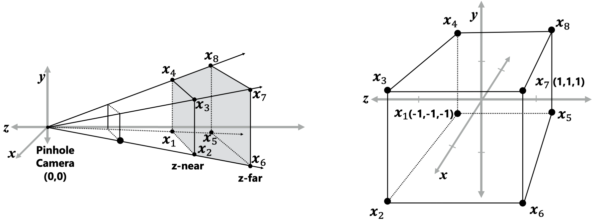{width=50%}

## 4.2 Geometry

### 4.2.1 Implicit Representations of Geometry

In an **implicit representation**, points aren't known directly, but satisfy some relationship. For example, we might define a unit sphere as all points $x$ such that $x^2 + y^2 + z^2 = 1$.
Implicit surfaces make some tasks easy, such as deciding whether some point is inside or outside our implicit surface.

### 4.2.2 Explicit Representations of Geometry

In an **explicit representation,** all points are given directly. For example, the points on a sphere are $(\cos u \sin v, \, \sin u \sin v, \, \cos v)$ for $0 \leq u < 2 \pi$ and $0 \leq v < \pi$.
There are many explicit representations in graphics, such as:

- Triangle meshes
- Polygon meshes
- Point clouds
- etc.

Explicit surfaces make some tasks easy, such as sampling. However, they also make some tasks hard, such as deciding whether a given point is inside or outside our surface.

**Visual Computing - Lecture notes week 10**

- Author: Ruben Schenk
- Date: 13.12.2021
- Contact: ruben.schenk@inf.ethz.ch

### 4.2.3 L-Systems (Implicit)

#### Introduction

The underlying computational system to **L-systems** is simple:

- The geometry is governed by simple rules
- The end result has interesting, useful, and surprising properties
- **L** stands for _Lindenmayer,_ the inventor of these types of systems

An **L-system** is a set of grammar rules, a start symbol, and semantics, i.e. a way of interpreting the grammar strings.

_Example:_ We define our grammar to have a start string `AAA` and the following two rules:

```bnf
rule 1: A -> BBC
rule 2: B -> abA
```

We might furthermore define the following semantics:

```bnf
a = forward 10
b = left rand(10, 40)
A = right rand(10, 40), foward 5
C = disc diameter rand(2, 5), forward 10
```

This can lead to something like the following geometry:

{width=50%}

#### von Koch Snowflake Curve

We define the following grammar:

```bnf
Symbols: {F, +, -}
Start symbol: {F}
Rules: F -> F+F--F+F
Semantics:
- F = forward 1
- + = rotate left 60
- - = rotate right 60
```

{width=50%}

#### Branching Structures

We assume that `[` pushes the state onto the stack and `]` pops the state from the stack. Furthermore, we use `[` to start a branch and `]` when finished returning to its base.

With those additional symbols, we can define three rules for different types of branching:

- _Monopodial:_ The trunk extends undeviated to the top and branches extend perpendicularly: `T -> T[+B][-B]T`
- _Sympodial:_ The trunk deviates to the top and branches extend perpendicularly: `T -> T[--B]+T`
- _Binary:_ Trunk terminates at the first branching point and branches deviate uniformly: `T -> T[+B][-B]`

_Example:_ The following figure shows an example of the L-System `F -> F[+F]F[-F]F`:

{width=50%}

#### Stochastic L-System

In **stochastic L-systems** we have conditional firing of rules:

```bnf
F -> <something> : probability1
F -> <something> : probability2
...
```

_Example:_ We can generate random bushes with the following three rules:

```bnf
F -> F[+F]F[-F]F : 0.33
F -> F[+F]F : 0.33
F -> F[-F]F : 0.34
```

Multiple applications of the above rules will lead to a geometry similar to the figure below:

{width=50%}

### 4.2.4 Point Cloud (Explicit)

**Point clouds** are the simplest representation for geometries, they are simply a list of points:

- Easily represent any kind of geometry
- Useful for large datasets (>> 1 point per pixel)
- Difficult to draw in undersampled regions
- Hard to do processing and simulation

### 4.2.5 Polygonal Mesh (Explicit)

In a **polygonal mesh,** we store vertices and polygons (most often triangles or quads). They are easier to do processing, simulation, and adaptive sampling.
This is perhaps the most common representation in computer graphics.

A **polygon** consists of vertices $v_0, \, v_1,..., \, v_{n-1}$ and edges $\{(v_0, \, v_1), \, (v_1, \, v_2),... \}$. The line segments must for a closed loop!

A **polygonal mesh** is a set $M = \langle V, \, E, \, F \rangle$, consisting of a set of vertices $V$, a set of edge $E$, and a set of faces $F$. It has the following properties:

- Every edge belongs to at least one polygon
- The intersection of two polygons in $M$ is either empty, a vertex, or an edge

Let's introduce some useful definitions:

- _Vertex degree (Valence):_ Number of edges incident to a vertex.
- _Boundary:_ The set of all edges that belong to only one polygon

{width=50%}

#### Mesh Data Structures

With **mesh datastructures** we can store the geometry and topology of some object:

- _Geometry:_ The vertex locations
- _Topology:_ How vertices are connected (i.e. the edges and faces)

The simplest storage option for mesh datastructures is to simply store them in an **indexed face set:**

{width=50%}

### 4.2.6 Surface Normals

We can describe the power of a (light) beam in terms of its **irradiance,** i.e. the energy per time, per area, or:

$$
E = \frac{\Phi}{A},
$$

where $\Phi$ is the flux of the beam of light and $A$ is the surface area to which the beam is incident.

If the beam is incident to an angled surface, it will cover more area, and therefore the irradiance must be smaller! **Lambert's Law** states that the irradiance at some surface is proportional to the cosine of the angle between the light direction and the surface normal, or:

$$
E = \frac{\Phi}{A'} = \frac{\Phi \cos \theta}{A}
$$

{width=50%}

#### N-dot-L Lightning

**N-dot-L lightning** is one of the most basic ways to shade a surface: One simply takes the dot product of a unit surface normal (_N_) and the unit direction to the light source (_L_).

{width=50%}

## 4.3 Texture Mapping

### 4.3.1 Texture Coordinates

**Texture coordinates** define a mapping from surface coordinates (points on a triangle) to points in the texture domain.

{width=50%}

### 4.3.2 Texture Space Samples

To do a texture mapping, we need some space samples. We can sample some positions in the $XY$ screen space and then use the same sample positions in the texture space.
However, this can lead to **perspective-incorrect interpolation:**

{width=50%}

This is due to perspective projection. Barycentric interpolation of values in $XY$ screen coordinates do not correspond to values that vary linearly on the original triangle!

{width=50%}

### 4.3.3 Filtering Textures

Due to resizing, our rendering pixels from our image may be much larger or smaller than the pixels available of our texture. This leads to minification and magnification:

- _Minification:_ The area of screen pixel maps to a large region of texture (filtering required). One texel corresponds to far less than a pixel on the screen.
- _Magnification:_ The area of screen pixel maps to a tiny region of texture (interpolation required). One texel maps to many screen pixels.

#### Mipmap (L. Williams 83)

The idea of the **Mipmap** is to prefilter the texture data to remove high frequencies. Texels at higher levels store the integral of the texture function over a region of texture space (downsampled images), i.e. they represent low-pass filtered versions of the original texture signal.

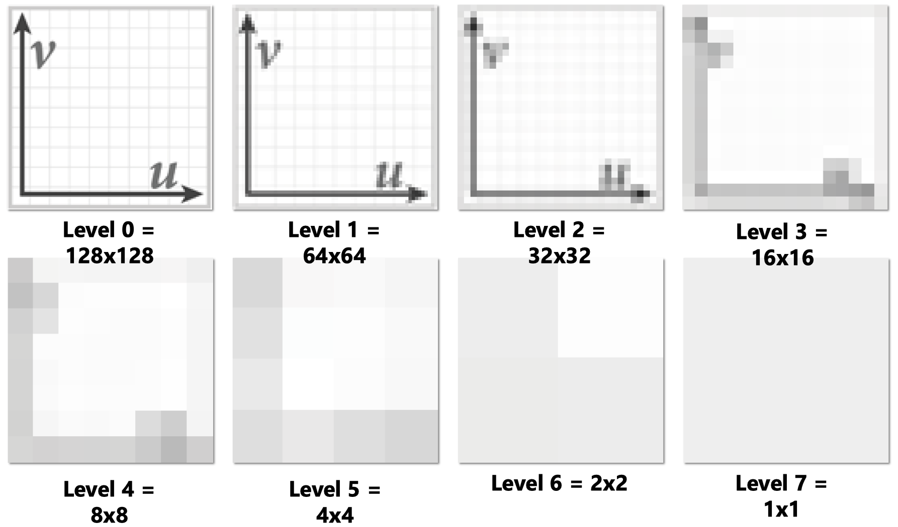{width=50%}

To decide which level $d$ to use, we calculate the differences between texture coordinate values of neighboring screen samples:

{width=50%}

# 5. The Rasterization Pipeline

## 5.1 Occlusion

### 5.1.1 Introduction

**Occlusion** tries to answer an important question we have already seen: Given some number of overlapping triangles, which triangle is visible at each pixel?

We will explore some techniques to solve this problem in the following subchapters.

### 5.1.2 The Depth Buffer (Z-Buffer)

We can determine the occlusion by using a **Z-buffer.** For each coverage sample point, the depth-buffer stores the depth of the closest triangle at this sample point that has been processed by the render so far. We use a grayscale value for each sample point to indicate the distance:

- Black = indicates a small distance
- White = indicates a large distance

_Example: Rendering three opaque triangles_

1. We start by processing a yellow triangle with depth 0.5:

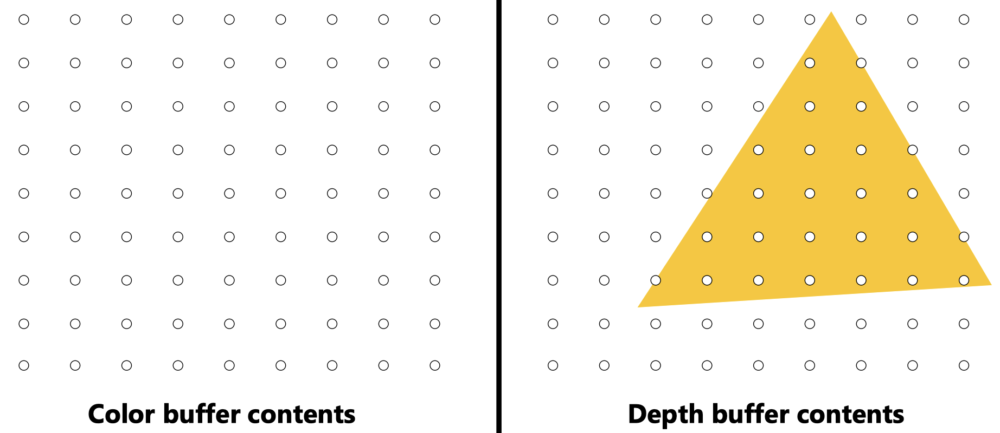{width=50%}

2. After processing the first triangle, we end up with a color buffer and depth buffer as shown below:

{width=50%}

3. Next we process a blue triangle with depth 0.75. We end up with buffers like this:

{width=50%}

4. Finally, we process a red triangle with depth 0.25. Our final color and depth buffer looks like this:

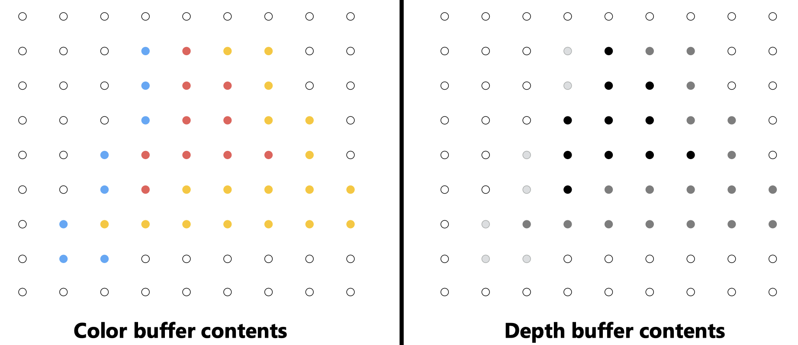{width=50%}

5. The final picture is:

{width=50%}

The occlusion algorithm using the depth buffer is simple and given by:

```c
bool pass_depth_test(d1, d2) {
    return d1 < d2;
}

depth_test(tri_d, tri_color, x, y) {
    if(pass_depth_test(tri_d, zbuffer[x][y])) {
        zbuffer[x][y] = tri_d;
        color[x][y] = tri_color;
    }
}
```

## 5.2 Compositing

### 5.2.1 Alpha / RGBA

We can represent _opacity_ as alpha. **Alpha** describes the opacity of an object:

- Fully opaque: $\alpha = 1$
- 50% transparent: $\alpha = 0.5$
- Fully transparent: $\alpha = 0$

{width=50%}

### 5.2.2 The Over Operator

The **over operator** defines what happens if we composite image `B` with opacity $\alpha_B$ over an image `A` with opacity $\alpha_A$.
We have the images `A` and `B` as:

$$
A = [A_r \quad A_g \quad A_b \quad \alpha_A]^T \\
B = [B_r \quad B_g \quad B_b \quad \alpha_B]^T
$$

The _composited color_ is then given by:

$$
C = \alpha_BB + (1 - \alpha_B)\alpha_AA
$$

Furthermore, the opacity of the "image of overlap" is given by:

$$
\alpha_C = \alpha_B + (1 - \alpha_B)\alpha_A
$$

We might do some optimization and use _premultiplied alpha._ The result is equivalent to above:

$$
A' = [\alpha_AA_r \quad \alpha_AA_g \quad \alpha_AA_b \quad \alpha_A]^T \\
B' = [\alpha_BB_r \quad \alpha_BB_g \quad \alpha_AA_b \quad \alpha_B]^T \\
C' = B' + (1 - \alpha_B)A'
$$

The color buffer algorithm with semi-transparent surfaces is given by:

```c
over(c1, c2) {
    return c1 + (1 - c1.a) * c2;
}

update_color_buffer(tri_d, tri_color, x, y) {
    if(pass_depth_test(tri_d, zbuffer[x][y])) {
        color[x][y] = over(tri_color, color[x][y]);
    }
}
```

_Remark:_ Triangles must be rendered in back to front order!

## 5.3 End-to-end Rasterization Pipeline

### 5.3.1 The Real-time Graphics Pipeline

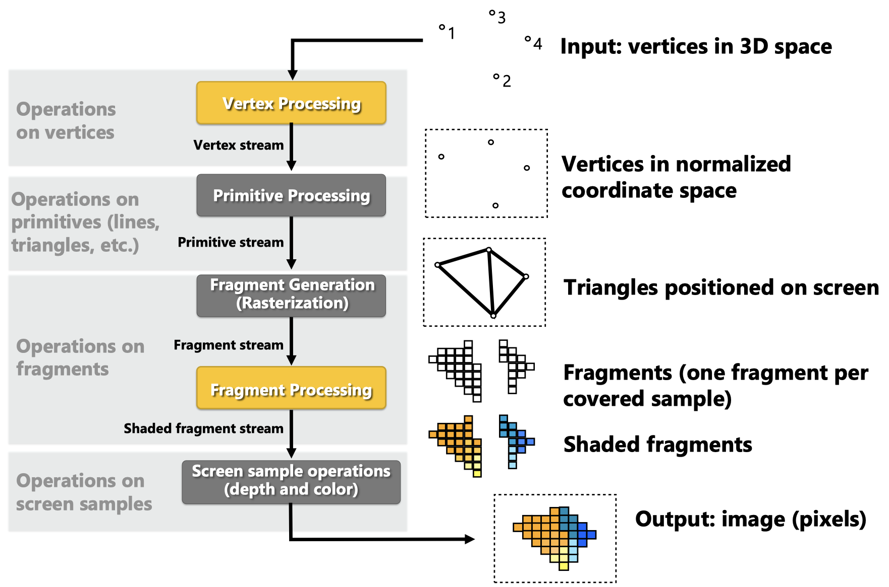{width=50%}

### 5.3.2 Drawing Triangles: Step-by-step

#### Inputs

We are given the following inputs:

```c
list_of_positions = {
    v0x, v0y, v0z,
    v1x, v1y, v1z,
    v2x, v2y, v2z,
    v3x, v3y, v3z,
    v4x, v4y, v4z,
    v5x, v5y, v5z,
};

list_of_textcoords = {
    v0u, v0v,
    v1u, v1v,
    v2u, v2v,
    v3u, v3v,
    v4u, v4v,
    v5u, v5v
};
```

Additionally:

- Some texture map
- Object-to-camera-space transform `T`
- Perspective projection transform `P`
- Size of the output image `(W, H)`

#### Step 1

Transform the triangle vertices into the camera space:

{width=50%}

#### Step 2

Apply the perspective projection transform to transform the triangle vertices into a normalized coordinate space:

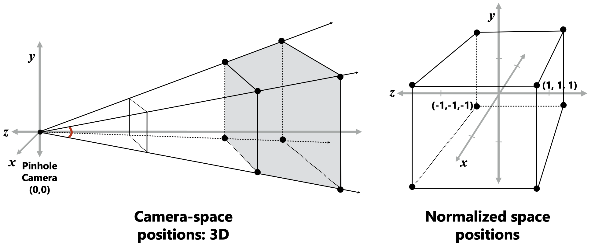{width=50%}

#### Step 3

Discard triangles that lie completely outside the unit cube (since they are off-screen) and clip triangles that extend beyond the unit cube to the unit cube:

{width=50%}

#### Step 4

Transform the vertex $xy$ positions from the normalized coordinates into the screen coordinates (based on the screen size `(w, h)`):

{width=50%}

#### Step 5

Preprocess the triangles, i.e. compute the triangle edge equations and the triangle attribute equations.

#### Step 6

Do the sample coverage and evaluate attributes `Z, u, v` at all covered samples:

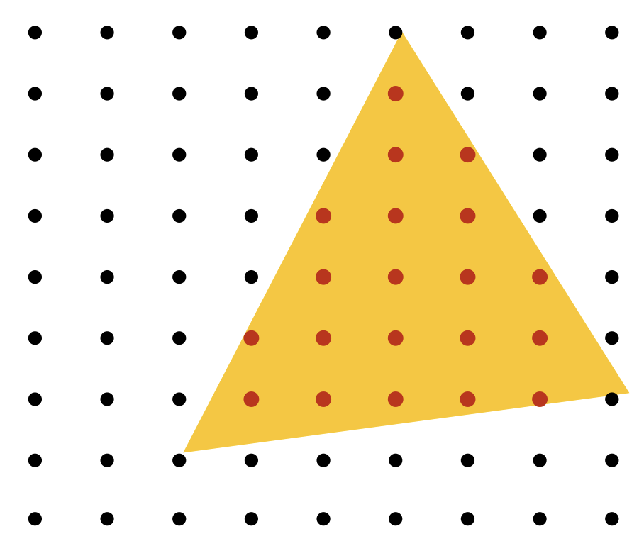{width=50%}

#### Step 7

Compute the triangle color at the sample point through color interpolation, sample texture map, or more advanced shading algorithms:

{width=50%}

#### Step 8

Perform the depth test and update the depth value at the covered samples:

{width=50%}

#### Step 9

Update the color buffer if the depth test passed:

{width=50%}

### 5.3.3 Shadow Mapping

**Shadow mapping** is a multi-pass rasterization approach:

- We render every scene (depth buffer only) from the location of the light source. Everything "seen" from this point of view is directly lit.
- We then render the scene from the location of the camera. We need to transform every screen sample to light coordinate frames and perform a depth test (if the test fails, the sample is in the shadow).

## 5.4 Reflections

### 5.4.1 Modelling Reflections

Reflections are modelled based on an environment mapping:

1. Place the camera at the origin of the location of the reflective object, and render 6 different views.
2. Use the real camera ray reflected about the surface normal to determine which texel in the cube map it hits.
3. This will approximate the appearance of the reflective surface.

### 5.4.2 GPUs

GPU's are specialized processor for executing graphics pipeline computations. They render highly complex 3D scenes:

- 100's of thousands to millions of triangles in a scene
- Complex vertex and fragment shader computations
- High resolution screen outputs (2-4 Mpixel + supersampling)
- 30-60 fps

**Visual Computing - Lecture notes week 11**

- Author: Ruben Schenk
- Date: 14.12.2021
- Contact: ruben.schenk@inf.ethz.ch

# 6. Light, Color And The Rendering Equation

## 6.1 What Is Color?

### 6.1.1 Introduction

**Light** is electromagnetic radiation, and **color** is its frequency, in other word: Light is oscillating electric and magnetic fields and its frequency determines the color of the light.

Most light is _not visible_ to the human eye. The frequencies that are visible to the human eyes are called the **visible spectrum.** These frequencies are what we think of as color.

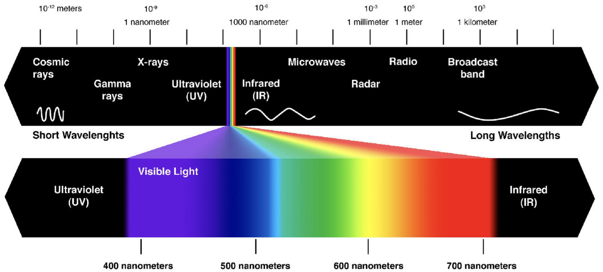{width=50%}

### 6.1.2 Description Of Light

We already saw the **emission spectrum** for the sun. In general, it tells us how much light is _produced_ and is useful to compare against other sources of light, such as lightbulbs.
Another very useful description is the **absorption spectrum**, which tells us how much light is _absorbed,_ e.g. turned into heat. It is useful to characterize color of paint, ink, etc.

While the emission spectrum is intensity as a function of frequency, the absorption spectrum is a fraction absorbed as a function of frequency. Light that is not absorbed is _reflected._

This is the fundamental description of light: Intensity, emission and absorption as a function of frequency.

## 6.2 The Eye

The eye consists of two types of photoreceptor cells: rods and cones.

- _Rods_ are primary photoreceptors under dark conditions.
- _Cones_ are primary receptors under high-light viewing conditions.

There are three types of cones: S, M, and L cones. These correspond to a peak response at short, medium, and long wavelengths.

The human eye does not directly measure the spectrum of incoming light, but three response values `(S, M, L)` by integrating the incoming spectrum against response functions of S-, M-, and L-cones. The brain then interprets these functions as colors.

{width=50%}

## 6.3 Additive And Subtractive Color Models

### 6.3.1 Introduction

Just like we had emission and absorption spectra, we have _additive_ and _subtractive_ color models:

- Additive: Used for combining colored lights, prototypical example is RGB
- Subtractive: used for combining paint colors, prototypical example is CMYK

### 6.3.2 Practical Encoding Of Color Values

One might ask how we encode colors digitally. One common encoding is through 8-bit per color _hexadecimal values._ Each hexadecimal number represents the intensity of red, green, and blue:

- `#000000` represents black
- `#ffffff` represents white

## 6.4 Geometric Model Of Light

**Photons** are a type of elementary particle. We can think of it as the most basic unit of light or electromagnetic radiation, they each carry a small amount of energy:

- Photons are massless and travel at the speed of light in a vacuum
- They bounce around when they interact with matter
- They travel in straight lines
- A ray of light informally means a lot of photons all moving in the same direction

### 6.4.1 Radiometry

One idea to capture photons hitting some surface is to just store the total number of hits that occur anywhere in the scene, over the complete duration of the scene. This captures the total energy of all the photons hitting the scene and is said to be the **radiant energy** (total number of hits).

The **radiant flux** describes the number of hits per second. Rather than recording the total energy over some arbitrary duration, it makes much more sense to record the total hits per second.

To make images, we also need to know where the hits occurred. So, we compute the hits per second in some unit area, which is called the **irradiance.**

{width=50%}

### 6.4.2 Measuring Illumination

For the radiant energy, we need to know how much energy is carried by a photon:

$$
Q = \frac{hc}{\lambda},
$$

where:

- $h$: Plack's constant
- $c$: speed of light
- $\lambda$: wavelength

The radiant flux is then equal to the energy per unit time received by the sensor:

$$
\Phi = \lim_{\Delta \to 0} \frac{\Delta Q}{\Delta t} = \frac{\text{d}Q}{\text{d}t}
$$

We can also go the other way around and say that the time integral of the flux is equal to the total radiant energy:

$$
Q = \int_{t_0}^{t_1} \Phi(t) \, \text{d}t
$$

If we are now given a sensor with area $A$, we can consider the average flux over the entire sensor area to be $\frac{\Phi}{A}$. The irradiance $E$ is then given by taking the limit of the flux as the sensor are becomes tiny:

$$
E(p) = \lim_{\Delta \to 0} \frac{\Delta \Phi(p)}{\Delta A} = \frac{\text{d}\Phi(p)}{\text{d}A}
$$

### 6.4.3 Radiance

The irradiance, i.e. the number of photons per area per time, along a given direction is called the **radiance.** We can compute:

$$
E = \int_{H^2} L(\omega) \cos \theta \, \text{d} \omega,
$$

where $E$ is the irradiance, $L$ is the radiance in direction $\omega$, and $\cos \theta$ is the angle between the normal and $\omega$.

The radiance is the solid angle density of irradiance:

$$
L(p, \, \omega) = \lim_{\Delta \to 0} \frac{\Delta E_{\omega}(p)}{\Delta \omega} = \frac{\text{d}E_{\omega}(p)}{\text{d}\omega},
$$

where $E_{\omega}$ means that the differential surface area is oriented to face in the direction $\omega$. In other words, radiance is energy along a ray defined by some origin point $p$ and a direction $\omega$.

#### Surface Radiance

We somehow need to distinguish between incident radiance and exitant radiance functions at a point on a surface:

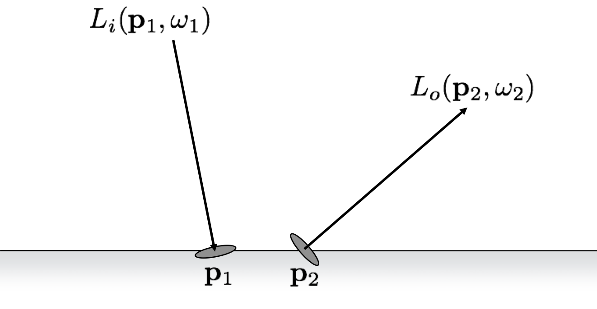{width=50%}

In general, $L_i(p, \, \omega) \neq L_o(p, \, \omega)$

## 6.5 The Rendering Equation

The core functionality of photorealistic renderer is to estimate the radiance at a given point, in a given direction. This is summed up by the **rendering equation:**

{width=50%}

### 6.5.1 Scattering Function

How can we model the **scattering** of light? There are many things that could happen to a photon:

- Bounces of the surface
- Transmitted through the surface
- Bounces around inside the surface
- Absorbed and re-emitted

The _bidirectional reflectance distribution function (BRDF)_ $f_r(\omega_i \to \omega_o)$ encodes the behavior of light that bounces off the surface. It answers the following question: Given some incoming direction $\omega_i$, how much light is scattered in the outgoing direction $\omega_o$?

The following properties hold:

- $f_r(\omega_i \to \omega_o) \geq 0$
- $\int_{H^2} f_r(\omega_i \to \omega_o) \cos \theta \, \text{d}\omega_i \leq 1$
- $f_r(\omega_i \to \omega_o) = f_r(\omega_o \to \omega_i)$

# 7. Ray Tracing

## 7.1 Rasterization & Ray-Casting

### 7.1.1 Rasterization

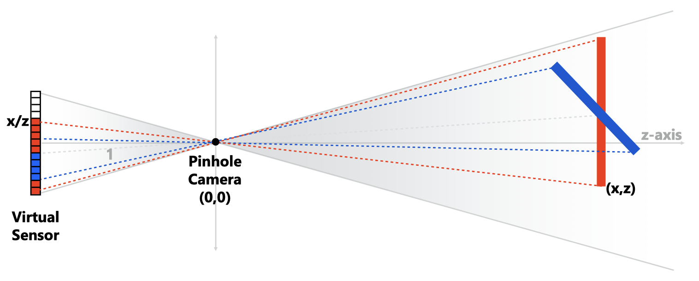{width=50%}

The basic rasterization algorithm consists of obtaining 2D samples and then computing the coverage, i.e. whether a projected triangle covers a 2D sample point, and the occlusion, i.e. calculating the depth buffer.

Finding samples in this case is easy since they are distributed uniformly on screen.

## 7.1.2 Ray-Casting

An alternative to rasterization is **ray-casting.**

{width=50%}

The basic ray casting algorithm looks as follows:

- Sample: some ray in 3D
- Coverage: does a ray hit the triangle? (ray-triangle intersection tests)
- Occlusion: closest intersection along the ray

### 7.1.3 Rasterization vs. Ray-Casting

Rasterization:

- Proceeds in triangle order
- Most processing is based on 2D primitives
- Stores a depth buffer

Ray-Casting:

- Proceeds in screen sample order
    - Never have to store depth buffer
    - Natural order for rendering transparent surfaces
- Must store entire scene

Both are approaches for solving the same problem: _determining "visibility"._

## 7.2 Shadows

Shadow can be computed by _recursive ray tracing:_

-  Shoot shadow rays towards the light source from points where camera rays intersect the scene
    - If they are unclouded, the point is directly lit by the light source

{width=50%}

Shadows computed via ray tracing are correct hard shadows. If done via rasterization, shadow map texture can lead to aliasing.

## 7.3 Reflections

Similar to shadow, reflections can be computed with recursive ray tracing by "simply" adding more secondary arrays:

{width=50%}

## 7.4 Ray-Scene Intersections

### 7.4.1 Line-Line Intersection

Assume we have two lines $ax = b$ and $cx = d$. How do we fine the intersection?

We simply have to check if there is a simultaneous solution which leads to the following liner system of equations:

$$
\begin{bmatrix} a_1 & a_2 \\ c_1 & c_2  \end{bmatrix} \begin{bmatrix} x_1 \\ x_2  \end{bmatrix} = \begin{bmatrix} b \\ d \end{bmatrix}
$$

### 7.4.2 Ray-Mesh Intersection

One very important question to answer is where a ray pierces a surface, since this allows us to do:

- Rendering: visibility, ray tracing
- Simulation: collision detection
- Interaction: mouse picking

The parametric equation of a ray is given by: $r(t) = o + t\text{d}$, where $r(t)$ is a point along the ray, $o$ is the origin, and $\text{d}$ is some unit direction.

#### Intersection With Implicit Surface

Recall that implicit surfaces are given by some function $f(x)$, i.e. all points such that $f(x) = 0$. If we want to find all points where a ray intersects a surface, we can simply plug in $r(t)$ for $x$ in $f(x)$ and then solve for $t$.

#### Ray-Plane Intersection

Suppose we are given some plane $N^Tx = c$. Then we can find the intersection with ray $r(t)$ with the following equation:

$$
r(t) = o + \frac{c - N^To}{N^T \text{d}} \text{d}
$$

#### Ray-Triangle Intersection

If we want to find the intersection of a ray and a triangle, we proceed as follows:

1. Parameterize the triangle by vertices $p_0, \, p_1, \, p_2$ using the barycentric coordinates:

$$
f(u, \, v) = (1-u-v)p_0 + up_1 + vp_2
$$

2. Plug parametric ray equation directly into the equation for the points on the triangle:

$$
p_0 + u(p_1-p_0) + v(p_2 - p_0) = o + td
$$

3. Solve for $u, \, v, \, t$:

$$
\begin{bmatrix} p_1 - p_0 & p_2 - p_0 & -d  \end{bmatrix} \begin{bmatrix} u \\ v \\ t  \end{bmatrix} = o - p_0
$$

### 7.4.3 Core Methods For Ray-Primitive Queries

We want to solve the following query: Given some primitive `p`, `p.intersect(r)` returns the value `t` corresponding to the point of intersection with ray `r`.

Now given a scene defined by a set of `N` primitives and a ray `r`, find the closes point of intersection of `r` with the scene. A very simple algorithm to solve this query could look like this:

```python
p_closest = NULL
t_closes = INF
for each primitive p in scene:
    t = p.intersect(r)
    if t >= 0 && t < t_closest:
        t_closest = t
        p_closest = p
```

This has complexity $O(n)$.

**Visual Computing - Lecture notes week 12**

- Author: Ruben Schenk
- Date: 14.12.2021
- Contact: ruben.schenk@inf.ethz.ch

# 8. Computer Animation

## 8.1 Describing Motion

### 8.1.1 Introduction

How we describe motion on a computer is probably the most important question to answer when talking about motion in general. From a computer graphics perspective, there are three main techniques to that:

- Artist directed, such as keyframing
- Data-driven, such as motion capturing
- Procedural, such as simulations

### 8.1.2 Keyframing

**Keyframing** is an important yet quite "simple" idea of describing motion. The basic idea is to specify important events in our motion only, and let the computer fill in the rest via interpolation or approximation.

{width=50%}

## 8.2 Spline Interpolation

### 8.2.1 Interpolation

The basic idea behind **interpolation** data is to connect the dots, i.e. the given sample points. One such technique is _piecewise linear interpolation:_

{width=50%}

It might be simple, but it yields a rather rough motion.

Another common interpolation technique is _piecewise polynomial interpolation:_

{width=50%}

### 8.2.2 Splines

In general, a **spline** is any piecewise polynomial function. In 1D, splines interpolate data over the real line:

$$
(t_i, \, f_i), \quad i = 0,...,n
$$

"_Interpolates_" in that case just means that the function exactly passes through those values, i.e.:

$$
f(t_i) = f_i \quad \forall i
$$

The only other condition is that the function is a _polynomial_ when restricted to any interval between the knots:

$$
\text{for } t_i \leq t \leq t_{i+1}, \, f(t) = \sum_{j = 1}^d c_it^j =: p_i(t)
$$

The splines most commonly used for interpolation are _cubic,_ i.e. $d = 3.$

### 8.2.3 Fitting Cubic Polynomials To Endpoints

If we want to connect two end points with a cubic polynomial, there are many solutions! Cubic polynomials have four _degrees of freedom,_ namely the four coefficients $(a, \, b, \, c, \, d)$ that we can manipulate and control.

However, we only need two degrees of freedom to specify the endpoints!

$$
p(t) = at^3 + bt^2 + ct + d \\
p(0) = p_0 \Rightarrow d = p_0
p(1) = p_1 \Rightarrow a + b + c + d = p_1
$$

This leaves us with four unknowns but only two equations, which is obviously not enough to determine the curve.

However, what if we also want to match the _derivatives_ at the endpoints?

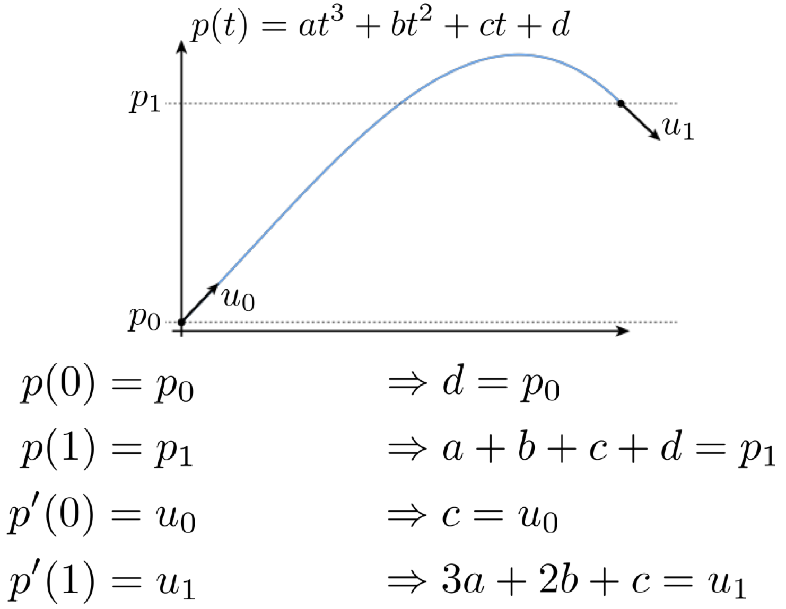{width=50%}

Then we end up with 4 equations and 4 unknowns, which lets us uniquely identify the cubic polynomial we are looking for.

### 8.2.4 Natural Splines

**Natural splines** are piecewise splines made out f cubic polynomials $p_i$.

{width=50%}

We want three conditions to hold for natural splines:

1. Interpolation at both endpoints:

$$
p_i(t_i) = f_i, \, p_i(t_{i + 1}) = f_{i + 1}, \quad i = 0,...,n-1
$$

2. Tangents agree at the endpoints, i.e. $C^1$ continuity:

$$
p'_i(t_{i + 1}) = p'_{i + 1}(t_{i + 1}), \quad i = 0,...,n-2
$$

3. Curvatures agree at the endpoints, i.e. $C^2$ continuity:

$$
p''_i(t_{i+1}) P p''_{i+1}(t_{i+1}), \quad i = 0,...,n-2
$$

If we look at the picture above, we see that for $n+1$ points we have $4n$ DOFs, which leads us to $2n + (n-1) + (n-1) = 4n-2$ equations. WE can pin down the remaining DOFs by setting the curvature to zero at the endpoints. This is what makes the curvature "_natural_".

### 8.2.5 Hermite/Bézier Splines

**Hermite/Bézier splines** are based on the idea that each cubic piece is specified by the endpoints and tangents, in contrast to natural splines where we define an additional point on which we have to exactly meet:

{width=50%}

Hermite splines have the following properties:

1. Endpoints interpolate data:

$$
p_i(t_i) = f_i, \, p_i(t_{i+1}) = f_{i + 1}, \quad i = 0,...,n-1
$$

2. Tangents interpolate some given data:

$$
p'_i(t_i) = u_i, \, p'_i(t_{i+1}) = u_{i+1}, \quad i = 0,...,n-1
$$

## 8.3 Rigging

### 8.3.1 Introduction

**Animation rigs** are user-defined mappings between a few parameters and the deformations of a high-res mesh. Animations are simply time trajectories specified for rig parameters.

### 8.3.2 Blend Shape Rigs

**Blend Shape rigs** are simple rigs based on a set of meshes (the input). The output is a blended mesh obtained through interpolation. The splines (or keyframes) specify the blending weights over time.

_Mathematically:_

- Input: set of meshes $M_i$ with vertices $x_i^j$ and blending weights $\alpha = (\alpha_1,...,\alpha_n)$
- Output: blended mesh $M$ through linear combination: $M = \sum_i\alpha_iM_i$, i.e. $x^j = \sum_i \alpha_ix_i^j$

### 8.3.3 Cage-Base Deformers

The idea behind **cage-based deformers** is to embed the model in a coarse mesh (cage), then deform the coarse mesh and reconstruct the hi-res geometry. For example, we can model the vertices as weighted sums of the cage vertices:

$$
v = \sum_{j = 1}^m w_j(v)c_j
$$

### 8.3.4 Skeletal Animation

Very often, shape implies the existence of a _skeleton,_ and a skeleton imposes a lot of structure in ho a character can move.

The key idea behind **skeletal animation** is to animate just the skeleton (much less DOFs), and then have the mesh to follow automatically.

### 8.3.5 Forward Kinematics

We define _kinematic skeletons_ as follows:

- Joints: local coordinate frames
- Bones: vectors between consecutive pairs of joints
- Each non-root bone defined in the frame of a unique parent
- Changes to parent frame affects all descendant bones
- Both skeleton and skin are designed in a rest pose

Assuming $n+1$ joints $0, \, 1,..., \, n$, where joint $0$ is the root, then each joint corresponds to a frame. $p(j)$ denotes the parent of joint $j$, and the frame of joint $j$ is expressed w.r.t the frame of $p(j)$:

$$
_{p(j)}R_j = \begin{bmatrix} r_{11}(j) & r_{12}(j) & r_{13}(j) & t_1(j) \\ r_{21}(j) & r_{22}(j) & r_{23}(j) & t_2(j) \\ r_{31}(j) & r_{32}(j) & r_{33}(j) & t_3(j) \\ 0 & 0 & 0 & 1  \end{bmatrix} = \begin{bmatrix} Rot(j) & t(j) \\ 0 & 1  \end{bmatrix},
$$

where $t(j)$ typically comes from a bind pose and $Rot(j)$ comes from some animation.

The transformation from frame $j$ to world is then given by:

{width=50%}

### 8.3.6 Skinning

The basic idea behind the _skinning process_ is that we simply move the vertices of the skin along with the bones! In a first attempt, we might assign each vertex to the closest bone, compute the world coordinates according to the bone's transformation and move the skin vertices along with it:

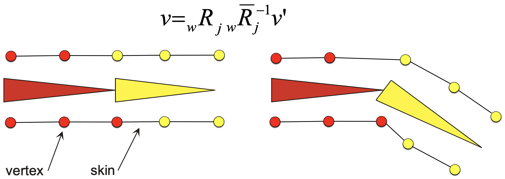{width=50%}

This process is also called **rigid skinning.**

#### Linear Blend Skinning

The attempt is similar to above, however we assign each vertex to multiple bones, and then compute the world coordinates as a convex combination. Weights define the influence of each bone on the vertex. This leads to an overall smoother deformation of the skin:

$$
v = \sum_j \alpha_j \,_wR_j \,_{\bar{w}}\bar{R}_j^{-1}v'
$$

{width=50%}

### 8.3.7 Inverse Kinematics

**Inverse kinematics** describes the problem that given some position of our character, compute the joint angles. This is one of the most fundamental techniques in animation and robotics!

The basic idea behind an IK algorithm is as follows:

1. Write down the distance between the final point and the target and set up the objective
2. Compute the gradient with respect to angles
3. Go downhill from there

### 8.3.8 The Uncanny Valley

> The uncanny valley is a concept first introduced in the 1970s by Masahiro Mori, then a professor at the Tokyo Institute of Technology. Mori coined the term "uncanny valley" to describe his observation that as robots appear more humanlike, they become more appealing—but only up to a certain point. Upon reaching the uncanny valley, our affinity descends into a feeling of strangeness, a sense of unease, and a tendency to be scared or freaked out. So the uncanny valley can be defined as people's negative reaction to certain lifelike robots.

{width=50%}

### 8.3.9 Motion Capture

**Motion capture** provides sparse signals, such as marker trajectories, from which a full body motion needs to be reconstructed.

This is a problem which is often-times posed as an optimization problem, for example in inverse kinematics.

**Visual Computing - Lecture notes week 13**

- Author: Ruben Schenk
- Date: 20.12.2021
- Contact: ruben.schenk@inf.ethz.ch

## 8.4 Physics-Based Animation

### 8.4.1 Introduction

We first differentiate between two important terms in the field of physics and physics-based animation:

- **Kinematics:** The branch of mechanics concerned with the motion of objects without reference to the forces which cause the motion.
- **Dynamics:** The branch of mechanics concerned with the motion of bodies under the action of forces.

### 8.4.2 The Animation Equation

We have already seen the _rendering equation_ which is concerned with rasterization and path tracing which give approximate solutions to the rendering equation.

The **animation equation** is concerned with the large spectrum of physical systems and phenomena, such as solids, fluids, elasticity, etc. For animations, the connection between force and motion is essential:

> A change in motion is proportional to the motive force impressed and takes place along the straight line in which that force is impressed. - Sir Isaac Newton, 1687

However, there is more to be said than $F = ma$:

- Every system has a _configuration_ $q(t)$
- It also has a _velocity_ $\dot{q} := \frac{d }{dt}q$
- It has some kind of _mass_ $M$
- There are _forces_ $F$ acting on the system

### 8.4.3 Generalized Coordinates

In physics, we often need to describe a system with many moving parts, e.g. a collection of billiard balls, each with position $x_i$. We usually collect them all into a single vector of **generalized coordinates.**

{width=50%}

We can think of $q$ as a single point moving along some trajectory in $\mathbb{R}^n$. If we take the time derivative of the generalized coordinates, we get **generalized velocity:**

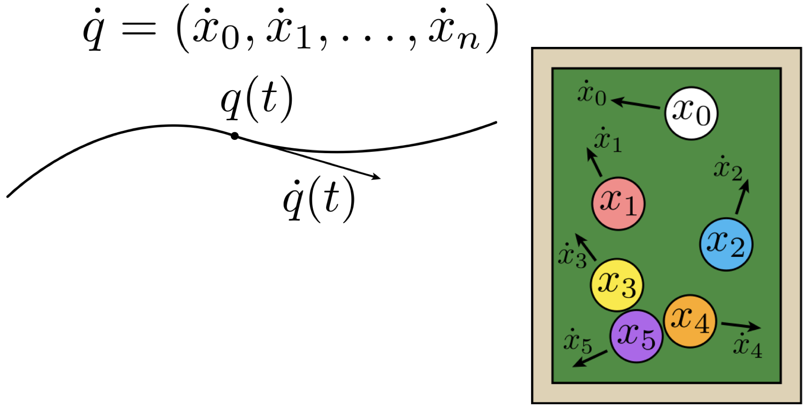{width=50%}

### 8.4.4 Ordinary Differential Equations

Many dynamical systems can be described via an **ordinary differential equation:**

$$
\frac{d}{dt}q = f(q, \, \dot{q}, \, t),
$$

where $\frac{d}{dt}$ is the change in configuration over time and $f$ is the velocity function.

_Example:_ Assume we have a function where the rate of growth is proportional to the value, i.e.

$$
\frac{d}{dt}u(t) = au,
$$

then our solution is given by $u(t) = be^{at}$.

Note that Newton's 2nd law is an ODE as well, i.e. $\ddot{q} = F/m$. We can also write this as a system of two first order ODEs, by introducing new variables for velocity:

$$
\dot{q} = v, \quad \dot{v} = \frac{F}{m} \\ \frac{d}{dt} \begin{bmatrix} q \\ v  \end{bmatrix} = \begin{bmatrix} v \\ F/m  \end{bmatrix}.
$$

### 8.4.5 Solving ODEs Numerically

When we are talking about solving ODEs we mean that given some initial conditions $q(0)$ and $\dot{q}(0)$, we want to find the function $q(t)$. Solving ODEs _numerically_ means solving numerical time integration:

$$
q(t + h) = q(t) + \int_t^{t + h} \dot{q}(t) \, dt
$$

We use some discrete approximation of the form

$$
\Delta q_i \simeq \int_t^{t + h} \dot{q}(t) \, dt,
$$

and then apply the following **numerical integration rules:**

{width=50%}

### 8.4.6 Forward Euler

**Forward Euler** describes a simple scheme: We evaluate the derivative at the current configuration and write the new state explicitly in terms of known data:

$$
q_{i + 1} = a_i + h \cdot \dot{q}_i \\
\dot{q}_{i + 1} = \dot{q}_i + h \cdot \ddot{q}_i = \dot{q}_i + hM^{-1}F(q_i, \, \dot{q}_i)
$$

_Example:_ Assume some simple linear ODE, i.e. $\dot{u} = -au, \, a > 0$. The exact solution to this ODE would be $u(t) = u(0)e^{-at}$, so $u_k \to 0$ as $l \to \infty$. The forward Euler approximation is given by:

$$
u_n = (1-ha)^nu_0,
$$

from where we can derive that this decays only if $|1-ha| < 1$, or equivalently $h < 2/a$, so in practice we many need very small time-steps!

### 8.4.7 Backward Euler

We might try something else and evaluate the velocity at some new configuration. This scheme is also known as **backward Euler.** The new configuration is then implicit, and we must solve for it:

$$
q_{i + 1} = q_i + h \cdot \dot{q}_{i + 1} \\
\dot{q}_{i + 1} = \dot{q}_i + h \cdot \ddot{q}_{i + 1} = \dot{q}_i + hM^{-1}F(q_{i + 1}, \, \dot{q}_{i+1})
$$

We can again observe the stability of the backward Euler with our previous example, i.e. $\dot{u} = -au, \, a > 0.$ The backward Euler approximation is given by:

$$
u_n = \Big (\frac{1}{1 + ha} \Big)^nu_0,
$$

which decays if $|1 + ha| > 1$, which is always true! Backward Euler is _unconditionally stable_ for linear ODEs.

**Visual Computing - Lecture notes week 14**

- Author: Ruben Schenk
- Date: 27.12.2021
- Contact: ruben.schenk@inf.ethz.ch

### 8.4.8 Partial Differential Equations

In contrast to ODEs, where an unknown function is described through its derivatives with respect to a single variable, **partial differential equations (PDEs)** describe an unknown function through its partial derivatives with respect to _multiple_ variables:

$$
\frac{\partial u (t, \, x)}{\partial t^2} = c^2 \frac{\partial u(t, \, x)}{\partial x^2}
$$

#### Fluid Simulation in Graphics

_Incompressible Navier Stokes Equations:_

$$
\nabla \cdot u = 0 \\
\frac{\partial u}{\partial t} + (u \cdot \nabla)u - v \nabla^2u = - \nabla w + g
$$

#### Elasticity in Graphics

_Governing Equations of Continuum Mechanics:_

$$
\nabla \cdot \sigma + f = m \cdot a
$$

#### Magnetism in Graphics

_Maxwell Equations (static case):_

$$
\nabla \cdot B = 0, \quad \nabla \times H = J \\
H = \frac{1}{\mu_0}B - M
$$

#### 1D Advection

Consider the following example, where we are given some initial temperature distribution $T_0(x) = T(x, \, 0)$ and some wind speed $c$. We want to find the temperature distribution $T(x, \, t)$ for any $t$:

{width=50%}

We can solve this problem _analytically:_

- Any $T(x, \, t)$ of the form $T(x, \, t) = f(x-ct)$ solves $\frac{\partial T}{\partial t} = -c \frac{\partial T}{\partial x}$
- The solution also needs to satisfy the initial condition $T(x, \, 0) = T_0(x)$
- The solution therefore is given by $T(x, \, t) = T_0(x-ct)$

_Note:_ Only simple PDEs can be solved analytically!

We might also solve the problem _numerically:_

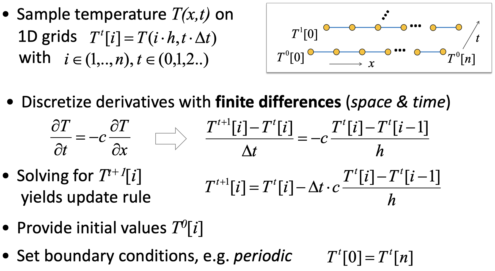{width=50%}

#### Some Notation

{width=50%}

#### PDE Classification

The **order** of a PDE is the order of the highest partial derivative. A PDE is said to be **linear** if the unknown function $u$ and its partial derivatives only occur linearly.

Second order linear PDEs are of high practical relevance. A second order linear PDE in 2 variables has the following form:

$$
Au_{xx} + 2Bu_{xy} + Cu_{yy} = F(x, \, y, \, u, \, u_x, \, u_y)
$$

A second order linear PDE in 2 variables can be classified into:

- _Hyperbolic:_ $B^2-AC > 0$ (wave equation)
- _Parabolic:_ $B^2-AC = 0$ (heat equation)
- _Elliptic:_ $B^2-AC < 0$ (Laplace equation)

#### Solving PDEs

Like ODEs, many interesting PDEs are difficult or impossible to solve analytically. The basic strategy is as follows:

- Pick a spatial discretization
- Pick a time discretization (forward Euler, backward Euler, etc.)
- As with ODEs, run a time-stepping algorithm

#### Spatial Discretization

Two basic ways to **discretize space** are the Lagrangian and the Eulerian approach:

{width=50%}

We observe the following trade-offs:

- Lagrangian:
    - Conceptually easy
    - Resolution/domain not limited by grid
    - Good particle distribution can be tough
    - Finding neighbors can be expensive
- Eulerian:
    - Fast, regular computation
    - Easy to represent
    - Simulation is "trapped" in a grid

#### The Laplace Operator

{width=50%}

_Discretization:_

{width=50%}

_Numerically solving the Laplace equation:_

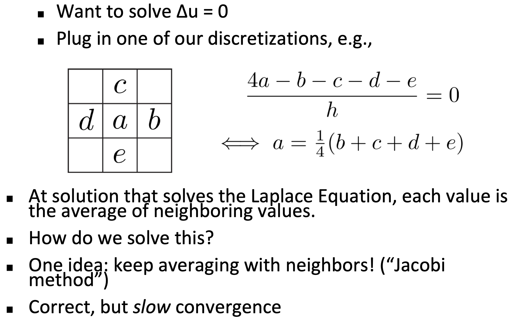{width=50%}
