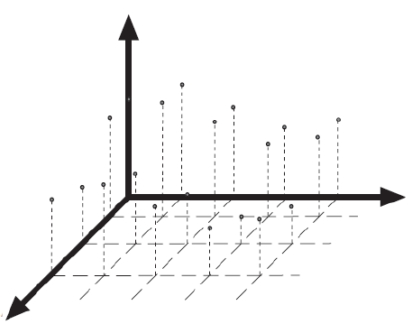
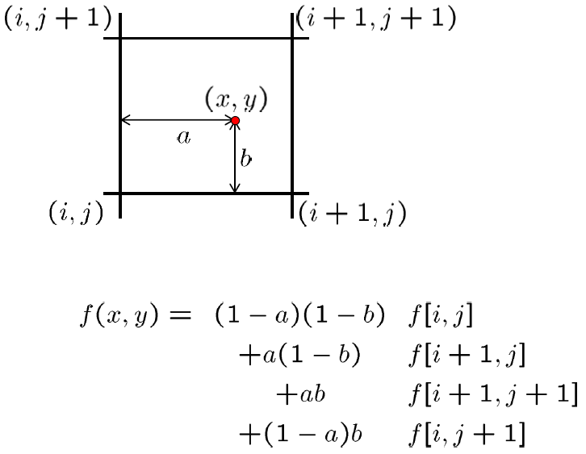
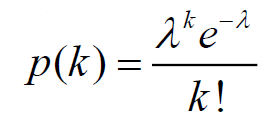

# 1. The Digital Image

## 1.1 What is an image?

### Image as a 2D signal

The **signal** is a function depending on some variable with physical meaning. The **image** is a continuous function, where we either have 2 variables `x y` which are the coordinates, or, in case of a video, three variables `x y` and the corresponding time in the video. Usually, the value of the function is the **brightness**.

_Images in Python:_

```python
    # Load a picture into Python
    import cv2
    img = cv2.imread('foo.jpg')

    # Display the image in Python
    cv2.imshow('My image', img)
    cv2.waitKey(0)

    # Print the image data array
    img

    # Print the size of the image array and create a subimage
    img.shape
    subimg = img[72:92, 62:82]
```

```python
    # Random image in Python
    import numpy as np
    import cv2
    t = np.random.rand(64, 64)
    cv2.imshow('Random', t)
    cv2.waitKey(0)
```

In summary, an **image** is a picture or pattern of a value varying in space and/or time. It is the representation of a _continuous_ function to a _discrete_ domain: `f : R^n -> S`.

As an example, for grayscale CCD images, `n = 2` and `S = R^+`.

### What is a pixel?

_A pixel is not a little square!_

**Pixels** are point measurements of a function (of the above described continuous function).

## 1.2 Where do images come from?

There are several things where pictures can come from:

- Digital cameras
- MRI scanners
- Computer graphics packages
- Body scanners
- Many more...

### Digital cameras

Simplified, the **digital camera** consists of the following parts and is said to be a _Charge Coupled Device (CCD)_:

{width=50%}

The **sensor array** can be < 1 cm^2 and is an array of _photosites_. Each photosite is a bucket of electrical charge, and this charge is proportional to the incident light intensity during the exposure.

The **analog to digital conversion (ADC)** measure the charge and digitizes the result. The conversion happens line by line in that charges in each photosite move down through the sensor array.

Example:

{width=50%}

Because each bucket has a finite capacity, if a photosite bucket is full, it can overflow to other buckets, which leads to **blooming**.

Even without any light, there will still be some current which can degrade the quality of a picture. CCD's produce thermally-generated charge, which results in a _non-zero output_ even in darkness. This effect is called the **dark current**.

## 1.3 CMOS

**CMOS** sensors have the same sensor elements as CCD. Each photo sensor has its own amplifier, which results in more noise and a lower sensitivity. However, since CMOS photo sensor use standard CMOS technology, we might put other components on the chip (such as "smart pixels").

### CCD vs. CMOS

_CCD_

- Mature technology
- Specific technology
- High production cost
- High power consumption
- Blooming
- Sequential readout

_CMOS_

- More recent technology
- Cheap
- Lower power consumption
- Less sensitive
- Per pixel amplification
- Random pixel access
- On chip integration with other components

### Rolling shutter

By resetting each line in the sensor line by line (the "shutter"), each line will start capturing light a little before the line below and so on. Each line in the picture is therefore a little behind in time as the line above.

## 1.4 Sampling in 1D

**Sampling** in 1D takes a function, and returns a vector whose elements are values of that function at the sample points.

Example:

{width=50%}

Sampling solves one problem with working with continuous functions. How do we store and compute with them? A common scheme for representing continuous functions is with **samples**: we simply write down the function's values as discrete values at many sample points.

### Reconstruction

**Reconstruction** describes the process of making samples back into a continuous function. We might do this for several reasons:

- For output where we need a realizable method
- For analysis or processing, where we need a mathematical method
- Instead of "guessing" what the function did in between sample points

### Undersampling

Unsurprisingly, if we undersample some function, we loose information.

Example: If we undersample the following `sin` wave, it gets indistinguishable from lower frequencies:

_Sample:_

{width=50%}

_Reconstruction 1:_

{width=50%}

_Reconstruction 2:_

{width=50%}

This effect is what we call **aliasing**, i.e. _"Signals travelling in disguise as other frequencies"_.

## 1.5 Sampling in 2D

**Sampling** in 2D takes a function and returns an array. We allow the array to be infinite dimensional and to have negative as well as positive indices.

Example:

_Function:_

{width=50%}

_Sample:_

{width=50%}

### Reconstruction

In 2D, a simple way to reconstruct a function from a sample is to use **bilinear interpolation**, which works essentially the same as linear interpolation: we calculate two lines in each direction, and then take the intersection of the two lines.

Example:

{width=50%}

## 1.6 Nyquist Frequency

We define the **Nyquist Frequency** as half the sampling frequency of a discrete signal processing system. The concept tells us, that if the signal's maximum frequency is at most the Nyquist frequency, then we can reconstruct the signal.

## 1.7 Quantization

When sampling, real valued functions will get digital values, i.e. integer values. This means that **quantization** is lossy: after quantization, the original signal cannot be reconstructed anymore.

This is in contrast to sampling, as a sampled but not quantized signal _can_ be reconstructed.

### Usual quantization intervals

The following are the most widely used quantization intervals:

- Grayscale image: `8 bit = 2^8 = 256` gray values
- Color image RGB (3 channels): `8 bit/channel = 2^24 = 16.7M` colors
- 12 bit or 16 bit for some sensors

## 1.8 Image Properties

### Image resolution

Simply tells the amount of pixels our pictures has.

### Geometric resolution

_How many pixels per area?_

Tells us how many pixels we have per a given area (e.g. how many pixels per square centimeter of picture).

### Radiometric resolution

_How many bits per pixel?_

Tells us how much information each pixel can store.

## 1.9 Image Noise

A common model is the **additive Gaussian noise**, which means that we measure some signal with our processor but have some deviation/noise in our measurement:

{width=50%}

One might also use the much more meaningful assumption of **Poisson noise**:

{width=50%}

### SNR

The **signal-to-noise ration (SNR)** `s` is an index of image quality:

{width=50%}
