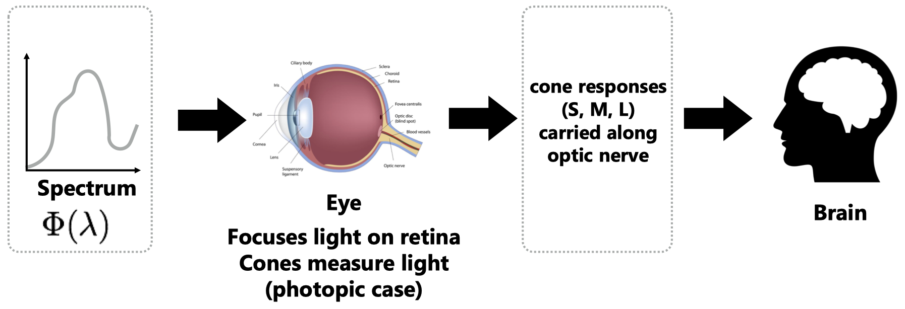
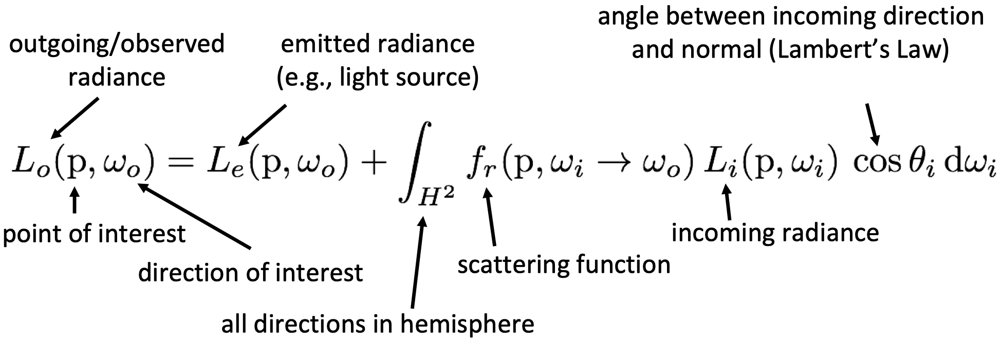
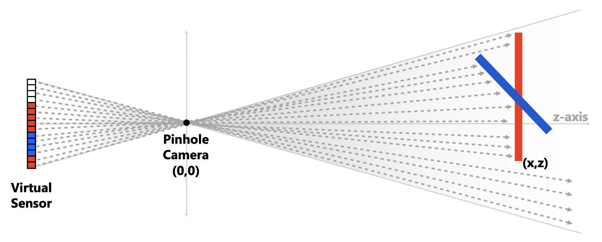

# 6. Light, Color And The Rendering Equation

## 6.1 What Is Color?

### 6.1.1 Introduction

**Light** is electromagnetic radiation, and **color** is its frequency, in other word: Light is oscillating electric and magnetic fields and its frequency determines the color of the light.

Most light is _not visible_ to the human eye. The frequencies that are visible to the human eyes are called the **visible spectrum.** These frequencies are what we think of as color.

{width=50%}

### 6.1.2 Description Of Light

We already saw the **emission spectrum** for the sun. In general, it tells us how much light is _produced_ and is useful to compare against other sources of light, such as lightbulbs.
Another very useful description is the **absorption spectrum**, which tells us how much light is _absorbed,_ e.g. turned into heat. It is useful to characterize color of paint, ink, etc.

While the emission spectrum is intensity as a function of frequency, the absorption spectrum is a fraction absorbed as a function of frequency. Light that is not absorbed is _reflected._

This is the fundamental description of light: Intensity, emission and absorption as a function of frequency.

## 6.2 The Eye

The eye consists of two types of photoreceptor cells: rods and cones.

- _Rods_ are primary photoreceptors under dark conditions.
- _Cones_ are primary receptors under high-light viewing conditions.

There are three types of cones: S, M, and L cones. These correspond to a peak response at short, medium, and long wavelengths.

The human eye does not directly measure the spectrum of incoming light, but three response values `(S, M, L)` by integrating the incoming spectrum against response functions of S-, M-, and L-cones. The brain then interprets these functions as colors.

{width=50%}

## 6.3 Additive And Subtractive Color Models

### 6.3.1 Introduction

Just like we had emission and absorption spectra, we have _additive_ and _subtractive_ color models:

- Additive: Used for combining colored lights, prototypical example is RGB
- Subtractive: used for combining paint colors, prototypical example is CMYK

### 6.3.2 Practical Encoding Of Color Values

One might ask how we encode colors digitally. One common encoding is through 8-bit per color _hexadecimal values._ Each hexadecimal number represents the intensity of red, green, and blue:

- `#000000` represents black
- `#ffffff` represents white

## 6.4 Geometric Model Of Light

**Photons** are a type of elementary particle. We can think of it as the most basic unit of light or electromagnetic radiation, they each carry a small amount of energy:

- Photons are massless and travel at the speed of light in a vacuum
- They bounce around when they interact with matter
- They travel in straight lines
- A ray of light informally means a lot of photons all moving in the same direction

### 6.4.1 Radiometry

One idea to capture photons hitting some surface is to just store the total number of hits that occur anywhere in the scene, over the complete duration of the scene. This captures the total energy of all the photons hitting the scene and is said to be the **radiant energy** (total number of hits).

The **radiant flux** describes the number of hits per second. Rather than recording the total energy over some arbitrary duration, it makes much more sense to record the total hits per second.

To make images, we also need to know where the hits occurred. So, we compute the hits per second in some unit area, which is called the **irradiance.**

{width=50%}

### 6.4.2 Measuring Illumination

For the radiant energy, we need to know how much energy is carried by a photon:

$$
Q = \frac{hc}{\lambda},
$$

where:

- $h$: Plack's constant
- $c$: speed of light
- $\lambda$: wavelength

The radiant flux is then equal to the energy per unit time received by the sensor:

$$
\Phi = \lim_{\Delta \to 0} \frac{\Delta Q}{\Delta t} = \frac{\text{d}Q}{\text{d}t}
$$

We can also go the other way around and say that the time integral of the flux is equal to the total radiant energy:

$$
Q = \int_{t_0}^{t_1} \Phi(t) \, \text{d}t
$$

If we are now given a sensor with area $A$, we can consider the average flux over the entire sensor area to be $\frac{\Phi}{A}$. The irradiance $E$ is then given by taking the limit of the flux as the sensor are becomes tiny:

$$
E(p) = \lim_{\Delta \to 0} \frac{\Delta \Phi(p)}{\Delta A} = \frac{\text{d}\Phi(p)}{\text{d}A}
$$

### 6.4.3 Radiance

The irradiance, i.e. the number of photons per area per time, along a given direction is called the **radiance.** We can compute:

$$
E = \int_{H^2} L(\omega) \cos \theta \, \text{d} \omega,
$$

where $E$ is the irradiance, $L$ is the radiance in direction $\omega$, and $\cos \theta$ is the angle between the normal and $\omega$.

The radiance is the solid angle density of irradiance:

$$
L(p, \, \omega) = \lim_{\Delta \to 0} \frac{\Delta E_{\omega}(p)}{\Delta \omega} = \frac{\text{d}E_{\omega}(p)}{\text{d}\omega},
$$

where $E_{\omega}$ means that the differential surface area is oriented to face in the direction $\omega$. In other words, radiance is energy along a ray defined by some origin point $p$ and a direction $\omega$.

#### Surface Radiance

We somehow need to distinguish between incident radiance and exitant radiance functions at a point on a surface:

{width=50%}

In general, $L_i(p, \, \omega) \neq L_o(p, \, \omega)$

## 6.5 The Rendering Equation

The core functionality of photorealistic renderer is to estimate the radiance at a given point, in a given direction. This is summed up by the **rendering equation:**

{width=50%}

### 6.5.1 Scattering Function

How can we model the **scattering** of light? There are many things that could happen to a photon:

- Bounces of the surface
- Transmitted through the surface
- Bounces around inside the surface
- Absorbed and re-emitted

The _bidirectional reflectance distribution function (BRDF)_ $f_r(\omega_i \to \omega_o)$ encodes the behavior of light that bounces off the surface. It answers the following question: Given some incoming direction $\omega_i$, how much light is scattered in the outgoing direction $\omega_o$?

The following properties hold:

- $f_r(\omega_i \to \omega_o) \geq 0$
- $\int_{H^2} f_r(\omega_i \to \omega_o) \cos \theta \, \text{d}\omega_i \leq 1$
- $f_r(\omega_i \to \omega_o) = f_r(\omega_o \to \omega_i)$

# 7. Ray Tracing

## 7.1 Rasterization & Ray-Casting

### 7.1.1 Rasterization

{width=50%}

The basic rasterization algorithm consists of obtaining 2D samples and then computing the coverage, i.e. whether a projected triangle covers a 2D sample point, and the occlusion, i.e. calculating the depth buffer.

Finding samples in this case is easy since they are distributed uniformly on screen.

## 7.1.2 Ray-Casting

An alternative to rasterization is **ray-casting.**

{width=50%}

The basic ray casting algorithm looks as follows:

- Sample: some ray in 3D
- Coverage: does a ray hit the triangle? (ray-triangle intersection tests)
- Occlusion: closest intersection along the ray

### 7.1.3 Rasterization vs. Ray-Casting

Rasterization:

- Proceeds in triangle order
- Most processing is based on 2D primitives
- Stores a depth buffer

Ray-Casting:

- Proceeds in screen sample order
    - Never have to store depth buffer
    - Natural order for rendering transparent surfaces
- Must store entire scene

Both are approaches for solving the same problem: _determining "visibility"._

## 7.2 Shadows

Shadow can be computed by _recursive ray tracing:_

-  Shoot shadow rays towards the light source from points where camera rays intersect the scene
    - If they are unclouded, the point is directly lit by the light source

{width=50%}

Shadows computed via ray tracing are correct hard shadows. If done via rasterization, shadow map texture can lead to aliasing.

## 7.3 Reflections

Similar to shadow, reflections can be computed with recursive ray tracing by "simply" adding more secondary arrays:

{width=50%}

## 7.4 Ray-Scene Intersections

### 7.4.1 Line-Line Intersection

Assume we have two lines $ax = b$ and $cx = d$. How do we fine the intersection?

We simply have to check if there is a simultaneous solution which leads to the following liner system of equations:

$$
\begin{bmatrix} a_1 & a_2 \\ c_1 & c_2  \end{bmatrix} \begin{bmatrix} x_1 \\ x_2  \end{bmatrix} = \begin{bmatrix} b \\ d \end{bmatrix}
$$

### 7.4.2 Ray-Mesh Intersection

One very important question to answer is where a ray pierces a surface, since this allows us to do:

- Rendering: visibility, ray tracing
- Simulation: collision detection
- Interaction: mouse picking

The parametric equation of a ray is given by: $r(t) = o + t\text{d}$, where $r(t)$ is a point along the ray, $o$ is the origin, and $\text{d}$ is some unit direction.

#### Intersection With Implicit Surface

Recall that implicit surfaces are given by some function $f(x)$, i.e. all points such that $f(x) = 0$. If we want to find all points where a ray intersects a surface, we can simply plug in $r(t)$ for $x$ in $f(x)$ and then solve for $t$.

#### Ray-Plane Intersection

Suppose we are given some plane $N^Tx = c$. Then we can find the intersection with ray $r(t)$ with the following equation:

$$
r(t) = o + \frac{c - N^To}{N^T \text{d}} \text{d}
$$

#### Ray-Triangle Intersection

If we want to find the intersection of a ray and a triangle, we proceed as follows:

1. Parameterize the triangle by vertices $p_0, \, p_1, \, p_2$ using the barycentric coordinates:

$$
f(u, \, v) = (1-u-v)p_0 + up_1 + vp_2
$$

2. Plug parametric ray equation directly into the equation for the points on the triangle:

$$
p_0 + u(p_1-p_0) + v(p_2 - p_0) = o + td
$$

3. Solve for $u, \, v, \, t$:

$$
\begin{bmatrix} p_1 - p_0 & p_2 - p_0 & -d  \end{bmatrix} \begin{bmatrix} u \\ v \\ t  \end{bmatrix} = o - p_0
$$

### 7.4.3 Core Methods For Ray-Primitive Queries

We want to solve the following query: Given some primitive `p`, `p.intersect(r)` returns the value `t` corresponding to the point of intersection with ray `r`.

Now given a scene defined by a set of `N` primitives and a ray `r`, find the closes point of intersection of `r` with the scene. A very simple algorithm to solve this query could look like this:

```python
p_closest = NULL
t_closes = INF
for each primitive p in scene:
    t = p.intersect(r)
    if t >= 0 && t < t_closest:
        t_closest = t
        p_closest = p
```

This has complexity $O(n)$.
