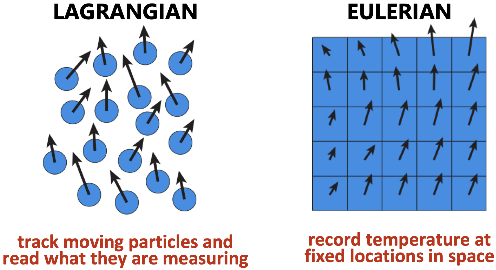

**Visual Computing - Lecture notes week 14**

- Author: Ruben Schenk
- Date: 27.12.2021
- Contact: ruben.schenk@inf.ethz.ch

### 8.4.8 Partial Differential Equations

In contrast to ODEs, where an unknown function is described through its derivatives with respect to a single variable, **partial differential equations (PDEs)** describe an unknown function through its partial derivatives with respect to _multiple_ variables:

$$
\frac{\partial u (t, \, x)}{\partial t^2} = c^2 \frac{\partial u(t, \, x)}{\partial x^2}
$$

#### Fluid Simulation in Graphics

_Incompressible Navier Stokes Equations:_

$$
\nabla \cdot u = 0 \\
\frac{\partial u}{\partial t} + (u \cdot \nabla)u - v \nabla^2u = - \nabla w + g
$$

#### Elasticity in Graphics

_Governing Equations of Continuum Mechanics:_

$$
\nabla \cdot \sigma + f = m \cdot a
$$

#### Magnetism in Graphics

_Maxwell Equations (static case):_

$$
\nabla \cdot B = 0, \quad \nabla \times H = J \\
H = \frac{1}{\mu_0}B - M
$$

#### 1D Advection

Consider the following example, where we are given some initial temperature distribution $T_0(x) = T(x, \, 0)$ and some wind speed $c$. We want to find the temperature distribution $T(x, \, t)$ for any $t$:

We can solve this problem _analytically:_

- Any $T(x, \, t)$ of the form $T(x, \, t) = f(x-ct)$ solves $\frac{\partial T}{\partial t} = -c \frac{\partial T}{\partial x}$
- The solution also needs to satisfy the initial condition $T(x, \, 0) = T_0(x)$
- The solution therefore is given by $T(x, \, t) = T_0(x-ct)$

_Note:_ Only simple PDEs can be solved analytically!

We might also solve the problem _numerically:_

#### Some Notation

#### PDE Classification

The **order** of a PDE is the order of the highest partial derivative. A PDE is said to be **linear** if the unknown function $u$ and its partial derivatives only occur linearly.

Second order linear PDEs are of high practical relevance. A second order linear PDE in 2 variables has the following form:

$$
Au_{xx} + 2Bu_{xy} + Cu_{yy} = F(x, \, y, \, u, \, u_x, \, u_y)
$$

A second order linear PDE in 2 variables can be classified into:

- _Hyperbolic:_ $B^2-AC > 0$ (wave equation)
- _Parabolic:_ $B^2-AC = 0$ (heat equation)
- _Elliptic:_ $B^2-AC < 0$ (Laplace equation)

#### Solving PDEs

Like ODEs, many interesting PDEs are difficult or impossible to solve analytically. The basic strategy is as follows:

- Pick a spatial discretization
- Pick a time discretization (forward Euler, backward Euler, etc.)
- As with ODEs, run a time-stepping algorithm

#### Spatial Discretization

Two basic ways to **discretize space** are the Lagrangian and the Eulerian approach:

We observe the following trade-offs:

- Lagrangian:
    - Conceptually easy
    - Resolution/domain not limited by grid
    - Good particle distribution can be tough
    - Finding neighbors can be expensive
- Eulerian:
    - Fast, regular computation
    - Easy to represent
    - Simulation is "trapped" in a grid

#### The Laplace Operator

_Discretization:_

_Numerically solving the Laplace equation:_

