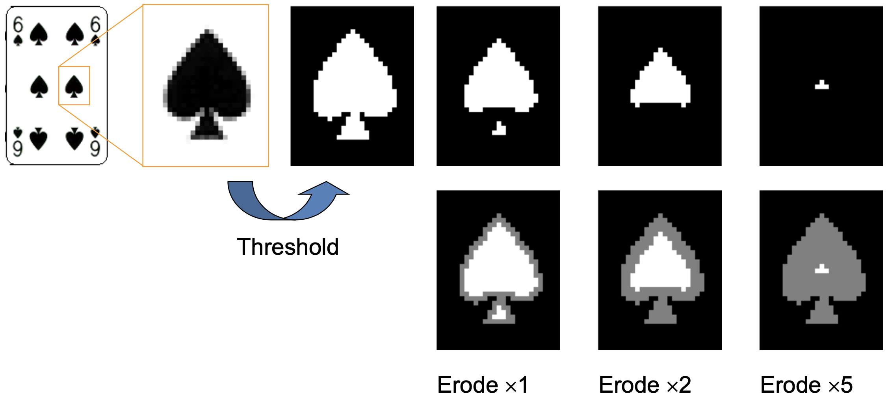
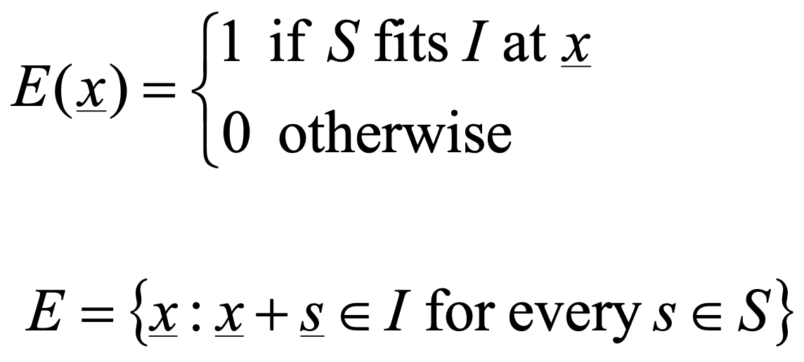
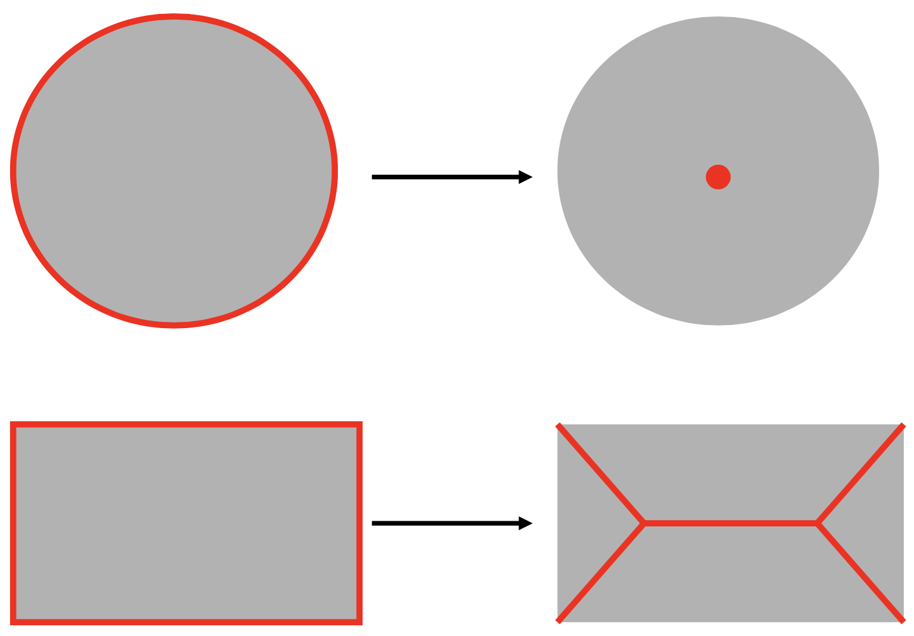

**Visual Computing - Lecture notes week 2**

- Author: Ruben Schenk
- Date: 04.10.2021
- Contact: ruben.schenk@inf.ethz.ch

## 1.10 Color Cameras

We consider three different common concepts:

1. Prism (with three different sensors)
2. Filter mosaic
3. Filter wheel

### Prism

With this type of camera, we separate the light into three beams using two _dichroic prisms_. However, this requires three sensors and a very precise alignment. The plus of this concept is that there is a very good color separation.

### Filter Mosaic

With this concept, one coats the filter directly on the sensor.

### Filter wheel

For static scenes, we can rotate multiple filters in front of the lens. This allows for more than 3 colors.

### Prism vs. mosaic vs. wheel

| Approach   | Prism            | Mosaic          | Wheel                   |
| ---------- | ---------------- | --------------- | ----------------------- |
| # Sensors  | 3                | 1               | 1                       |
| Separation | High             | Average         | Good                    |
| Cost       | High             | Low             | Average                 |
| Framerate  | High             | High            | Low                     |
| Artefacts  | Low              | Aliasing        | Motion                  |
| Bands      | 3                | 3               | 3 or more               |
| Type       | High-end cameras | Low-end cameras | Scientific applications |

### Color CMOS sensor (Foveon's X3)


In contrast to a filter mosaic, we truly measure each color at each pixel, instead of either red, blue or green per pixel.

# 2. Image Segmentation

> Image segmentation is the ultimate classification problem. Once solved, Computer Vision is solved.

## 2.1 What is Image Segmentation?

**Image segmentation** partitions an image into regions of interest. It is the first stage in many automatic image analysis systems.

A _complete segmentation_ of an image `I` is a finite set of regions `R_1,..., R_N`, such that:


_Excluding dark pixels from an image:_

```python
    img = cv2.imread('BlobsIP.png') # An 8-bit image
    cv2.imshow('BlobsIP', img)
    cv2.waitKey(0)
    img.shape --> [244 767 3]
    hist = np.histogram(img, bins=256)
    cv2.imshow('Histogram', hist)
    cv2.waitKey(0)
    cv2.imshow('Mask', img[:,:,1] > 20)
    cv2.waitKey(0)
```

### Segmentation quality

The **quality** of a segmentation depends on what you want to do with it. Segmentation algorithms must be chosen and evaluated with an application in mind.

## 2.2 Thresholding

**Thresholding** is a simple segmentation process. It produces a binary image `B` by labeling each pixel in or out of the region of interest by comparison of the graylevel with a threshold `T`:


### How do we choose T?

There are several ways to choose `T`:

- Trial and error
- Compare results with ground truth
- Automatic methods (we'll discuss ROC curves later on)

## 2.3 Chromakeying

If we can control the background of a picture, segmentation becomes easier. Assume we use a green screen.

**Chromakeying** describes the process of plain distance measuring, in this case for green:


This has some problems:

- Variation is _not_ the same in all three channels
- The alpha mask is hard: `I_comp = I_alpha I_a + (1 - I_alpha) I_b`

### Background color variation

Colors in the background may vary a lot (especially the intensity of colors and especially of green).

On way which can make segmentation easier is to **normalize colors** (per pixel):

- Intensity `I = R + G + B`
- Normalized color `(r, g, b) = (R/I, G/I, B/I)`

## 2.4 ROC Analysis

A **Receiver Operating Characteristic (ROC)** curve characterizes the performance of a binary classifier. A binary classifier distinguishes between two different types of things, e.g.:

- Healthy/afflicted patients
- Pregnancy tests
- Object detection
- Foreground/background image pixels

### Classification errors

Binary classifiers make errors. There are two types of input to a binary classifier:

- positives
- negatives

This results in four possible outcomes in any test:

- True positive
- True negative
- _False negative_
- _False positive_

### ROC Curve

The **ROC curve** characterizes the error trade-off in binary classification tasks. It plots the TP fraction against the FP fraction:

- _TP fraction_ (**sensitivity**) is `True positive count / positive count`
- _FP fraction_ (1-sensitivity) is `False positive count / negative count`

The result could look something like this:


### Operating points

We can choose an **operating point** by assigning relative costs and values to each outcome:

- `V_TN`: value of true negative
- `V_TP`: value of true positive
- `C_FN`: cost of false negative
- `C_FP`: cost of false positive

When we assigned these costs, we can choose the point on the ROC curve with **gradient**:


For simplicity, we often set `V_TN = V_TP = 0`.
¨

## 2.5 Limits of Thresholding

Why can we segment images much better by eye than through thresholding processes? Because we can consider the context of the whole image.

We might improve results by considering _image context_ through **surface coherence**.

## 2.6 Pixels

### Pixel connectivity

We need to define which pixels are connected/neighbors.

We define two different types of **pixel neighborhoods**:


### Pixel paths

A **4-connected path** between pixels `p_1` and `p_n` is a set of pixels `{p_1, p_2,..., p_n}` such that `p_i` is a 4-neighbor of `p_i+1`.

In an **8-connected path**, `p_i` is an 8-neighbor of `p_i+1`.

### Connected regions

A region is 4-connected if it contains a 4-connected path between any two of its pixels. Analog, a region is 8-connected if it contains an 8-connected path between any two of its pixels.

## 2.7 Region growing

**Region growing** is defined by the following steps:

1. Start from a seed point/pixel or region
2. Add neighboring pixels that satisfy the criteria defining the region
3. Repeat until we can include no more pixels

In code, this could look like the following example:

```python
def regionGrow(I, seed) :
    X, Y = I.shape
    visited = np.zeros((X, Y))
    visited[seed] = 1
    boundary = []
    boundary.append(seed)

    while len(boundary) > 0 :
            nextPoint = boundary.pop()
            # Here is the important function which defines the region criteria
            if include(nextPoint, seed) :
                visited[nextpoint] = 2
                for (x, y) in neighbors(nextPoint) :
                    if visted[x, y] == 0 :
                        boundary.append((x, y))
                        visited [x, y] = 1
```

### Variations

There are three key indicators which lead to variation:

- Seed selection
- Inclusion criteria
- Boundary constraints and snakes

**Seed selection** can happen in different ways. This may be either by hand (point and click), or automatically by conservative thresholding.

The **inclusion criteria** could either be done by greylevel thresholding or by a _greylevel distribution model_:

- Use mean `mu` and standard deviation `sigma` in seed region and then:
  - include if `(I(x, y) - mu)^2 < (n sigma)^2` (with for example `n = 3`)
  - this also leads to the ability to update the mean and standard deviation after every iteration

### Snakes

A **snake** is an active contour. It is a polygon, i.e., an ordered set of points joined up by lines. Each point on the contour moves away from the seed while its image neighborhood satisfies an inclusion criterion.

## 2.8 Distance Measures

With a **plain background-subtraction metric** we do the following calculations:

- `I_alpha = | I - I_bg | > T`
- `T = [20 20 10]` (for example)
- `I_bg` is the background image

The background image is obtained by a "previous image", for example before a car drives into the scene. The color of the background is determined on a per-pixel basis.

When possible, we should fit a Gaussian model per pixel, just as we did for an entire green-screen. This leads to the following, better way of doing distance measurements:


## 2.9 Spatial Relations

We introduce the concept of **Markov Random Field** for spatial relations:

- _Markov chains_ have a 1D structure. At every time, there is one state (which enables use of dynamic programming)
- _Markov Random Fields_ break this 1D structure. It is a field of sites, each of which has a label. The labels at one site depend on others, there are no 1D structure dependencies.

### Solving MRFs with graph cuts

_something something_

## 2.10 Morphological Operations

**Morphological operators** are local pixel transformers for processing region shapes. They are most often used on binary images. Logical transformations are based on comparison of pixel neighborhoods with a pattern.

### Example: 8-neighbor erode

The **8-neighbor erode** works by simply erasing any foreground pixel that has one eight-connected neighbor that belongs to the background.

_Example:_



The contrast to this function is the **8-neighbor dilate**, where we simply paint any background pixel that has one 8-connected neighbor that is foreground.

### Structuring elements

Morphological operations take two arguments:

- A binary image
- A structuring element

We compare the structuring element to the neighborhood of each pixel, which determines the output of the morphological operation.

We can think of **binary images** and the structuring elements as _sets_ containing the pixels with value `1`.


### Fitting, Hitting and Missing

We define the following three terms:

- `S` _fits_ `I` at `x` if `{y : y = x + s, s in S} subset I`
- `S` _hits_ `I` at `x` if `{y : y = x - s, s in S} intersection I != emptyset`
- `S` _misses_ `I` at `x` if `{y : y = x - s, s in S} intersection I = emptyset`

### Erosion

The image `E = I circ- S` is the **erosion** of image `I` by structuring element `S`:



### Opening and Closing

The **opening** of `I` by `S` is defined by:


The **closing** of `I` by `S` is defined by:


### Skeletonization and the Medial Axis Transform

The **skeleton** and **medial axis transform (MAT)** are stick-figure representations of a region `X subset R^2`.
Simply speaking, one might start a "grassfire" at the boundary of the region, and the skeleton is then defined as the set of points at which two fire fronts meet.

Example:



With a **medial axis transform** you remember for each point on the skeleton the distance you travelled to get to that point. This way, the whole shape can be reconstructed from a MAT.
