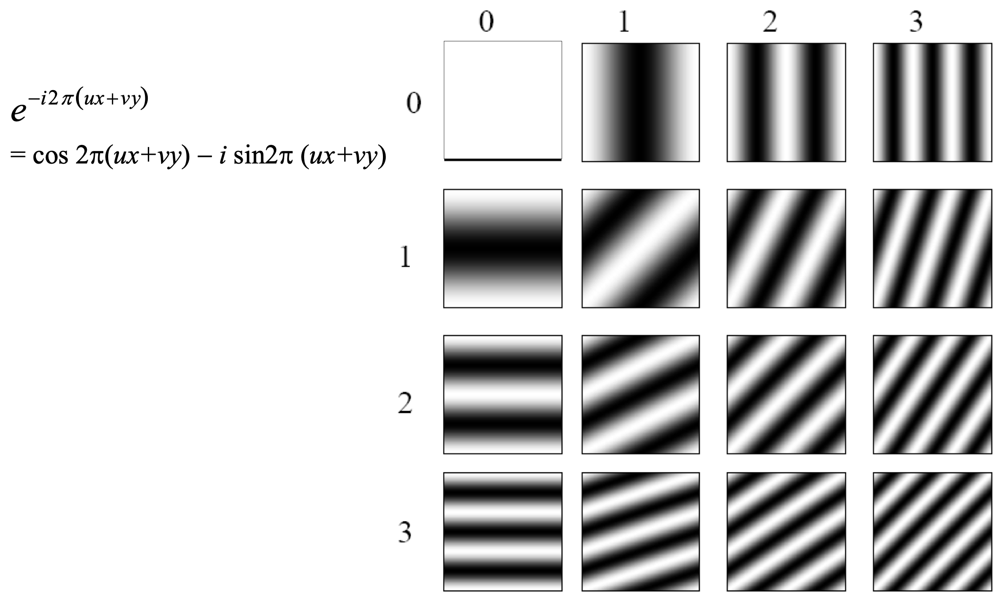

**Visual Computing - Lecture notes week 4**

- Author: Ruben Schenk
- Date: 26.10.2021
- Contact: ruben.schenk@inf.ethz.ch

# 5. Fourier Transform

## 5.1 Introduction

The idea of the **Fourier Transform** is to represent functions in a new basis. We might think of functions as vectors, with many components, where we can apply a linear transformation to transform the basis (i.e. a dot product with each basis elements).

In the expressions, $u$ and $v$ select the basis elements, so a function of $x$ and $y$ becomes a function of $u$ and $v$. The **basis elements** have the form $e^{-i2 \pi (ux + vy)} = \cos 2 \pi (ux + vy) - i \sin 2 \pi (ux + vy)$. Or:

$$F(g(x, \, y))(u, \, v) = \int \int_{\mathbb{R}^2} g(x, \, y)e^{i2 \pi (ux + vy)}\text{d}x \text{dy}$$

The **discrete fourier transform** therefore is of the form:

$$F = Uf$$

where:

- $F$ is the transformed image
- $U$ is the Fourier transform base
- $f$ is the vectorized image

## 5.2 Fourier Basis Functions

## 5.3 Phase and Magnitude

The Fourier transform of a real function is complex. It's difficult to plot and to visualize, and instead, we can think of the phase and magnitude of the transform.

The **phase** is the phase of the complex transform, and the **magnitude** is the magnitude of the complex transform. An interesting fact is that all natural images have about the *same magnitude transform*, hence the phase seems to matter much more than the magnitude does.

## 5.4 Convolution Theorem

The **Convolution Theorem** goes as follows:

> The Fourier transform of the convolution of two functions is the product of their Fourier transforms: $F.G = U(f**g)$.
> The Fourier transform of the product of two functions is the convolution of the Fourier transform: $F**G = U(f.g)$.
