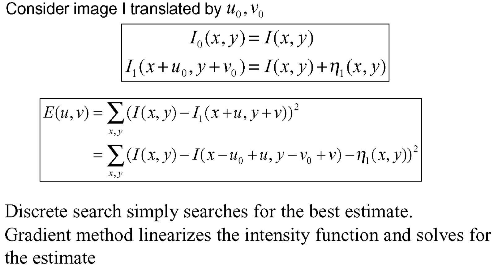
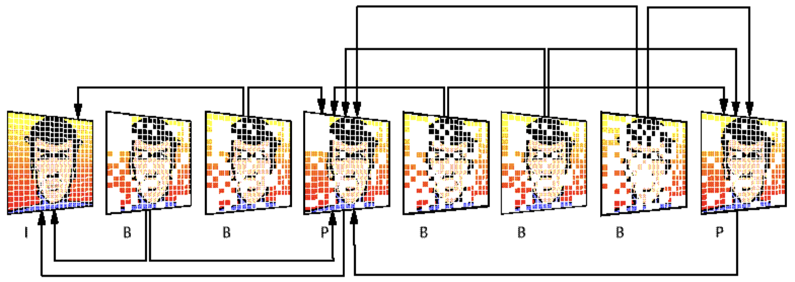
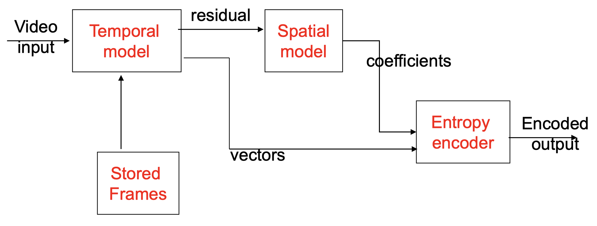
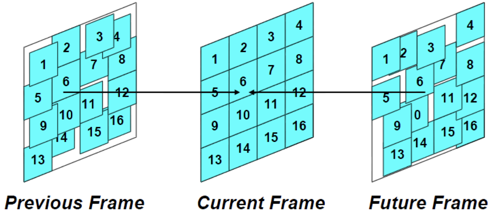

**Visual Computing - Lecture notes week 7**

- Author: Ruben Schenk
- Date: 15.11.2021
- Contact: ruben.schenk@inf.ethz.ch

## 8.7 Bayesian Flow

Some low-level human motion illusions can be explained by adding an uncertianty model to the Lucas-Kanade tracking.

This will result in the birghtness constancy equation _with noise_ to be:

$$I(x, \, y, \, t) = I(x + v_x \delta t, \, y + v_y \delta t, \, t + \delta t) + \eta$$

## 8.8 SSD Tracking

For large displacements, we do _template matching_ as we used in stereo disparity search:

1. Define a small area around a pixel as the template
2. Match the template against each pixel within a search are in the next image
3. Use a meatch measure such as correlation, normalued correlation, or sum-of-squares difference
4. Choose the maximum (or minimum) as the match

# 9. Video Compression

## 9.1 Perception Of Motion

The human visual system is specifically sensitive to motion. Our eyes follow motion automatically. Some distortions, however, are not as perceivable as in image coding.

Visual perception is limited to <24Hz, therefore, a succession of images will be preceived as continuous if the frequency is sufficiently high. We still need to avoid aliasing (i.e. the "wheel effect"), therefore high-rendering frame-rates desired in computer games (needed due to absence of motion blur).

## 9.2 Bloch's Law

**Bloch's Law** states that for human perception, it doesn't really matter whether we see something at 100% brightness for 10ms, or something at 50% for 20ms.

## 9.3 Video Format

A **video** is essentially a sequence of 2D images, so for storing a video, we need to simply store each 2D image and their corresponding place in time.

### 9.3.1 Interlaced Video Format

The **interlaced video format** consists of two temporally shifted half images, which increases the frequency from 25 to 50 Hz (for example).

This results in a reduction of spatial resolution.

## 9.4 Lossy Video Compression

With **lossy video compression** we take advantage of redundancy:

- Spatial correlation between neighboring pixels
- Temporal correlation between frames

With the above information, we can _drop perceptually unimportant details._

### 9.4.1 Temporal Processing

With a usually high frame rate, we have significant temporal redundancy. We have two possible representations along temporal dimension:

- _Transform/subband methods:_
    - Good for textbook case of constant velocity uniform global motion
    - Inefficient for nonuniform motion, i.e. real-worl motion
    - Requires a large number of frame stores
- _Predictive methods:_
    - Good performance using only two frame stores
    - However, simple frame differencing is not enough

The goal is to exploit temporal redundancy by **predicting the current frame** based on previously coded frames. There are three types of **coded frames:**

- _I-frame:_ Intra-coded frame, coded independently of all other frames
- _P-frame:_ Predicively coded frame, coded based on previously coded frame
- _B-frame:_ Bi-directionally predicted frame, coded based on both previous and future coded frames

Temporal redundancy reduction my be _ineffective_ when there are many scene changes or when there is high motion.

### 9.4.2 Video Compressor Diagram

### 9.4.3 Motion-compensated Prediction

Simple frame differencing fails when there is motion. We can account for motion with a **motion-compensated (MC) prediction.** The practical approach to this is so called **Block-Matching Motion Estimation:**

- Partition each frame into blocks, e.g. 16x16 pixels
- Describe the motion of each block
- No object identification required
- Good, robust perfomance

_Example of fast motion estimation seach: 3-step log search_

### 9.4.4 Bidirectional MC Prediction

**Bidirectional MC-Prediction** is used to estimate a block in the current frame from a block in:

1. Previous frame
2. Future frame
3. Average of a block from the previous frame and a block from the future frame
4. Neither, i.e. code the current block without prediction