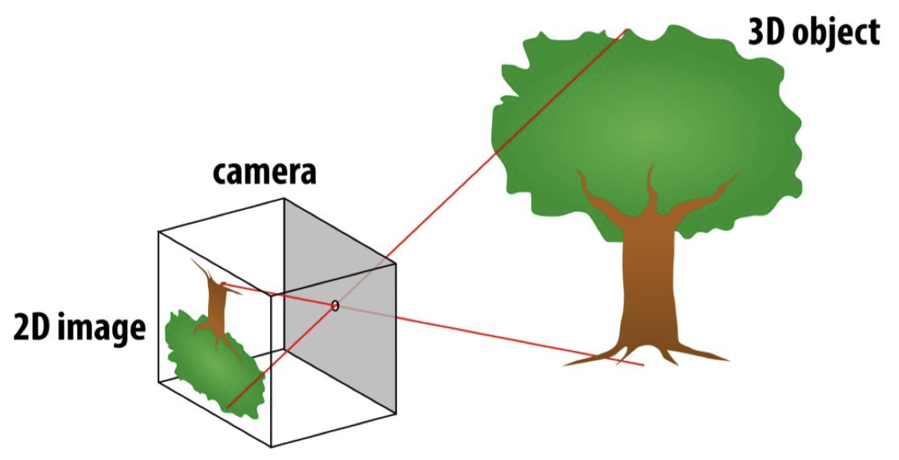
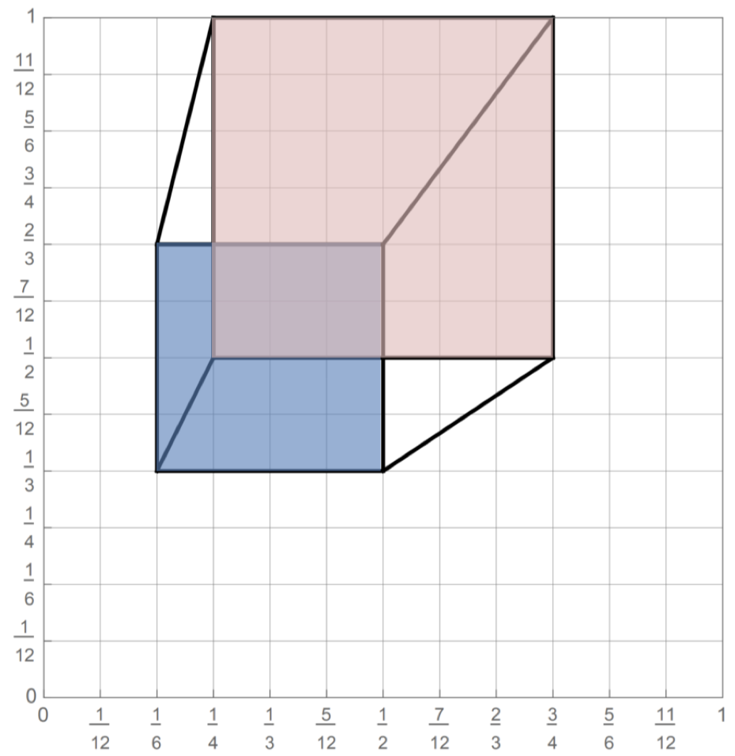

**Visual Computing - Lecture notes week 8**

- Author: Ruben Schenk
- Date: 08.12.2021
- Contact: ruben.schenk@inf.ethz.ch


# Part 2: Computer Graphics

# 1. Introduction

## 1.1 Computer Graphics

**Computer graphics** describes the use of computers to synthesize and manipulate visual information.

It is used in many, if not all of the movies we see today to synthesize movie scenes which are fictional or too expensive to shoot in real life.

In general, computer graphics is about building computational models of the real world!

## 1.2 Foundations Of Computer Graphics

Building models of the world demands sophisticated theory and systems, such as:

- geometric representations
- sampling theory
- integration and optimization
- perception
- physics-based modeling
- parallel, heterogeneous processing
- graphics-specific programming languages

## 1.3 Modeling And Drawing A Cube

We start by exploring how we draw a cube, i.e. how we describe a cube and how we can visualize our model.

We assume our cube to be as follows:

- Centered at origin `(0, 0, 0)`
- Has dimensions `2 x 2 x 2`
- Edges are aligned with `x, y, z` axes

We can then define the coordinates of the cube _vertices_ to be:

```bnf
A: (1, 1, 1)        E: (1, 1, -1)
B: (-1, 1, 1)       F: (-1, 1, -1)
C: (1, -1, 1)       G: (1, -1, -1)
D: (-1, -1, 1)      H: (-1, -1, -1)
```

With the information above, we can define the _edges_ of our cube to be:

```bnf
AB, CD, EF, GH,
AC, BD, EG, FH,
AE, CG, BF, DH
```

But how do we draw our 3D vertices as a 2D flat image? The basic strategy is:

1. Map the 3D vertices to 2D points in the image
2. Draw straight lines between 2D points corresponding to the edges

## 1.4 Perspective Projection

The **perspective projection** describes what a simple _pinhole_ model of a camera does:



With this simple projection we can answer the following question: Where does a point `p = (x, y, z)` from our real world end up in the image `q = (u, v)`?

$$
\begin{align*}
&v = \frac{y}{z}, \quad \text{(v is simply the slope y/z)} \\
&u = \frac{x}{z}
\end{align*}
$$


Applying the above learned information, we can draw our cube, assuming that the camera is at `c = (2, 3, 5)`, as follows:

1. We get the following coordinates for our vertices of the cube:

```bnf
A: (1/4, 1/2)       E: (1/6, 1/3)
B: (3/4, 1/2)       F: (1/2, 1/3)
C: (1/4, 1)         G: (1/6, 2/3)
D: (3/4, 1)         H: (1/2, 2/3)
```

2. We can draw the points on a 2D grid and connect the points which belong to our previously defined edges:



## 1.5 Drawing On A Raster Display

### 1.5.1 Introduction

Considering we have solved our cube representation, a natural question to ask would be how a computer can draw lines.
A common abstraction is that a image is represented as a _2D grid of pixels._ Each pixel can take on a unique color value.

**Rasterization** describes the process of converting a continuous object to a discrete representation on a pixel grid (or _raster grid_). However this approach leads to a fundamental question which we must solve: Which pixels should we color in to depict the line?

1. One simple approach is to light up all pixels intersected by the line:


2. In modern graphics hardware, we use a approached called the _diamond rule:_


The last question we might want to answer is how do we find the pixels satisfying a chosen rasterization rule? We could check every single pixel in the image to see if it meets the condition.
However, considering the `O(n)` pixels in an image with respect to the at most `O(n)` "lit up" pixels, we have to do way too much computation.

### 1.5.2 Incremental Line Rasterization

Let's assume that a line is represented with integer endpoints `(u1, v1)` and `(u2, v2)`, and a slope `s = (v2 - v1)/(u2 - u1)`. We consider the very easy special case where:

- `u1 < u2, v1 < v2`, i.e. the line points towards the upper-right
- `0 < s < 1`, i.e. there is more change in `x` than in `y`

A common optimization for drawing the pixels is the so-called **Bresenham algorithm:**

```c
v = v1;
for(u = u1; u <= u2; u++) {
    v += s;
    draw(u, round(v));
}
```
