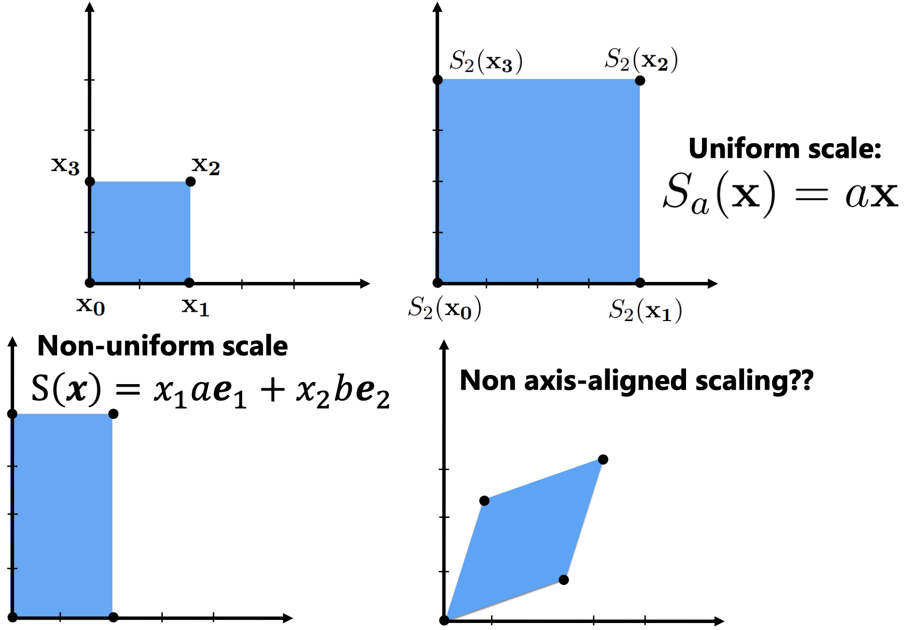
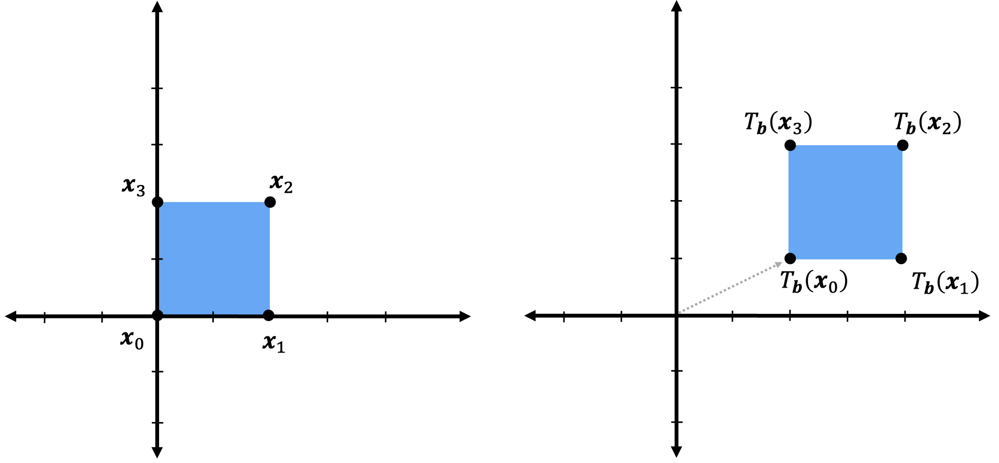
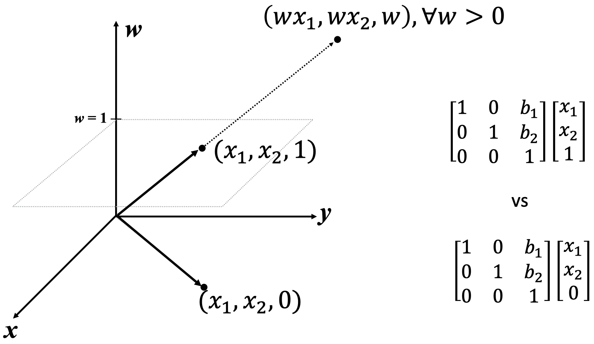
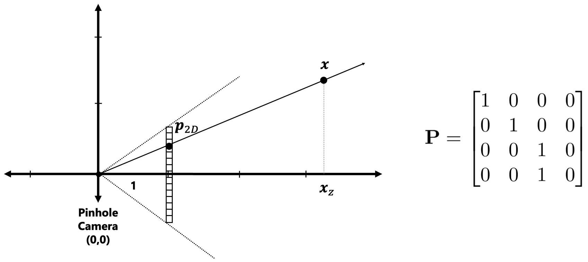
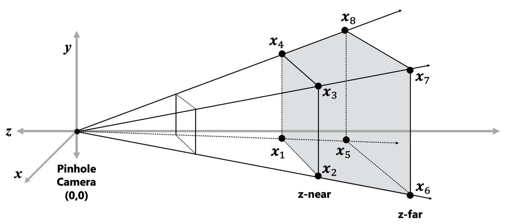

**Visual Computing - Lecture notes week 9**

- Author: Ruben Schenk
- Date: 10.12.2021
- Contact: ruben.schenk@inf.ethz.ch

# 3. Transforms

## 3.1 Introduction

### 3.1.1 Linear Transforms

In computer graphics, we are mainly concerned about **linear transforms.** This is due to:

- Computationally speaking, linear transforms and linear maps are easy to solve
- Linear transforms are still very powerful
- All maps can be approximated as linear maps (though sometimes only over a short distance, or small amount of time)
- Composition of linear transformations is linear, leading to uniform representation of transformations

### 3.1.2 Algebraic Definition

A map $f$ is _linear_ if it maps vectors to vectors, and if for all vectors $u, \, v$ and scalars $\alpha$ we have:

$$
f(u + v) = f(u) + f(v) \\ f(\alpha u) = \alpha f(u)
$$

For maps between $\mathbb{R}^m$ and $\mathbb{R}^n$, we can give an even more explicit definition:

If a map can be expressed as $f(u) = \sum_{i = 1}^m u_i a_i$, with fixed vectors $a_i$, then it is linear.

_Example:_

$u$ is a linear combination of $e_1$ and $e_2$. $f(u)$ is the _same_ linear combination, but of $a_1$ and $a_2$, and we have that $a_1 = f(e_1)$ and $a_2 = f(e_2)$.

## 3.2 Scale

**Scaling** is simply defined by either scalar multiplication of the whole vector (_uniform scale_) or scalar multiplication of specific basis vectors (_non-uniform scale_).

$$
S(x) = x_1ae_1 + x_2be_2 = \begin{bmatrix} a & 0 \\ 0 & b \end{bmatrix} \cdot x
$$

## 3.3 Rotation

Mathematically, **rotations** can be defined by the following two formulaes:

$$
R_{\theta}(e_1) = (\cos \theta, \, \sin \theta) = a_1 \\
R_{\theta}(e_2) = (- \sin \theta, \, \cos \theta) = a_2
$$

Which leads us, due to the linearity of rotations, to the following simple formula:

$$
R_{\theta}(x) = x_1 a_1 + x_2 a_2 = \begin{bmatrix} \cos \theta & -\sin \theta \\ \sin \theta & \cos \theta \end{bmatrix} \cdot x
$$

_Remark:_ Rotation around any other point than the origin is _not linear,_ since for linearity, the origin must map to the origin!

## 3.4 Reflection

For now, we only consider **reflection** about the $y$-axis and $x$-axis. They are expressed as:

- $Re_y(x) = x_1e_x \cdot (-1) + x_2e_y$
- $Re_x(x) = x_1e_x + x_2e_2 \cdot (-1)$

Those special cases are actually simple _non-uniform scales._

## 3.5 Shear

A **shear operation** (in the $x$ direction) is done by moving the upper edge along the $x$-axis by some defined amount.

Mathematically, this operation is defined through:

$$
H_a(x) = x_1 \begin{bmatrix} 1 \\ 0 \end{bmatrix} + x_2 \begin{bmatrix} a \\ 1 \end{bmatrix} = \begin{bmatrix} 1 & a \\ 0 & 1  \end{bmatrix} \cdot x
$$

## 3.6 Translation

**Translation** describes mappings of the following form:

We can denote this transformation by:

$$
T_b(x) = x_1 \begin{bmatrix} ? \\ ? \end{bmatrix} + x_2 \begin{bmatrix} ? \\ ? \end{bmatrix}
$$

such that $T_b(x) = x + b$ for some translation vector $b$.

_Remark:_ Translation is _not linear_, but affine.

## 3.7 2D Homogeneous Coordinates (2D-H)

### 3.7.1 Introduction

The key idea with **2D-H coordinates** is to _lift_ our 2D points into the 3D space. For example, our 2D point $(x_1, \, x_2)$ is represented as:

$$
(x_1, \, x_2) \Rightarrow \begin{bmatrix} x_1 \\ x_2 \\ 1 \end{bmatrix}
$$

This also leads to the change, that our 2D transforms are now represented by $3 \times 3$ matrices instead of $2 \times 2$.

_Example:_ The previously seen 2D rotation in homogeneous coordinates is defined by:

$$
\begin{bmatrix} \cos \theta & -\sin \theta & 0 \\ \sin \theta & \cos \theta & 0 \\ 0 & 0 & 1 \end{bmatrix} \cdot \begin{bmatrix} x_1 \\ x_2 \\ 1 \end{bmatrix}
$$

### 3.7.2 Translation In 2D-H Coordinates

One of our main interests in 2D-H coordinates is that we are able to define non-linear maps in 2D as linear maps in 3D/2D-H coordinates!

The translation operation expressed in 2D-H, i.e. as a $3 \times 3$ matrix multiplication, is given by:

$$
T_b(x) = x + b = \begin{bmatrix} 1 & 0 & b_1 \\ 0 & 1 & b_2 \\ 0 & 0 & 1 \end{bmatrix} \cdot \begin{bmatrix} x_1 \\ x_2 \\ x_3 \end{bmatrix} = \begin{bmatrix} x_1 + b_1x_3 \\ x_2 + b_2x_3 \\ x_3 \end{bmatrix}
$$

In our homogeneous coordinates, translation is a linear transformation!

_Remark:_ $x_3$ is usually set to $1$.

### 3.7.3 Points vs. Vectors

In computer graphics we often have to distinguish between _points_ and _vectors._

We define a vector to have $x_3 = 0$ in 2D-H and a point to have $x_3 \neq 0$ in 2D-H. To get from a point in 2D-H back to 2D, we simply divide all components by $x_3$.

## 3.8 Composition Of Linear Transformations

We can **compose linear transforms** via matrix multiplication. This enables for simple and efficient implementation, since we can reduce a complex chain of transforms to a single matrix.

_Example:_ We take a look at the following transform: $R_{\pi / 4} S_{[1.5, \, 1.5]}x$

## 3.9 Moving To 3D (And 3D-H)

Similar to 2D, we represent 3D transforms as $3 \times 3$ matrices and 3D-H transforms as $4 \times 4$ matrices.

_Example:_ 

- A _scale_ in 3D is given by:

$$
S_S = \begin{bmatrix} S_x & 0 & 0 \\ 0 & S_y & 0 \\ 0 & 0 & S_z  \end{bmatrix}, \quad S_S = \begin{bmatrix} S_x & 0 & 0 & 0 \\ 0 & S_y & 0 & 0 \\ 0 & 0 & S_z & 0 \\ 0 & 0 & 0 & 1  \end{bmatrix}
$$

- A _shear_, in $x$ and based on the $y, \, z$ position, is given by:

$$
H_{x, \, d} = \begin{bmatrix} 1 & d_y & d_z \\ 0 & 1 & 0 \\ 0 & 0 & 1  \end{bmatrix}, \quad H_{x, \, d} = \begin{bmatrix} 1 & d_y & d_z & 0 \\ 0 & 1 & 0 & 0 \\ 0 & 0 & 1 & 0 \\ 0 & 0 & 0 & 1  \end{bmatrix}
$$

- A _translation_ by vector $b$:

$$
T_b = \begin{bmatrix} 1 & 0 & 0 & b_x \\ 0 & 1 & 0 & b_y \\ 0 & 0 & 1 & b_z \\ 0 & 0 & 0 & 1 \end{bmatrix}
$$

- Rotation about $x$-axis:

$$
R_{x, \, \theta} = \begin{bmatrix} 1 & 0 & 0 \\ 0 & \cos \theta & - \sin \theta \\ 0 & \sin \theta & \cos \theta  \end{bmatrix}
$$

- Rotation about $y$-axis:

$$
R_{y, \, \theta} = \begin{bmatrix} \cos \theta & 0 & \sin \theta \\ 0 & 1 & 0 \\ - \sin \theta & 0 & \cos \theta  \end{bmatrix}
$$

- Rotation about $z$-axis:

$$
R_{z, \, \theta} = \begin{bmatrix} \cos \theta & - \sin \theta & 0 \\ \sin \theta & \cos \theta & 0 \\ 0 & 0 & 1  \end{bmatrix}
$$

# 4. Perspective Projection Transformations, Geometry and Texture Mapping

## 4.1 Perspective Projection Transformations

### 4.1.1 Basic Perspective Projection

When doing basic perspective projection, the desired _perspective projection result_ (some 2D point), is given by:

$$
p_{2D} = (\frac{x_x}{x_z}, \, \frac{x_y}{x_z})
$$

The procedure for a basic perspective projection, follows 4 steps:

1. Input point in 3D-h: $x = (x_x, \, x_y, \, x_z, \, 1)$
2. Applying map to get the projected point in 3D-H: $Px = (x_x, \, x_y, \, x_z, \, x_z)$
3. Point projected to 2D-H by dropping the $z$ coordinate: $p_{2D-H} = (x_x, \, x_y, \, x_z)$
4. Point in 2D by homogeneous divide: $p_{2D} = (\frac{x_x}{x_z}, \, \frac{x_y}{x_z})$

### 4.1.2 The View Frustum

The **view frustum** denotes the region in space that will appear on the screen.

We want a transformation that maps view frustum to a unit cube, such that computing screen coordinates in that space becomes trivial.

Define the following properties:

- $\theta$ : The field of view in the $y$ direction ($h = 2 \cdot \tan \Big(\frac{\theta}{2} \Big)$)
- $f = \cdot \Big(\frac{\theta }{2} \Big)$
- $r$ : The aspect ratio, i.e. $\frac{\text{width}}{\text{height}}$

Then, we can define the _transformation matrix from frustum to unit cube_ as:

$$
P = \begin{bmatrix} \frac{f}{r} & 0 & 0 & 0 \\ 0 & f & 0 & 0 \\ 0 & 0 & \frac{zfar + znear}{znear - zfar} & \frac{2 \cdot zfar \cdot znear}{znear - zfar} \\ 0 & 0 & -1 & 0  \end{bmatrix}
$$

## 4.2 Geometry

### 4.2.1 Implicit Representations of Geometry

In an **implicit representation**, points aren't known directly, but satisfy some relationship. For example, we might define a unit sphere as all points $x$ such that $x^2 + y^2 + z^2 = 1$.
Implicit surfaces make some tasks easy, such as deciding whether some point is inside or outside our implicit suface.

### 4.2.2 Explicit Representations of Geometry

In an **explicit representation,** all points are given directly. For example, the points on a sphere are $(\cos u \sin v, \, \sin u \sin v, \, \cos v)$ for $0 \le u \lt 2 \pi$ and $ 0 \le v \lt \pi$.
There are many explicit representations in graphics, such as:

- Triangle meshes
- Polygon meshes
- Point clouds
- etc.

Explicit surfaces make some tasks easy, such as sampling. However, they also make some tasks hard, such as deciding whether a given point is inside or outside our surface.
